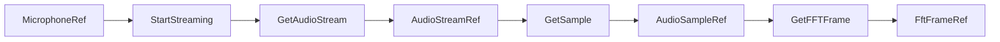

# Streaming lifecycle

## Цепочка ссылок



| Звено | Кто создаёт активный ресурс |
|-------|----------------------------|
| MicrophoneRef | GetMicrophone или Event/host |
| **AudioStreamRef** | **StartStreaming** (host); GetAudioStream только **читает** активный stream |
| AudioSampleRef | GetSample + host.captureAudioSample |
| FftFrameRef | GetFFTFrame + host.computeFftFrame |

## Guards (рекомендуемый паттерн)

```text
On start:  … → set mic → StartStreaming(mic)
Main:      isValid(mic) → GetAudioStream(mic) → set stream → isValid(stream) → GetSample → …
```

## Частые ошибки

1. **Нет StartStreaming** — GetAudioStream возвращает invalid stream.
2. **isValid только на mic** — sample всё равно invalid без stream.
3. **Нет ребра mic → GetAudioStream** — при активном stream без mic-входа сверка mic не выполняется (см. `resolveGetAudioStreamOutput`).

## Host

Реализация: `apps/client/src/modules/device-board/scenarioMicJournalBridge.ts`.
