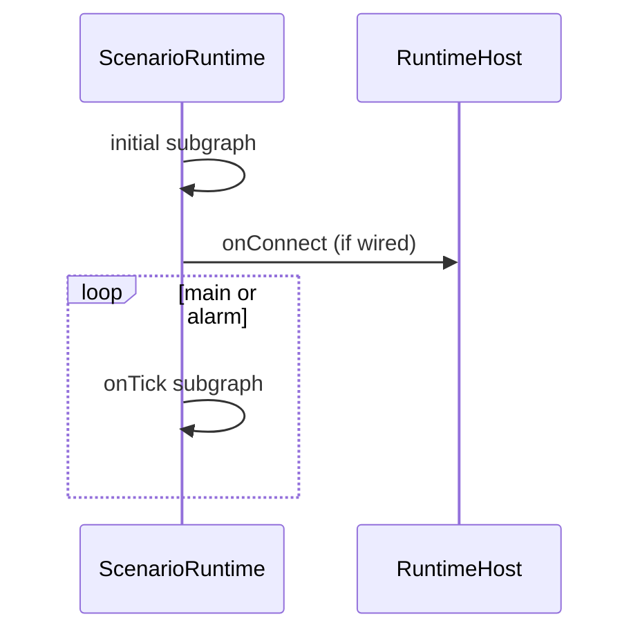

# Architecture

## Два слоя доски

| Слой | Вкладка | Исполнение |
|------|---------|------------|
| **Signal graph** | Signal | View-only над audio pipeline (engine + shared hubs) |
| **Scenario graph** | Scenario | **Scenario runtime** в `@membrana/device-board` |

Scenario graph использует **exec-рёбра** (порядок) и **data-рёбра** (значения между узлами).

## Ветки-обработчики (Scenario)

| UI label | Ключ в документе | Entry |
|----------|------------------|-------|
| On start | `initial` | системный Event |
| On connect | `onConnect` | Event + ServerRef |
| onMainTick | `loops.main` | loopTick Event |
| onAlarmTick | `loops.alarm` | loopTick Event |
| On stop / On disconnect | `triggers.*` | Event |

Переменные **document-scope**: один `ScenarioVariableStore` на прогон runtime; `reset()` только при `load()`.

## Границы пакетов

```
@membrana/core          ← типы, ScenarioNodeKind, Ref types
@membrana/device-board  ← UI + graph + runtime (без Web Audio)
apps/client             ← host bridge (audio-engine, capture, FFT)
```

<Warning>
  Запрещено: `new AudioContext()`, `getUserMedia` внутри `@membrana/device-board`. Только через host.
</Warning>

## Runtime phases



Подробно: [`docs/SCENARIO_RUNTIME.md`](https://github.com/officefish/Membrana/blob/main/docs/SCENARIO_RUNTIME.md).

## Источники правды

| Вопрос | Где |
|--------|-----|
| Контракты типов | `packages/core` |
| Семантика узлов | `block-executor.ts`, `resolve-input.ts` |
| Пины палитры | `palette-node.ts` |
| Агент перед правкой | `docs/catalog/client/prompts/modules/device-board.md` |
