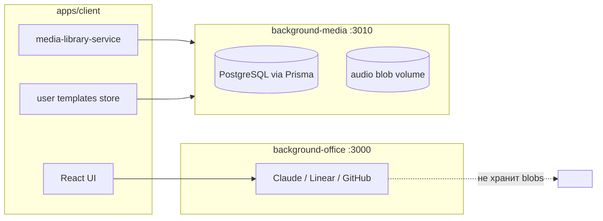

# Фоновые серверы Membrana (`packages/background-*`)

> **Статус:** `background-office` — реализован (v0.1). `background-media` — **в разработке** (эпик [#58](https://github.com/officefish/Membrana/issues/58), промпты A5a–A5c).
>
> Связанные документы: [`ARCHITECTURE.md`](./ARCHITECTURE.md) §1d–§1e, [`MEDIA_LIBRARY_ARCHITECTURE.md`](./MEDIA_LIBRARY_ARCHITECTURE.md), [`INTEGRATIONS_STRATEGY.md`](./INTEGRATIONS_STRATEGY.md) §1.1 (эшелон 2).

---

## Зачем семейство `background-*`

Membrana — прежде всего **клиент** (браузер / Electron) с аудио-анализом на узле. Не всё должно жить в браузере:

| Потребность | Почему не в клиенте |
|-------------|-------------------|
| Секреты внешних API (Claude, Linear) | Нельзя класть ключи в Vite-бандл |
| Webhook'и от Linear/GitHub | Нужен публичный HTTPS-endpoint |
| Крупные WAV-датасеты | IndexedDB ограничен (~100 MB fallback) |
| Персистентные шаблоны trends между устройствами | localStorage не масштабируется на команду/поле |

Поэтому рядом с `apps/client` существуют **автономные Node.js-серверы** в `packages/background-*`. Они **не** входят в граф `packages/services/*` и **не** импортируют `@membrana/core`, `@membrana/agenda`, `apps/client`.

---

## Три сервера — три роли (не смешивать)

> **Планируется:** `@membrana/background-cabinet` (эпик [#67](https://github.com/officefish/Membrana/issues/67)) — auth, мембраны, узлы, ключи TTL, тарифы. Канон: [`MEMBRANE_PLATFORM.md`](./MEMBRANE_PLATFORM.md).



| Пакет | Порт (dev) | Stateful? | Назначение |
|-------|------------|-----------|------------|
| **`@membrana/background-office`** | 3000 | Нет | **Интеграционный шлюз:** Anthropic Claude, Linear GraphQL, Linear webhooks, GitHub Issues (persona-контекст), **RAG query** (`POST /api/rag/query`, R4). Скрипты `yarn ask`, CI, dev-tools. |
| **`@membrana/background-media`** | 3010 | **Да** | **Data-plane веб-клиента:** библиотека сэмплов (коллекции, multipart upload, blob storage), trends-шаблоны (JSON), квота. Изоляция по **`deviceId`** (узел/клиент); v2 эпика #67 — scope по **`membraneId`**. Стек: **NestJS + Fastify**, **Prisma + PostgreSQL**. |
| **`@membrana/background-cabinet`** *(план)* | 3020 | **Да** | **Identity + domain:** users (login/password), membranes, nodes, access keys (TTL enum), tariffs, telemetry metadata. SPA: `apps/cabinet` → `cabinet.membrana.space`. |

### Жёсткие границы

**В `background-office` НЕ добавлять:**

- загрузку/хранение WAV;
- CRUD коллекций сэмплов;
- trends-шаблоны пользователя;
- PostgreSQL / файловые volume под пользовательские данные.

**В `background-media` НЕ добавлять:**

- вызовы Anthropic / Linear / GitHub;
- приём webhook'ов тикет-трекеров;
- persona-промпты из `docs/virtual-team/`;
- тяжёлый inference ML (эшелон 2 для моделей — отдельный пакет в будущем, не office и не media v1);
- login/password и CRUD пользователей (→ `background-cabinet`).

**В `background-cabinet` НЕ добавлять:**

- хранение WAV / multipart audio (→ `background-media`);
- вызовы Anthropic / Linear / GitHub (→ `background-office`);
- FFT / детекторы (→ `packages/services/*`).

**Общее для обоих:**

- NestJS + TypeScript strict + zod env + pino + `X-Membrana-Token` на `/v1/*` и **`/api/rag/*`** (R4);
- `GET /health` без авторизации;
- отдельный деплой и DNS (напр. `api.<domain>` vs `media.<domain>`);
- автономность от монорепо-клиента (локальные DTO, без `@membrana/trends-detector-service` в runtime).

### Исключение R4: `@membrana/rag-service` в `background-office`

По умолчанию `background-*` **не** импортируют пакеты `packages/services/*`. Для dual-circuit RAG (эпик `rag-dual-circuit-v1`, фаза **R4**) разрешена **единственная** зависимость:

| Пакет | Где | Зачем |
|-------|-----|-------|
| `@membrana/rag-service` | `background-office` only | `POST /api/rag/query` — удалённый доступ к `retrieveContext()` для consilium / automation |

**Не переносить RAG в `background-media` Postgres** — LanceDB остаётся embedded (`.membrana/rag/` на диске процесса office или `RAG_REPO_ROOT`).

#### Security (R4)

| Риск | Митигация v1 |
|------|----------------|
| Утечка repo-доков | Только `X-Membrana-Token` (тот же секрет, что `/v1/claude/*`); **не** вызывать из browser bundle |
| Утечка `OPENAI_API_KEY` | Ключ только в env office; embeddings — server-side |
| Prompt injection через `query` | Max 2000 chars; zod validation; fragments — read-only context, не исполняются |
| Логирование секретов | pino redact для `X-Membrana-Token`; не логировать полные `fragments[]` на `info` |
| DoS / cost (embeddings) | Archive circuit = 1 embed/query; rate limit — отложен (R7 / reverse proxy) |
| Несинхронный index | Оперативный circuit (BM25) работает без LanceDB; archive → 503 с явным сообщением |

**Клиент (`apps/client`)** в v1 **не** ходит на `/api/rag/query` напрямую — только скрипты ритуалов / consilium через office или локальный `yarn rag:query`.

**Различие HTTP-адаптеров (намеренное):**

| Пакет | Адаптер | Зачем |
|-------|---------|-------|
| `background-office` | **Express** (`@nestjs/platform-express`) | raw body для HMAC webhook'ов Linear — уже в v0.1 |
| `background-media` | **Fastify** (`@nestjs/platform-fastify`) | multipart upload, стриминг blob'ов, меньше оверхеда на I/O |

Не унифицировать адаптеры без ADR: office и media деплоятся отдельно.

---

## Стек `background-media` (зафиксировано до A5a)

| Слой | Технология | Примечание |
|------|------------|------------|
| HTTP | NestJS 10 + **Fastify** | `@nestjs/platform-fastify`, `@fastify/multipart` |
| ORM | **Prisma** | `schema.prisma`, `prisma migrate` |
| БД | **PostgreSQL** 16 | метаданные: devices, collections, samples, templates |
| Blobs | Файловый volume | оригинальный файл как загружен; путь в `storage_ref` |
| Метаданные аудио | **`music-metadata`** | duration, sampleRate, channels для wav/mp3/flac/ogg на upload |
| WAV (опционально) | **`wavefile`** | разбор/валидация PCM-заголовка WAV, если нужна строгая проверка |
| Логи / env | pino, zod | как в office |

Сырые аудио-байты **не** в PostgreSQL (BYTEA) в v1.

### Мультиформатная библиотека сэмплов

Библиотека **не ограничена WAV**: сервер принимает несколько контейнеров, хранит blob в исходном формате, отдаёт с корректным `Content-Type`.

| Формат (v1) | MIME | Метаданные на upload |
|-------------|------|----------------------|
| WAV | `audio/wav`, `audio/wave` | `music-metadata` + при необходимости `wavefile` (PCM) |
| MP3 | `audio/mpeg` | `music-metadata` |
| FLAC | `audio/flac` | `music-metadata` |
| OGG | `audio/ogg` | `music-metadata` |

Поля сэмпла (расширение `MediaSample`): `audioFormat` (`'wav' \| 'mp3' \| 'flac' \| 'ogg'`), `contentType`. Воспроизведение в клиенте — через `audio-engine` / `decodeAudioData` (форматы, поддерживаемые браузером). Транскодирование на сервере — **out of scope v1** (отдельная задача, если понадобится единый WAV для benchmark).

Whitelist MIME и max upload — в env (`MEDIA_ALLOWED_MIME`, `MAX_UPLOAD_BYTES`). Неизвестный формат → `415 Unsupported Media Type`.

---

## `background-media` — модель данных и мульти-узел

Каждый **узел** (браузер, Electron, полевой ПК с микрофоном или антенной) — отдельный потребитель:

```text
Device (deviceId)
 ├── collections[]     — buffer / user / system tariff-dataset (`__tariff_dataset__`)
 ├── samples[]         — метаданные в PG (Prisma), аудио-blob на volume
 └── trend_templates[] — JSON PatternTemplate (ключи user:*)
```

- Регистрация: `POST /v1/devices` → клиент сохраняет `deviceId` (см. будущий `mediaDeviceRegistry`).
- Все resource routes: `/v1/devices/:deviceId/...`.
- Заголовок `X-Membrana-Device-Id` на запросах клиента (дублирует path).
- Узел A **не видит** сэмплы и шаблоны узла B.

Клиентский fallback при недоступности media-server: `BrowserLimitedStorageBackend` (IndexedDB) + localStorage для шаблонов — см. [`MEDIA_LIBRARY_ARCHITECTURE.md`](./MEDIA_LIBRARY_ARCHITECTURE.md) §4.3.

**Tariff catalog (free-v1, DS5):** при `POST .../collections/ensure-reserved` (pair flow из `background-cabinet`) сервер идемпотентно заливает 120 × 5 с WAV в `__tariff_dataset__` из `MEDIA_CATALOG_ROOT` (Docker: `/app/catalog/free-v1`). Ручной прогон: `yarn media:provision-catalog <deviceId>`. Catalog samples **не входят** в `userStorage` quota.

---

## API surface (media v1, план)

| Группа | Примеры | Потребитель |
|--------|---------|-------------|
| Health | `GET /health` | `resolveMediaLibraryStorageMode()` |
| Devices | `POST /v1/devices` | первый запуск клиента |
| Quota | `GET .../quota` | `StorageRuntimeIndicator`, banner |
| Collections / samples | CRUD + multipart | `ServerStorageBackend` → `@membrana/media-library-service` |
| Trends templates | `GET/PUT .../trends-templates` | `userTemplatesPersistence` / zustand store |

Полная спецификация: [`prompts/BACKGROUND_MEDIA_A5A_SERVER_PROMPT.md`](./prompts/BACKGROUND_MEDIA_A5A_SERVER_PROMPT.md).

---

## Куда класть новую функциональность (чеклист для разработчика)

| Вопрос | Куда |
|--------|------|
| Новый внешний API или webhook? | `background-office` (новый Nest-модуль) |
| Пользовательское аудио (wav/mp3/flac/ogg) / коллекция / export manifest? | `background-media` |
| Пользовательский шаблон trends (JSON)? | `background-media` (не office) |
| Login, мембрана, узел, ключ доступа (TTL)? | `background-cabinet` + `apps/cabinet` |
| Pairing `apps/client` с мембраной? | `apps/client` + API `background-cabinet` |
| Чистая математика FFT/детектор? | `packages/services/*` |
| UI плагин? | `apps/client` |
| Синхронизация offline ↔ server | клиент + media API (отдельная задача) |
| Inference нейросети на GPU | будущий `background-inference` или sidecar (не media v1) |

Перед PR, расширяющим `background-*`, обновить этот файл и [`ARCHITECTURE.md`](./ARCHITECTURE.md) §1d–§1e.

---

## Команды и пакеты

| Задача | Команда / путь |
|--------|----------------|
| Dev office | `yarn office:dev` |
| Dev media | `yarn media:dev` |
| Dev cabinet *(план)* | `yarn cabinet:dev` / `yarn cabinet:app:dev` |
| Docker cabinet | `yarn cabinet:docker:up` · VPS: `deploy/cabinet-stack.sh` |
| Docker media (локально / staging) | `yarn media:docker:up` |
| Docker media (VPS prod) | `deploy/media-stack.sh` + [`docs/deploy/BACKGROUND_MEDIA_DEPLOY.md`](./deploy/BACKGROUND_MEDIA_DEPLOY.md) |
| README office | [`packages/background-office/README.md`](../packages/background-office/README.md) |
| README media | [`packages/background-media/README.md`](../packages/background-media/README.md) |

---

## Задачи и история решений

| Артефакт | Ссылка |
|----------|--------|
| GitHub Issue (эпик) | [#58](https://github.com/officefish/Membrana/issues/58) |
| Реестр | `background-media-v1`, `background-media-a5a-server`, … |
| Консилиум 2026-06-11 | [`seanses/background-media-v1-consilium-2026-06-11.md`](./seanses/background-media-v1-consilium-2026-06-11.md) |
| Membrane Platform (эпик) | [#67](https://github.com/officefish/Membrana/issues/67), [`MEMBRANE_PLATFORM.md`](./MEMBRANE_PLATFORM.md), prod-smoke [`deploy/MEMBRANE_PLATFORM_DEPLOY.md`](./deploy/MEMBRANE_PLATFORM_DEPLOY.md) |
| Журнал office v0.1 | [`discussions/background-office-v0.1.md`](./discussions/background-office-v0.1.md) |

---

*Версия: 2026-06-11 (стек: NestJS+Fastify, Prisma+PG, мультиформат audio) · LGTM: ожидается при старте A5a*
