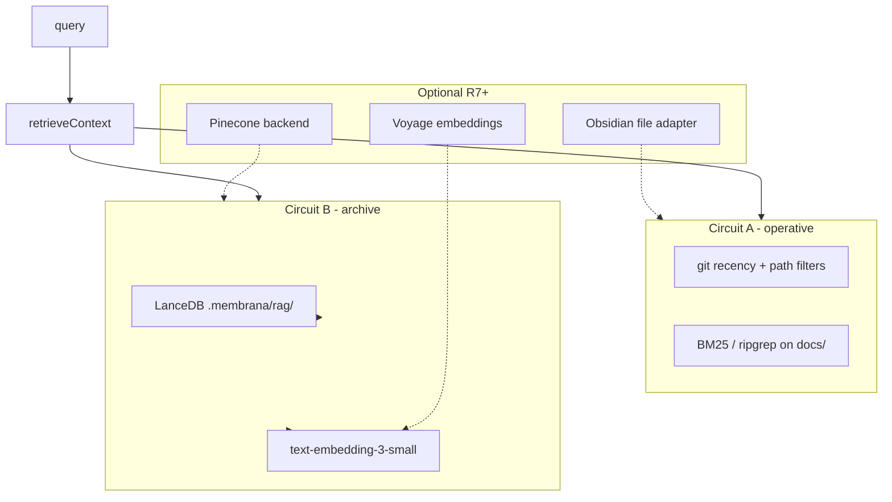

# CRITICAL_RAG_AUDIT — критический аудит RAG-стека Membrana

> **Дата:** 2026-06-21  
> **Метод:** консилиум команды + web-grounded анализ (Perplexity, 2025–2026)  
> **Статус:** **принято** — заменяет tooling-решения в [`RAG_STRATEGY_CONCEPT.md`](./RAG_STRATEGY_CONCEPT.md) и [`ADDITIONAL_RAG_STRATEGY_BRIEF.md`](./ADDITIONAL_RAG_STRATEGY_BRIEF.md)  
> **План внедрения:** [`discussions/rag-strategy-implementation-plan-2026-06-21-consilium.md`](./discussions/rag-strategy-implementation-plan-2026-06-21-consilium.md) (обновлён)  
> **Epic prompt:** [`prompts/RAG_DUAL_CIRCUIT_V1_EPIC_PROMPT.md`](./prompts/RAG_DUAL_CIRCUIT_V1_EPIC_PROMPT.md)

---

## 1. Executive summary

Исходное ТЗ (Obsidian + Pinecone + LangChain + `text-embedding-ada-002`) **архитектурно верно** в части двухконтурной памяти и интеграции с ритуалами, но **инструментально устарело и не совпадает** с масштабом Membrana (~500–800 чанков) и принципом [`INTEGRATIONS_STRATEGY.md`](./INTEGRATIONS_STRATEGY.md) «локально → свой сервер → внешний API».

**Пересмотренный стек v1:**

| Слой | Было | Стало |
|------|------|-------|
| Оперативная память (Circuit A) | Obsidian REST (обязательно) | **Repo-native**: git recency + BM25/ripgrep по `docs/` |
| Долговременная память (Circuit B) | Pinecone managed | **LanceDB embedded** (`.membrana/rag/`, gitignored) |
| Embeddings | ada-002 (1536) | **`text-embedding-3-small`** (1536); опционально Voyage 3 Lite |
| Chunking | LangChain RecursiveCharacterTextSplitter | **Собственный markdown/code splitter** |
| Obsidian | Core | **Optional overlay** (Phase R7) |
| Pinecone | Core | **Optional pluggable backend** (Phase R7+) |
| Office `/api/rag/query` | Phase 1 | **Phase R4**; R0–R3 — локальные скрипты |

---

## 2. Контекст Membrana (ограничения аудита)

- TypeScript monorepo, ~150–200 markdown-файлов → **~500–800 векторов** после chunking.
- LLM для ритуалов — **Anthropic** (скрипты + `background-office`); embeddings — отдельный API (OpenAI или Voyage).
- `background-office` **не импортирует** `@membrana/*` (кроме будущего исключения для `@membrana/rag-service`).
- `background-media` Postgres — **data-plane аудио**, не doc RAG.
- CI и Cloud Agents должны работать **без** Pinecone/Obsidian keys.
- `context-collector.mjs` + git slice — **остаются**; RAG дополняет, не заменяет целиком.

---

## 3. Vector store: Pinecone vs альтернативы

### 3.1 Критика Pinecone для нашего масштаба

Perplexity deep research (2025–2026):

- Managed-only, **~$20/мес floor** при минимальном usage.
- Каждый query — **сетевой RTT**; cold start / latency variance (community reports).
- Контрибьюторы и CI **не могут** клонировать repo и работать offline без API key.
- При 800 векторах производительность Pinecone **не даёт выигрыша** — bottleneck в network, не в ANN.

### 3.2 Сравнительная таблица

| Backend | Self-host / embedded | TS SDK | ~800 chunks CI | Cost | Lock-in | Verdict для Membrana |
|---------|---------------------|--------|----------------|------|---------|----------------------|
| **LanceDB** | ✅ embedded, local disk | ✅ official TS | ✅ zero deps | $0 | Low | **Default v1** |
| **pgvector** | ✅ Postgres | ✅ pgvector-node | Docker Postgres | $0 local | Low | Альтернатива если уже есть PG |
| **Qdrant** | ✅ OSS + cloud free tier | ✅ JS client | Docker required | $0 self-host | Medium | Optional backend |
| **Chroma** | ✅ local + cloud | ⚠️ weaker TS story | OK | usage-based | Medium | Fallback |
| **Weaviate** | ✅ OSS, heavy | ✅ ESM-only client | Heavy CI setup | varies | Medium | Overkill |
| **Pinecone** | ❌ managed only | ✅ | ❌ needs key | ~$20/mo | High | **Optional cloud sync only** |

**Источники:** Pinecone pricing/latency forums; LanceDB + Continue codebase RAG case; Encore pgvector RAG guide; MarkTechPost 2026 vector DB comparison.

### 3.3 Решение

- **R1:** `LanceDB` file store в `.membrana/rag/` (gitignore).
- **Interface:** `VectorStore` с implementations `LanceDbStore`, позже `PineconeStore` | `PgVectorStore`.
- **Не** ставить Pinecone blocking dependency в CI.

---

## 4. Embeddings: ada-002 vs современные модели

### 4.1 Критика ada-002

- Явно **superseded** `text-embedding-3-small` / `3-large` в 2024–2025 benchmarks.
- В исходном ТЗ указан ada-002 — **ошибка**, не индексировать.

### 4.2 Сравнение (tech docs + code signatures)

| Model | Dim | Quality (docs/code) | Cost @800 chunks | Notes |
|-------|-----|---------------------|------------------|-------|
| ada-002 | 1536 | Legacy | ~$0 | ❌ deprecated |
| **text-embedding-3-small** | 1536 | Strong general | ~$0.01 | ✅ default |
| **Voyage 3 Lite** | 512 | Best on code/specialized | ~$0.005 | ✅ optional A/B |
| Cohere Embed v4 | 1536 | Strong multilingual | similar | Overkill (English-only docs) |
| nomic-embed (local) | 768 | Weaker on long tech docs | $0 infra | Эшелон 1 local; BGE-M3 лучше |

При ~800 чанках **абсолютная стоимость embeddings negligible** — выбор по **P@5 на 5 эталонных вопросах**, не по цене.

### 4.3 Решение

- Default: **`OPENAI_EMBEDDING_MODEL=text-embedding-3-small`**
- Optional env: `RAG_EMBEDDING_PROVIDER=voyage` + `VOYAGE_API_KEY`
- Phase R7: A/B benchmark vs OpenAI на acceptance questions
- Future local: BGE-M3 sidecar (эшелон 1, `INTEGRATIONS_STRATEGY`)

---

## 5. LangChain vs custom pipeline

### 5.1 Критика LangChain для нашего case

Perplexity (2025–2026 TS RAG guides):

- Full LangChain/LangGraph — для **multi-step agents**, не markdown doc RAG.
- Тянет тяжёлый dependency graph без выигрыша на 800 чанках.
- Для TS monorepo рекомендуется **custom glue** или `@langchain/textsplitters` only.

### 5.2 Решение

- **`chunk/markdown-splitter.ts`**: split по `#` headings, сохранять heading path в metadata.
- **`chunk/code-signature-extractor.ts`**: exports + JSDoc only.
- **Не** добавлять `@langchain/core` в v1.
- Phase R7 optional: cross-encoder reranker (BGE reranker / Cohere Rerank) если retrieval шумный.

---

## 6. Operative memory: Obsidian vs repo-native

### 6.1 Критика Obsidian-as-core

- Local REST API — **community plugin**, Obsidian must be running.
- Per-user vault, **нет team ACL**, fragile для CI/Cloud Agent.
- Membrana **уже** хранит operative context в Git: `docs/DAILY_CODE_REVIEW.md`, `docs/MAIN_DAY_ISSUE.md`, `docs/archive/daily-day/`.

### 6.2 Альтернативы

| Подход | Pros | Cons | Membrana fit |
|--------|------|------|--------------|
| **Repo-native (git + paths + BM25)** | CI-safe, team-shared, auditable | Меньше «личных» заметок | ✅ **Circuit A default** |
| Obsidian REST | Rich personal notes | Fragile, dev-only | Optional overlay |
| GBrain (markdown+pgvector+hybrid) | Git-native + hybrid search | Отдельный self-host product | Watch, not v1 |
| Mem0 / Zep / Letta | Agent chat memory | Opaque, not docs-under-Git | Out of scope v1 |

### 6.3 Решение

**Circuit A (operative):**

1. Files changed in last N days (`git log` / mtime).
2. Path filters: `docs/DAILY_*`, `docs/CURRENT_TASK.md`, `docs/MAIN_DAY_ISSUE.md`, `docs/archive/daily-day/<recent>/`.
3. BM25-lite / ripgrep keyword scoring on query.
4. Freshness boost: today ×1.2, yesterday ×1.1.

**Obsidian (optional R7):** file adapter or REST read-only ingest tagged `#membrana-archival` — **never blocking**.

---

## 7. Что сохраняем из исходного ТЗ

| Идея | Статус |
|------|--------|
| `@membrana/rag-service` in `packages/services/rag` | ✅ |
| `retrieveContext(query, options)` dual-circuit | ✅ |
| Пороги: threshold 0.6, minCount 3, longTermPenalty 0.9 | ✅ (rename env → `RAG_OPERATIVE_*`) |
| `useLongTerm: true` для consilium | ✅ |
| Incremental index after `archive:daily-day` | ✅ |
| Chunk metadata (source, type, timestamp, priority) | ✅ |
| Hybrid: git context + RAG docs | ✅ |
| `/api/rag/query` in office | ✅ Phase R4 |
| 5 acceptance questions | ✅ |

---

## 8. Итоговая архитектура v1



---

## 9. Env vars (канон v1)

```text
# Embeddings (required for index/query with vectors)
OPENAI_API_KEY=...
RAG_EMBEDDING_PROVIDER=openai          # openai | voyage
RAG_EMBEDDING_MODEL=text-embedding-3-small

# Vector store
RAG_VECTOR_STORE=lancedb               # lancedb | pinecone | pgvector
RAG_LANCEDB_PATH=.membrana/rag/       # gitignored

# Operative circuit (repo-native)
RAG_OPERATIVE_DAYS=7
RAG_OPERATIVE_RELEVANCE_THRESHOLD=0.6
RAG_MIN_OPERATIVE_COUNT=3

# Retriever
RAG_LONG_TERM_PENALTY=0.9
RAG_TOP_K=5

# Optional
OBSIDIAN_ENABLED=false
OBSIDIAN_VAULT_PATH=
VOYAGE_API_KEY=
PINECONE_API_KEY=...                   # only if RAG_VECTOR_STORE=pinecone
```

Legacy aliases `RAG_OBSIDIAN_*` → **`RAG_OPERATIVE_*`** (deprecated, remove after R5).

---

## 10. Acceptance benchmark (5 questions)

| # | Question | Expected source |
|---|----------|-----------------|
| 1 | Порты background-office и background-media? | `BACKGROUND_SERVERS.md` |
| 2 | Где Web Audio запрещён напрямую? | `ARCHITECTURE.md` / `.cursorrules` |
| 3 | Как закрыть task M/L? | `TASK_CLOSURE_REGULATION.md` |
| 4 | Night Build stop rule? | `NIGHT_SPRINT_REGULATION.md` |
| 5 | Граница audio-engine для plugins? | `INTEGRATIONS_STRATEGY.md` |

**Gate:** top-5 contains correct `source` path on LanceDB + 3-small; p95 query < 3s local (mock) / < 5s with real embeddings.

---

## 11. Risks & mitigations (updated)

| Risk | Mitigation |
|------|------------|
| Office ↔ membrana boundary | R0–R3 scripts-only; documented exception R4 |
| Embedding vendor split (Anthropic LLM + OpenAI embed) | Accept or A/B Voyage; document in `.env.example` |
| LanceDB file corruption | Regenerate from `--full`; hash manifest |
| Operative layer misses personal notes | Optional Obsidian R7 |
| Retrieval noise | R7 reranker; hybrid BM25+vector in operative paths |
| context-collector regression | Git slice always appended |

---

## 12. Deferred (explicitly out of v1)

- Mem0 / Zep / Letta agent memory SaaS
- GBrain full adoption
- LangChain / LangGraph orchestration
- Pinecone as default
- ada-002 indexing
- Doc RAG in `background-media` Postgres
- Client UI «RAG status» (read-only panel — post-v1)

---

## 13. Document map (read order for agents)

| # | Document | Role |
|---|----------|------|
| 1 | **This file** | Tooling decisions & audit rationale |
| 2 | [`RAG_STRATEGY_CONCEPT.md`](./RAG_STRATEGY_CONCEPT.md) | Canonical TZ (updated stack) |
| 3 | [`ADDITIONAL_RAG_STRATEGY_BRIEF.md`](./ADDITIONAL_RAG_STRATEGY_BRIEF.md) | Extended spec: sources, metadata, rituals |
| 4 | [`discussions/rag-strategy-implementation-plan-2026-06-21-consilium.md`](./discussions/rag-strategy-implementation-plan-2026-06-21-consilium.md) | Phases R0–R7 |
| 5 | [`prompts/RAG_DUAL_CIRCUIT_V1_EPIC_PROMPT.md`](./prompts/RAG_DUAL_CIRCUIT_V1_EPIC_PROMPT.md) | Epic for registry / implementation |

---

## 14. Perplexity sources (summary)

- Vector DB comparison: Pinecone pricing ~$20/mo; LanceDB embedded TS (Continue); pgvector hybrid RAG; Qdrant filtering.
- Embeddings 2025–26: MTEB benchmarks; Voyage code domains; ada-002 deprecated.
- LangChain vs custom TS: overkill for simple RAG; Vercel AI SDK for UI (not our v1 scope).
- Obsidian REST fragility; GBrain/Mem0 alternatives for team memory.

**LGTM Vesnin:** принято с пересмотренным стеком; условное LGTM на implementation — после R3 demo на 5 questions.
