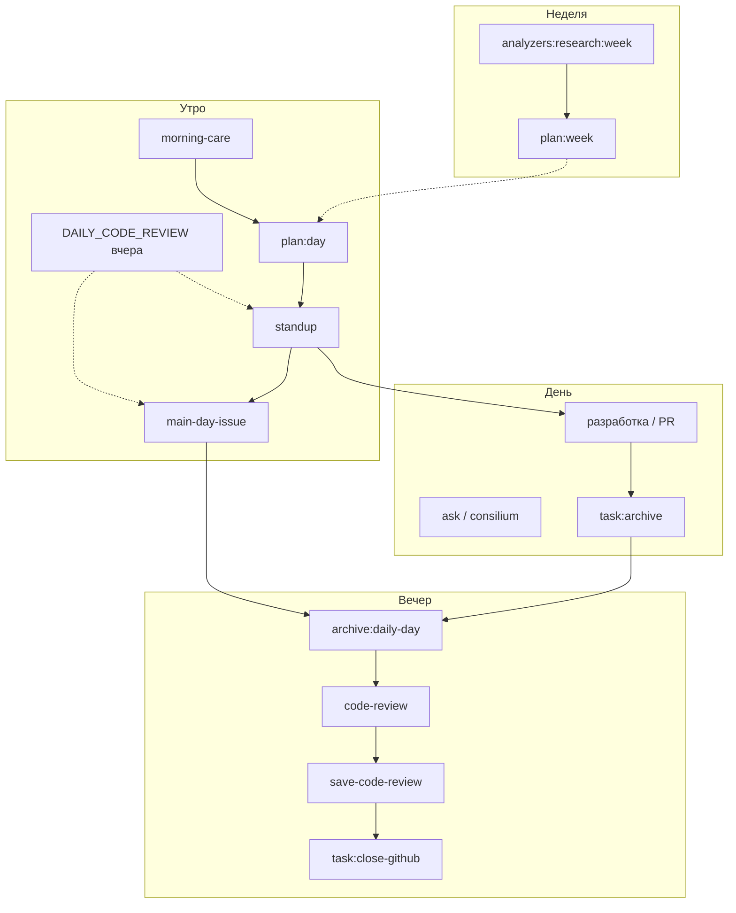

# Ритм разработки Membrana

Практический регламент: **какие `yarn`-команды запускать утром, вечером, раз в неделю и по ситуации**, чтобы повестка дня оставалась связной со стратегией ([`WHITE_PAPER.md`](./WHITE_PAPER.md)), архитектурой и открытыми задачами.

Скрипты пишут артефакты в `docs/` — их можно коммитить, читать агентам и использовать как вход для Cursor.

**Требования для «умных» скриптов:** `ANTHROPIC_API_KEY` в корневом `.env` (см. `.env.example`). Для Issues — `gh auth login`. Прокси при необходимости: `HTTPS_PROXY` / `ANTHROPIC_HTTPS_PROXY`.

---

## Сводная таблица

| Когда | Команды (порядок) | Артефакт |
|-------|-------------------|----------|
| **Утро** | `morning-care` → `plan:day` → `standup` → **`main-day-issue`** | читает вчерашний `DAILY_CODE_REVIEW.md`; пишет `STRATEGIC_PLAN_DAY`, `DAILY_STANDUP`, **`MAIN_DAY_ISSUE`** |
| **Вечер** | **`archive:daily-day`** → **`code-review`** → `task:archive` (по задачам) → `save-code-review` → `task:close-github` | архив плана/стендапа/фокуса, `DAILY_CODE_REVIEW.md` (+ архив), реестр, Issues |
| **Night Build** (опционально) | **`night:open`** → агент NB0…NBn → **`night:checkpoint`** → **`night:close`** → утро merge | `NIGHT_BUILD_ACTIVE.md`, `NIGHT_BUILD_LOG.md`, handoff в `docs/archive/night-build/` |
| **Понедельник / неделя** | `analyzers:research:week` → `plan:week` | `WEEKLY_ANALYZERS_RESEARCH.md`, `STRATEGIC_PLAN_WEEK.md` |
| **По необходимости** | `consilium`, `ask`, `task:list`, CI, **`mcp:verify-bootstrap`** | `docs/seanses/*`, `docs/discussions/*`, MCP docs |

---

## Утро (10–20 минут)

Цель: спланировать день, **учитывая вчерашнее вечернее code-review** (`docs/DAILY_CODE_REVIEW.md`) и **приоритеты детекции** после эпика #84 ([`FFT_METRICS_POTENTIAL_AND_LIMITS.md`](./prompts/FFT_METRICS_POTENTIAL_AND_LIMITS.md) §6), и зафиксировать один фокус.

> **Code-review утром не запускаем.** Ревью кода — вечерняя процедура (`yarn code-review`). Утром только **читаем** уже сгенерированный `DAILY_CODE_REVIEW.md` (standup и main-day-issue подмешивают его как вход). **RAG operative** подмешивается автоматически (BM25 по недавним `docs/`); archive — только с `OPENAI_API_KEY` + индексом.

### Рабочая ветка: `techies68`

Повседневная интеграционная ветка — **`techies68`** (не `cursor/*` и не персональные `vesnin`/`dynin`, если Teamlead не назначил иное). В начале дня переключаемся на неё и подтягиваем remote:

```bash
git checkout techies68
git pull origin techies68
```

`yarn morning-care` делает это автоматически (если рабочее дерево чистое). Переопределение: `MEMBRANA_WORK_BRANCH=my-branch yarn morning-care`.

Ветки `cursor/*` — для разовых Cloud-задач; после merge переносим результат в `techies68`.

```bash
# 0. (вручную или через morning-care) рабочая ветка techies68

# 1. Среда: прокси, git, быстрый тест скриптов; опционально ping Anthropic
yarn morning-care
# без траты токенов:
yarn morning-care --no-anthropic

# 2. План на день (WHITE_PAPER + git за сутки)
yarn plan:day
yarn plan:day:full

# 3. Стендап: план + вчерашнее ревью + Issues + наброски packages/temp
yarn standup

# 4. Центральная задача дня (последний шаг утра — канон для агентов)
yarn main-day-issue
# зафиксировать focus вручную:
yarn main-day-issue --focus dsp-drone-detector

# без API (только локальная сборка):
yarn standup:dry
# operative RAG в контексте (без OPENAI_API_KEY); отключить: --no-rag
yarn standup --no-rag
# больше текста из temp:
yarn standup:full

# вся цепочка одной командой:
yarn ritual:day
# без вызовов Anthropic (только standup dry + main-day-issue с предупреждением):
yarn ritual:day:no-api
```

**Что читать после:** [`docs/MAIN_DAY_ISSUE.md`](./MAIN_DAY_ISSUE.md) — **обязательный фокус**; стендап и планы — контекст. [`docs/CURRENT_TASK.md`](./CURRENT_TASK.md) — только вспомогательный буфер (может содержать шум; см. [`TASK_PROMPT_WORKFLOW.md`](./prompts/TASK_PROMPT_WORKFLOW.md)).

> **Планирование детекции:** `yarn plan:day`, `yarn standup` и `yarn main-day-issue` подмешивают [`prompts/FFT_METRICS_POTENTIAL_AND_LIMITS.md`](./prompts/FFT_METRICS_POTENTIAL_AND_LIMITS.md). Не ставить магистралью «Этап 1.A / benchmark 3 DSP» — эшелон 0 на free-v1 исчерпан; магистраль — trends `DRONE_TIGHT`, validated data или эшелон 2 (нейро/zero-shot).

**Минимальный утренний набор** (нет API / экономия токенов):

```bash
yarn morning-care --no-anthropic
yarn standup:dry
yarn task:list
```

---

## В течение дня

| Действие | Команда |
|----------|---------|
| Список активных task-промптов | `yarn task:list` |
| Синхронизировать README реестра | `yarn task:sync-readme` |
| Совет **одной** роли по Issue | `yarn ask vesnin --gh-issue N "…"` |
| Коллективное решение (5 ролей, ≥20 реплик) | `yarn consilium --save-as topic "…"` |
| Локальная проверка перед PR | `yarn turbo run lint typecheck test build --continue` |
| Dev-клиент | `yarn workspace @membrana/client dev` |

После приёмки задачи M/L — сразу **`yarn task:archive <id>`** (не откладывать на вечер). Регламент: [`prompts/TASK_CLOSURE_REGULATION.md`](./prompts/TASK_CLOSURE_REGULATION.md).

---

## Вечер (15–25 минут)

Цель: **сохранить утренние артефакты дня**, **сгенерировать code-review** на сегодняшний код, зафиксировать закрытые задачи, сохранить снимок ревью, закрыть Issues батчем.

> **Порядок важен.** Утром `plan:day`, `standup` и `main-day-issue` **перезаписывают** `STRATEGIC_PLAN_DAY.md`, `DAILY_STANDUP.md`, `MAIN_DAY_ISSUE.md`. Вечером их нужно **сначала** уложить в архив, **потом** запускать code-review.

```bash
# 0. Снимок утренних артефактов (до code-review)
yarn archive:daily-day
# 0b. Incremental RAG index (non-blocking; нужен OPENAI_API_KEY + prior --full)
#     входит в yarn ritual:evening автоматически
yarn rag:index:incremental
# alias:
yarn save-daily-day
# принудительно второй снимок за тот же день:
yarn archive:daily-day --force

# 1. Code-review (вечерняя процедура → docs/DAILY_CODE_REVIEW.md)
#    Регламент: docs/prompts/CODE_REVIEW_REGULATION.md
yarn code-review
yarn code-review:full
# PR перед merge: yarn code-review:pr -- 140

# 2. Архив task-промптов, принятых за день (можно было и днём)
yarn task:archive <id> --notes "кратко: что сделано, PR, Issue"

# 3. Снимок ревью в docs/archive/daily-code-review/ (на завтра — история)
yarn save-code-review

# 4. Очередь и закрытие Issues на GitHub
yarn task:close-github:dry
yarn task:close-github

# 5. Team Evening Feedback — ретроспектива виртуальной команды
#    Регламент: docs/prompts/TEAM_EVENING_FEEDBACK_REGULATION.md
yarn team-evening-feedback
yarn team-evening-feedback:dry   # без API — только сбор контекста

# Периодический аудит backlog (после крупного эпика или раз в 2–4 недели):
# manifest → docs/issues/manifests/github-issues-audit-YYYY-MM-DD.json
# yarn issues:audit:apply --manifest docs/issues/manifests/github-issues-audit-YYYY-MM-DD.json
# См. docs/prompts/GITHUB_ISSUES_AUDIT_PROMPT.md

# архив дня + ревью + снимок ревью + закрытие Issues + team feedback одной командой:
yarn ritual:evening
```

**Выход team feedback:** `docs/seanses/team-evening-feedback-<YYYY-MM-DD>.md` — пять ролей, голосование за полезность дня (1–10), сводка на завтра, резюме Teamlead по стратегии.

### Архивация утренних артефактов (`archive:daily-day`)

| Что | Куда |
|-----|------|
| `docs/STRATEGIC_PLAN_DAY.md` | `docs/archive/daily-day/<YYYY-MM-DD>/STRATEGIC_PLAN_DAY.md` |
| `docs/DAILY_STANDUP.md` | `…/DAILY_STANDUP.md` |
| `docs/MAIN_DAY_ISSUE.md` | `…/MAIN_DAY_ISSUE.md` |
| метаданные | `…/manifest.json` (`archivedAt`, размеры, источники) |

**Ключ папки `<YYYY-MM-DD>`** берётся из дат в тексте (стендап `**YYYY-MM-DD**`, `MAIN_DAY_ISSUE` → `Дата`, комментарий `Сгенерировано`). Если файлов нет или дат нет — используется локальная календарная дата.

**Поведение:**

- Исходники в `docs/` **не удаляются** — только копия в архив.
- Повторный запуск без `--force` **пропускается**, если тот же набор байт уже лежит в архиве за этот день (в т.ч. в папке `<YYYY-MM-DD>_<время>`).
- Отсутствующий файл (не запускали утренний ритуал) — **предупреждение**, остальные копируются; если нет ни одного — exit 1.
- Навигация по архиву: [`docs/archive/README.md`](./archive/README.md).

**Перед уходом** (по желанию): полный CI и `git status` — завтрашний `plan:day` увидит свежий лог.

---

## Night Build (ночной спринт)

Цель: **автономная работа агента между вечером и утром** — рефакторинг, DRY, quality gate **без prod-deploy** и без расширения scope.

Полный регламент: [`NIGHT_SPRINT_REGULATION.md`](./NIGHT_SPRINT_REGULATION.md).

```bash
# После yarn ritual:evening — открыть sprint
yarn night:open --id cabinet-mp4-hardening-night-build

# Во время ночи (после каждой фазы NB0…NB3)
yarn night:checkpoint --phase NB0 --status pass --note "lint green"

# Перед сном / утром до ritual:day
yarn night:close --id cabinet-mp4-hardening-night-build
```

**Порядок:**

1. Вечер: `ritual:evening` → выбрать epic с `sprintKind: night-build` в реестре.
2. `night:open` — фиксирует ветку `night/<epic-id>-<date>`, чеклист NB*.
3. Агент работает по epic-промпту (блок «Night Build — промпт целиком»).
4. `night:close` — handoff в `docs/archive/night-build/<date>/HANDOFF.md`.
5. Утро: прочитать handoff → `yarn ritual:day` → merge PR в `techies68` → `yarn task:archive` по фазам.

**Не путать с дневным фокусом:** ночью канон — `NIGHT_BUILD_ACTIVE.md`, не `MAIN_DAY_ISSUE.md`.

**Первый эталонный эпик:** [`CABINET_MP4_HARDENING_NIGHT_BUILD_EPIC_PROMPT.md`](./prompts/CABINET_MP4_HARDENING_NIGHT_BUILD_EPIC_PROMPT.md).

---

## Раз в неделю

Рекомендуемый порядок: **сначала «радар» внешних идей**, потом **недельный план** (он подмешивает радар).

```bash
# Понедельник или воскресенье вечером — идеи для INTEGRATIONS_STRATEGY §4
yarn analyzers:research:week
# без Anthropic (только сбор ссылок):
yarn analyzers:research:week:dry

# План на следующую неделю (git за 7 дней + WHITE_PAPER + радар)
yarn plan:week
yarn plan:week:full
```

**Что читать:** [`WEEKLY_ANALYZERS_RESEARCH.md`](./WEEKLY_ANALYZERS_RESEARCH.md), [`STRATEGIC_PLAN_WEEK.md`](./STRATEGIC_PLAN_WEEK.md).

Раз в неделю имеет смысл **`yarn standup:full`**, если в `packages/temp/` накопились крупные наброски — они попадут в повестку.

---

## Периодически — «оживить» повестку

Эти команды **не ежедневные**; они добавляют глубину и неожиданные темы в планирование.

| Задача | Команда | Куда пишется |
|--------|---------|--------------|
| Спорное архитектурное решение (все роли) | `yarn consilium "вопрос"` | [`docs/seanses/`](./seanses/) |
| Уточнить границы у Teamlead / математика / верстки | `yarn ask <persona> --gh-issue N "…"` | [`docs/discussions/`](./discussions/) |
| Аудит одного документа | `yarn anthropic:task docs/ARCHITECTURE.md "…"` | stdout |
| Проверка ключа / прокси | `yarn anthropic:smoke` | stdout |
| Исследование новых аналайзеров | `yarn analyzers:research:week` | `WEEKLY_ANALYZERS_RESEARCH.md` |
| Ревью через Claude Code CLI | `yarn claude:code` | по сценарию в промпте |

**Персонажи `yarn ask`:** `vesnin`, `ozhegov`, `dynin`, `rodchenko` (см. [`VIRTUAL_TEAM_PROMPT.md`](./VIRTUAL_TEAM_PROMPT.md)).

**Когда звать консилиум, а не `ask`:** вопрос затрагивает UI + аудио + пакеты + нужен **единый консенсус** в репозитории — см. [`prompts/CONSILIUM_PROMPT.md`](./prompts/CONSILIUM_PROMPT.md).

---

## Схема потока



---

## Артефакты по папкам

| Папка / файл | Кто создаёт |
|--------------|-------------|
| `docs/DAILY_STANDUP.md` | `yarn standup` |
| `docs/MAIN_DAY_ISSUE.md` | `yarn main-day-issue` (после standup) |
| `docs/CURRENT_TASK.md` | вручную / агент (буфер, не канон) |
| `docs/STRATEGIC_PLAN_DAY.md` | `yarn plan:day` |
| `docs/STRATEGIC_PLAN_WEEK.md` | `yarn plan:week` |
| `docs/DAILY_CODE_REVIEW.md` | `yarn code-review` (**вечер**); утром только читается |
| `docs/archive/daily-day/<YYYY-MM-DD>/` | `yarn archive:daily-day` (**вечер**, до code-review) |
| `docs/archive/daily-code-review/` | `yarn save-code-review` |
| [`docs/archive/README.md`](./archive/README.md) | навигация по снимкам |
| `docs/WEEKLY_ANALYZERS_RESEARCH.md` | `yarn analyzers:research:week` |
| `docs/seanses/` | `yarn consilium` |
| `docs/discussions/` | `yarn ask` |
| `docs/tasks/` | `yarn task:archive`, реестр |
| `docs/MCP_*.md`, `docs/mcp/` | MCP rollout (#50–#54); `yarn mcp:verify-bootstrap` |

---

## Связанные документы

- [`VIRTUAL_TEAM_PROMPT.md`](./VIRTUAL_TEAM_PROMPT.md) — роли, `ask`, `consilium`, стендап
- [`TASKS_MANAGEMENT.md`](./TASKS_MANAGEMENT.md) — Issues, Linear, планирование
- [`prompts/TASK_PROMPT_WORKFLOW.md`](./prompts/TASK_PROMPT_WORKFLOW.md) — постановка M/L задач
- [`prompts/TASK_CLOSURE_REGULATION.md`](./prompts/TASK_CLOSURE_REGULATION.md) — закрытие вечером
- [`CONTRIBUTING.md`](./CONTRIBUTING.md) — PR и CI
- [`MCP_ROLLOUT_PLAN.md`](./MCP_ROLLOUT_PLAN.md) — фазы MCP (#50–#54), fallback без ключей
- [`AGENTS.md`](../AGENTS.md) — шпаргалка для Cloud Agents
