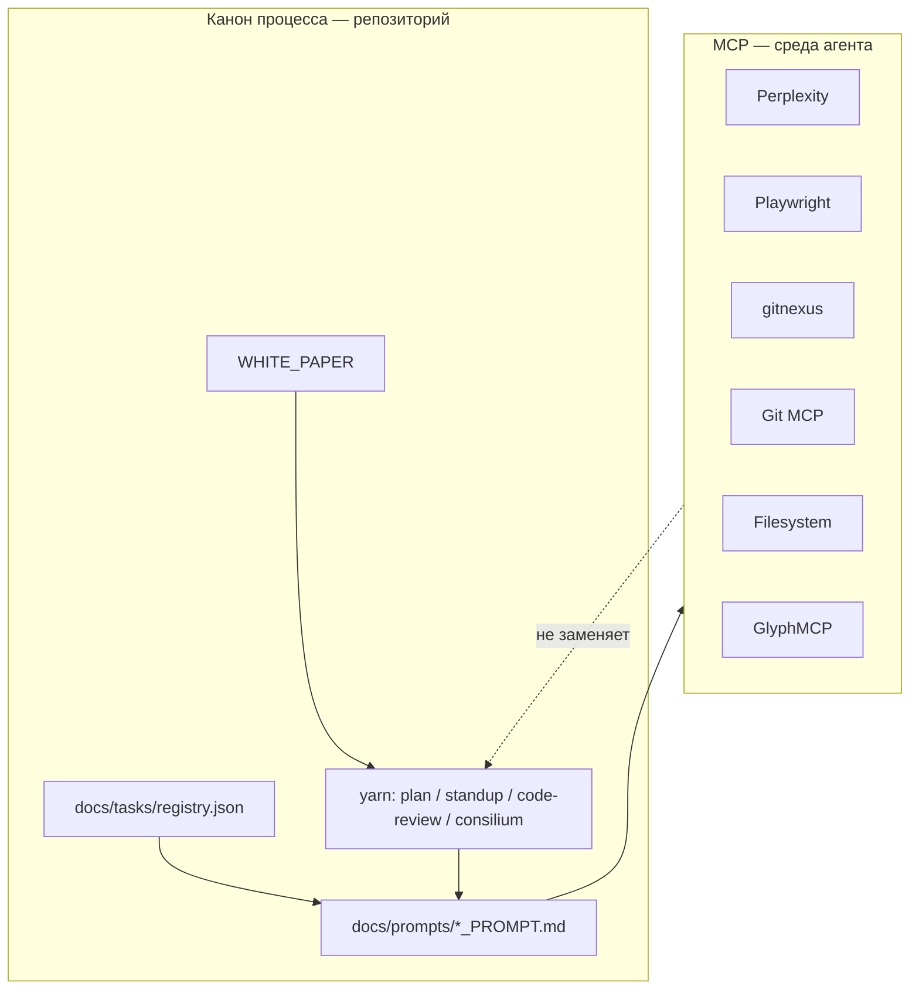

# MCP_INTEGRATION_STRATEGY — интеграция MCP-серверов в процесс Membrana

> **Статус:** v1.0 — рабочая стратегия (2026-05-20).
> **Хранитель:** Teamlead (Vesnin). Правки — через PR с пометкой `/architect`.
>
> **Процедура установки** (этапы, конфиги, приёмочные тесты): [`TZ_MCP_Servers_Membrana_v3.md`](./TZ_MCP_Servers_Membrana_v3.md).
> Этот документ — **политика и использование**; ТЗ — **runbook развёртывания**.

---

## 0. TL;DR

1. MCP — **расширение среды агента** (Cursor / Claude Desktop), а не замена `yarn`-ритуалов, реестра задач и GitHub Issues.
2. Стандартный контур — **шесть серверов**: Perplexity, Playwright, gitnexus, Git, Filesystem, GlyphMCP. **Chrome MCP в основной конфиг не входит.**
3. Каждый сервер привязан к **ролям виртуальной команды** (Vesnin, Ozhegov, Dynin, Boyarskiy, Rodchenko) — см. §3.
4. Перед задачами M/L агент читает этот документ; в task-промпте указывается, **какие MCP уместны** для конкретной работы.
5. Секреты (`PERPLEXITY_API_KEY`, `GLYPHMCP_API_TOKEN`) — только в локальном `mcp.json` / `claude_desktop_config.json`, **никогда в git и чатах**.

---

## 1. Место MCP в инженерном процессе



| Слой | Что фиксирует истину | MCP |
|------|----------------------|-----|
| Стратегия | `WHITE_PAPER.md`, `STRATEGIC_PLAN_*` | Perplexity — отраслевый research; Glyph — схемы для внешних материалов |
| Постановка задачи | Issue, реестр, task-промпт, `MAIN_DAY_ISSUE.md` | Glyph — диаграммы в промпте; gitnexus — границы пакетов до кода |
| Реализация | PR, CI, `yarn turbo …` | gitnexus + Git — навигация и история контрактов |
| Верификация | `DETECTOR_BENCHMARK.md`, stage-gate | Filesystem — метаданные датасетов; композитный сценарий — см. ТЗ §7.7 |
| Ритм дня | `DEVELOPER_RHYTHM.md` | **Не вызывается** вместо `yarn standup` / `code-review` |

**Правило:** артефакты, которые должны пережить сессию агента (план дня, DoD, отчёт в Issue), остаются в `docs/` и Issues. MCP помогает **собрать данные** для этих артефактов, но не подменяет их запись в репозиторий.

---

## 2. Состав серверов и приоритеты

| Сервер | Назначение | Приоритет | Секрет | Исключения |
|--------|------------|-----------|--------|------------|
| **gitnexus** | Граф TS-кода: зависимости, вызовы, реализации интерфейсов (`DroneDetector` и др.) | обязательный | нет | После крупных рефакторингов — `gitnexus analyze` из корня репо |
| **Git MCP** | `log`, `diff`, история контрактов между релизами | обязательный | нет | Путь репозитория — абсолютный, в конфиге |
| **Filesystem** | Whitelist: корень Membrana + каталог датасетов (метаданные `.wav`, без чтения бинарника в чат) | обязательный | нет | Не монтировать `$HOME` целиком |
| **Playwright** | Изолированный браузер: датасеты, документация, скриншоты | обязательный | нет | Не заменяет UI-тесты Vitest; не трогает личный Chrome |
| **Perplexity** | Research с цитатами: акустика БПЛА, YAMNet/CLAP, counter-UAS | обязательный | API-ключ | Дополняет, не заменяет `yarn analyzers:research:week` |
| **GlyphMCP** | Excalidraw-диаграммы для task-промптов и документации | рекомендуемый | API-токен | Текст уходит на `glyphmcp.dev` — см. §5 |
| **Chrome MCP** | — | **запрещён** в основном контуре | — | Только отдельная процедура с изолированным профилем (ТЗ §безопасность) |
| **mcp-firewall** | — | отложен | — | До production / доступа третьих лиц |

**Конфигурация:** `%USERPROFILE%\.cursor\mcp.json` (Cursor) и `%APPDATA%\Claude\claude_desktop_config.json` (Claude Desktop). Шаблон и пути — [`TZ_MCP_Servers_Membrana_v3.md`](./TZ_MCP_Servers_Membrana_v3.md) §6–9. В репозитории — только `.cursor/mcp.json` **без секретов** (сейчас: gitnexus; полный стек — после развёртывания по ТЗ).

---

## 3. Привязка к виртуальной команде

Роли из [`VIRTUAL_TEAM_PROMPT.md`](./VIRTUAL_TEAM_PROMPT.md) — единственный канон. Термины «стратег / архитектор / верификатор» из ТЗ — **синонимы зон**, не отдельные персонажи.

| Персонаж | Роль | MCP-серверы | Типовые сценарии |
|----------|------|-------------|------------------|
| **Vesnin** | Teamlead | Perplexity, Playwright, gitnexus, Git, Glyph | Stage-gate readiness, границы модулей, отраслевой контекст, pitch/white paper (обобщённые схемы) |
| **Ozhegov** | Структурщик | **gitnexus**, **Git** | Реализации `DroneDetector`, циклы зависимостей сервисов, история изменений `detector-base` |
| **Dynin** | Математик | Perplexity, **Filesystem** | Формальные методы (TDOA, кепстральный анализ), метаданные датасетов, сравнение open-моделей |
| **Boyarskiy** | Музыкант | Playwright, Filesystem | Страницы публичных датасетов, условия записи; сверка с `DATASET.md` |
| **Rodchenko** | Верстальщик | Glyph (опц.), Playwright (скриншоты) | Схемы data flow для промптов; скриншоты demo — не для верстки клиента по `DESIGN.md` |

**Верификация stage-gate** — коллективная: Vesnin + Ozhegov + Dynin; композитный сценарий — ТЗ тест **7.7** (gitnexus → Git → Filesystem → Glyph).

---

## 4. Когда использовать MCP (по типу задачи)

Используй таблицу при составлении task-промпта ([`TASK_PROMPT_TEMPLATE.md`](./prompts/TASK_PROMPT_TEMPLATE.md)) и в блоке «Промпт целиком».

| Тип задачи | Рекомендуемые MCP | Не использовать |
|------------|-------------------|-----------------|
| Новый / изменение детектора (`packages/services/detectors/*`) | gitnexus, Git | Glyph с точными метриками precision/recall |
| Research анализатора (каталог §4 INTEGRATIONS_STRATEGY) | Perplexity; недельный радар — `yarn analyzers:research:week` | — |
| Benchmark / датасет | Filesystem, gitnexus | Чтение целых WAV в промпт |
| Архитектурный консилиум / ADR | gitnexus, Git; фиксация — `yarn consilium` | — |
| UI / плагин клиента | grep/IDE; **DESIGN.md** канон | Playwright для верстки компонентов |
| Внешние материалы (pitch, grant) | Perplexity, Glyph (обобщённые слои), Playwright | Имена заказчиков, объекты внедрения в Glyph |
| Code-review вечером | — | MCP **не** заменяет `yarn code-review` |

**Явное правило для агента в task-промпте:**

```text
MCP: использовать <список>; конфиденциальность Glyph — только обобщённые компоненты;
артефакты записать в docs/ / Issue, не только в ответ чата.
```

---

## 5. Безопасность и конфиденциальность

1. **Chrome MCP** — не в стандартном конфиге (доступ к сессиям пользовательского браузера).
2. **Filesystem** — только whitelist (корень репо + `datasets/` или внешний путь из ТЗ §5).
3. **gitnexus** — индекс локально (`.gitnexus/` в `.gitignore`); код в облако не отправляется.
4. **GlyphMCP** — на сервер уходит **текст описания**. Запрещено: имена заказчиков, конкретные объекты, точные метрики stage-gate, конфиденциальные параметры архитектуры. Разрешено: «узел акустической разведки», «слой слияния», «DSP-ветка / neural-ветка».
5. **Секреты** — в менеджере паролей + локальный MCP-конфиг; эталон с плейсхолдерами — общий vault команды (ТЗ §8).
6. **При компрометации ключа** — отзыв в кабинете сервиса, перевыпуск, без коммита в git.

---

## 6. Связь с другими стратегиями

| Документ | Связь |
|----------|--------|
| [`INTEGRATIONS_STRATEGY.md`](./INTEGRATIONS_STRATEGY.md) | Perplexity — внешний research для кандидатов в §4; внедрение моделей — по эшелонам «локально → сервер → API», не через MCP |
| [`DEVELOPER_RHYTHM.md`](./DEVELOPER_RHYTHM.md) | Утро/вечер — `yarn`; MCP — по запросу в сессии агента |
| [`TASK_PROMPT_WORKFLOW.md`](./prompts/TASK_PROMPT_WORKFLOW.md) | Task-промпт может ссылаться на §4 этой стратегии |
| [`DATASET.md`](./DATASET.md) | Filesystem MCP для инвентаризации файлов |
| [`DETECTOR_BENCHMARK.md`](./DETECTOR_BENCHMARK.md) | Верификатор сверяет метрики; gitnexus — покрытие реализаций тестами |

---

## 7. Эксплуатация и обслуживание

| Событие | Действие |
|---------|----------|
| Первичная установка | ТЗ этапы 1–9 |
| Клон репозитория на новую машину | `gitnexus analyze` в корне; проверить пути в `mcp.json` |
| Крупный рефакторинг `packages/services/*` | `gitnexus analyze` |
| Смена пути к датасетам | Обновить args Filesystem в MCP-конфиге |
| Новый участник команды | Прочитать §0–5; пройти тесты ТЗ §7 |
| Откат | ТЗ §«Откат и удаление» |

**Definition of Done «MCP развёрнут»:** шесть серверов active в Cursor; тесты 7.3, 7.4, 7.5, 7.7 пройдены; раздел в корневом `README.md`; запись в `STRATEGIC_PLAN_DAY.md`.

---

## 8. Поэтапное внедрение (рекомендация команды)

| Фаза | Серверы | Критерий |
|------|---------|----------|
| **A** | gitnexus, Git, Filesystem | Навигация по детекторам и датасетам |
| **B** | + Perplexity, Playwright | Research и браузерные сценарии |
| **C** | + GlyphMCP | Диаграммы в промптах; правило §5 донесено |
| **D** | Приёмка 7.7 + README | «MCP-окружение разработчика» |

Фаза C не блокирует разработку кода; фазы A–B — желательны до активной работы над stage-gate.

---

## 9. Чего не делаем

- Не коммитим `mcp.json` / `claude_desktop_config.json` с реальными ключами.
- Не запускаем MCP-серверы вручную в терминале «для проверки» (stdio, ждут клиента).
- Не подменяем `yarn consilium` / `yarn ask` вызовами MCP без сохранения протокола в `docs/seanses/` / `docs/discussions/`.
- Не используем MCP Filesystem для чтения `.env`, ключей, личных каталогов.
- Не пишем собственные `.mjs`-обёртки для старта серверов — только `command` + `args` в конфиге (ТЗ §«Чего не делаем»).

---

## 10. Декомпозиция внедрения (задачи реестра)

Пять задач **M** в [`docs/tasks/registry.json`](./tasks/registry.json), промпты и шаблоны Issues:

| `id` | Назначение |
|------|------------|
| `mcp-repo-bootstrap` | PR: шаблоны конфига, `.gitignore`, `datasets/` |
| `mcp-workstation-phase-a` | gitnexus + Git + Filesystem; тесты 7.3–7.5 |
| `mcp-workstation-phase-b` | Perplexity + Playwright; тесты 7.1–7.2 |
| `mcp-workstation-phase-c` | GlyphMCP + правило конфиденциальности; тест 7.6 |
| `mcp-rollout-acceptance` | Композит 7.7, vault, запись в план дня |

Подробно: [`MCP_ROLLOUT_PLAN.md`](./MCP_ROLLOUT_PLAN.md).

---

## 11. Ссылки для системных промптов

Документ обязателен к прочтению при:

- создании нового `docs/prompts/*_PROMPT.md` ([`TASK_PROMPT_WORKFLOW.md`](./prompts/TASK_PROMPT_WORKFLOW.md));
- работе агента в Cursor по `.cursorrules`;
- внешних материалах Claude Project ([`foundation/CLAUDE_PROJECT_SYSTEM_PROMPT.md`](./foundation/CLAUDE_PROJECT_SYSTEM_PROMPT.md)) — только Perplexity/Glyph с правилами §5.

| Документ | Зачем |
|----------|--------|
| [`TZ_MCP_Servers_Membrana_v3.md`](./TZ_MCP_Servers_Membrana_v3.md) | Установка, JSON-конфиг, приёмочные тесты |
| [`VIRTUAL_TEAM_PROMPT.md`](./VIRTUAL_TEAM_PROMPT.md) | Роли и формат ответа |
| [`virtual-team/PROMPT_*.md`](./virtual-team/) | MCP по персонажу (кратко в каждом промпте) |
