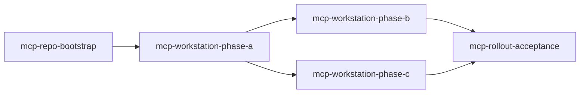

# План внедрения MCP (декомпозиция задач)

> **Статус:** 2026-05-20. Канон политики: [`MCP_INTEGRATION_STRATEGY.md`](./MCP_INTEGRATION_STRATEGY.md).
> Runbook: [`TZ_MCP_Servers_Membrana_v3.md`](./TZ_MCP_Servers_Membrana_v3.md).
> Постановка задач: [`prompts/TASK_PROMPT_WORKFLOW.md`](./prompts/TASK_PROMPT_WORKFLOW.md).

---

## Сколько задач и почему

| Вариант | Задач | Плюсы | Минусы |
|---------|-------|-------|--------|
| **Рекомендуемый** | **5** | Чёткий DoD на PR и на каждую фазу станции; параллель B∥C после A | Больше Issues |
| Сжатый | 3 | Меньше бюрократии | Смешение «репо» и «локальная установка» в одном DoD |
| Монолит | 1×L | Один Issue | Плохая приёмка, долгий фокус `MAIN_DAY_ISSUE` |

**Решение команды:** **5 задач M** — одна с merge в `techies68`, четыре операционные (артефакт — отчёт в Issue + локальный MCP active, без обязательного кода).

Фазы B и C можно вести **параллельно** разными людьми после завершения A.

---

## Реестр задач

| # | `id` | Размер | PR в репо | Промпт | Фаза стратегии |
|---|------|--------|-----------|--------|----------------|
| 1 | `mcp-repo-bootstrap` | M | **Да** | [`MCP_REPO_BOOTSTRAP_PROMPT.md`](./prompts/MCP_REPO_BOOTSTRAP_PROMPT.md) | Подготовка артефактов в git |
| 2 | `mcp-workstation-phase-a` | M | Нет* | [`MCP_WORKSTATION_PHASE_A_PROMPT.md`](./prompts/MCP_WORKSTATION_PHASE_A_PROMPT.md) | A: gitnexus + Git + Filesystem |
| 3 | `mcp-workstation-phase-b` | M | Нет* | [`MCP_WORKSTATION_PHASE_B_PROMPT.md`](./prompts/MCP_WORKSTATION_PHASE_B_PROMPT.md) | B: Perplexity + Playwright |
| 4 | `mcp-workstation-phase-c` | M | Нет* | [`MCP_WORKSTATION_PHASE_C_PROMPT.md`](./prompts/MCP_WORKSTATION_PHASE_C_PROMPT.md) | C: GlyphMCP + правило конфиденциальности |
| 5 | `mcp-rollout-acceptance` | M | Опц. | [`MCP_ROLLOUT_ACCEPTANCE_PROMPT.md`](./prompts/MCP_ROLLOUT_ACCEPTANCE_PROMPT.md) | D: тест 7.7 + «MCP развёрнут» |

\*Опциональный PR только для строки в `STRATEGIC_PLAN_DAY.md` / снимка приёмки в `docs/archive/`.

**Не в реестре:** [`MCP_INTEGRATION_STRATEGY.md`](./MCP_INTEGRATION_STRATEGY.md) — уже принята политика (документ в репо, без отдельной задачи M/L).

---

## Шаблоны GitHub Issue (wish)

Создать **5 Issues** до старта; в каждом: ссылка на `id`, `promptPath`, этап `WHITE_PAPER` §8 (инфраструктура агента).

### Issue 1 — `mcp-repo-bootstrap`

**Заголовок:** Add MCP repo bootstrap: example configs, gitnexus gitignore, datasets scaffold

**Acceptance criteria:**

- [ ] `.gitignore` содержит `.gitnexus/`
- [ ] `.cursor/mcp.json` — шаблон без секретов (gitnexus global, Git, Filesystem)
- [ ] `docs/claude_desktop_config.example.json` с плейсхолдерами
- [ ] `datasets/.gitkeep` или документирован внешний путь
- [ ] CI зелёный; ссылка на task-промпт и `mcp-repo-bootstrap`

### Issue 2 — `mcp-workstation-phase-a`

**Заголовок:** Deploy MCP phase A on workstation: gitnexus, Git, Filesystem

**Acceptance criteria:**

- [ ] Node ≥18, uv, Git for Windows (ТЗ §1)
- [ ] `gitnexus analyze` + `gitnexus list` показывает Membrana
- [ ] Cursor MCP: gitnexus, Git, Filesystem — active
- [ ] Тесты ТЗ 7.3, 7.4, 7.5 пройдены; скрин/log в комментарии Issue

### Issue 3 — `mcp-workstation-phase-b`

**Заголовок:** Deploy MCP phase B: Perplexity and Playwright

**Acceptance criteria:**

- [ ] Perplexity API key в vault, не в git
- [ ] Серверы Perplexity + Playwright active в Cursor
- [ ] Тесты ТЗ 7.1, 7.2 пройдены; отчёт в Issue

### Issue 4 — `mcp-workstation-phase-c`

**Заголовок:** Deploy MCP phase C: GlyphMCP and confidentiality rule

**Acceptance criteria:**

- [ ] Аккаунт GlyphMCP, токен в vault
- [ ] Команда ознакомлена с правилом §5 стратегии
- [ ] Glyph active; тест ТЗ 7.6 пройден

### Issue 5 — `mcp-rollout-acceptance`

**Заголовок:** MCP rollout acceptance: composite test 7.7 and deployment record

**Acceptance criteria:**

- [ ] Композитный тест 7.7 пройден
- [ ] Запись в `STRATEGIC_PLAN_DAY.md` или архив дня
- [ ] Эталонный конфиг (плейсхолдеры) в vault команды
- [ ] Все пять задач реестра архивированы

---

## Постановка Teamlead (выполнено 2026-05-20)

| `id` | GitHub Issue |
|------|----------------|
| `mcp-repo-bootstrap` | [#50](https://github.com/officefish/Membrana/issues/50) |
| `mcp-workstation-phase-a` | [#51](https://github.com/officefish/Membrana/issues/51) |
| `mcp-workstation-phase-b` | [#52](https://github.com/officefish/Membrana/issues/52) |
| `mcp-workstation-phase-c` | [#53](https://github.com/officefish/Membrana/issues/53) |
| `mcp-rollout-acceptance` | [#54](https://github.com/officefish/Membrana/issues/54) |

Черновики тел Issues: [`docs/tasks/issue-drafts/`](./tasks/issue-drafts/). Labels: `enhancement`, `status:triage`, `package:infra`.

**Фокус цепочки (рекомендация):** `mcp-repo-bootstrap` → [#50](https://github.com/officefish/Membrana/issues/50).

---

## Порядок работы для Teamlead

1. ~~Создать 5 Issues → проставить `githubIssue` в `registry.json`.~~ ✓
2. `yarn task:sync-readme`.
3. В `MAIN_DAY_ISSUE` — только **одна** активная задача цепочки (сейчас: **`mcp-repo-bootstrap`** / #50).
4. После merge bootstrap — фокус на phase-a (можно назначить ответственного за станцию).
5. Закрытие: [`TASK_CLOSURE_REGULATION.md`](./prompts/TASK_CLOSURE_REGULATION.md) на каждую; финальный gate — `mcp-rollout-acceptance`.

---

## Оценка трудозатрат

| Задача | Оценка | Исполнитель |
|--------|--------|-------------|
| mcp-repo-bootstrap | 2–4 ч | агент + PR |
| mcp-workstation-phase-a | 2–3 ч | разработчик Windows |
| mcp-workstation-phase-b | 1–2 ч | тот же / стратег |
| mcp-workstation-phase-c | 1–2 ч | Vesnin / Rodchenko |
| mcp-rollout-acceptance | 1 ч | Vesnin + Ozhegov |

**Суммарно:** ~1–2 рабочих дня на команду 4–7 человек (параллель B/C).

---

## Связь с `MAIN_DAY_ISSUE`

Не ставить все пять задач фокусом одного дня. Рекомендуемая последовательность дней:

1. День 1 — `mcp-repo-bootstrap`
2. День 2 — `mcp-workstation-phase-a`
3. День 3 — `mcp-workstation-phase-b` (+ при возможности C)
4. День 4 — `mcp-workstation-phase-c` (если не сделано) + `mcp-rollout-acceptance`
