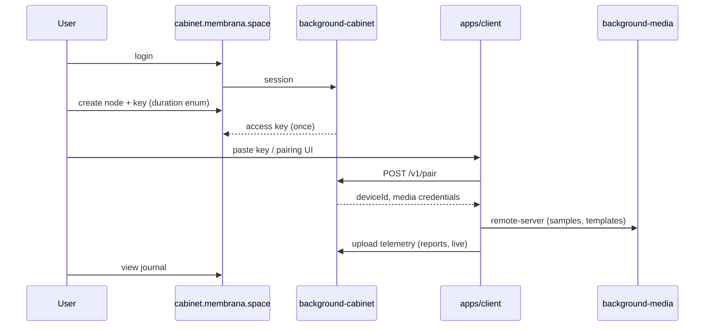

# Membrane Platform — личный кабинет и облачное поле

> **Статус:** спецификация v1 (документация; код — эпик [#67](https://github.com/officefish/Membrana/issues/67)).  
> **Связано:** [`BACKGROUND_SERVERS.md`](./BACKGROUND_SERVERS.md), [`MEDIA_LIBRARY_ARCHITECTURE.md`](./MEDIA_LIBRARY_ARCHITECTURE.md), [`ARCHITECTURE.md`](./ARCHITECTURE.md).

---

## Назначение

**Membrane Platform** связывает веб-кабинет, идентичность пользователя и полевой клиент `apps/client` через единую модель **Мембрана → Узел → Устройство**. Data-plane (сэмплы, шаблоны, квоты) остаётся в `background-media`; учётные записи и ключи — в новом `background-cabinet`.

| URL (цель) | Роль |
|------------|------|
| `membrana.space` | Маркетинг + вход (login) |
| `cabinet.membrana.space` | Личный кабинет (`apps/cabinet`) |
| `media.membrana.space` | Data-plane (`background-media`) |
| `apps/client` (десктоп/браузер) | Полевой анализ; режим pairing |

---

## Глоссарий

| Термин | Определение |
|--------|-------------|
| **Мембрана (Membrane)** | Единый контекст поля для пользователя: квоты, узлы, облачный журнал. v1: **одна на пользователя**. |
| **Узел (Node)** | Логический шлюз между мембраной и одним экземпляром `apps/client`. v1: **один на мембрану**. |
| **Ключ доступа (Node Access Key)** | Секрет для pairing клиента с узлом. **Формат** в UI = выбор **срока действия** (TTL), не тип QR/файл. |
| **Устройство (Device)** | Запись paired-клиента; маппится на `deviceId` в `background-media`. |
| **Тариф (Tariff)** | Набор лимитов (`datasetQuotaBytes`, `bufferQuotaBytes`, …). v1 seed: `free-v1`. |
| **TelemetryReport** | Серверная сущность: отчёт/снимок анализа (аналог записи client journal). |
| **TelemetryLiveRecord** | Серверная сущность: live-сессия / потоковая запись. |

---

## Форматы ключа: enum срока (TTL)

Поле **`duration`** типа `NodeAccessKeyDuration`. Пользователь выбирает один из пяти сроков; сервер выставляет `expiresAt`.

| `NodeAccessKeyDuration` | UI (RU) | Вычисление `expiresAt` |
|-------------------------|---------|-------------------------|
| `hours_4` | 4 часа | `createdAt + 4h` |
| `days_3` | 3 дня | `createdAt + 3d` |
| `weeks_2` | 2 недели | `createdAt + 14d` |
| `month_1` | 1 месяц | `createdAt` + 1 календарный месяц |
| `months_3` | 3 месяца | `createdAt` + 3 календарных месяца |

```typescript
/**
 * Срок действия ключа доступа к узлу.
 * Не описывает носитель (QR, файл) — только TTL.
 */
export enum NodeAccessKeyDuration {
  hours_4 = 'hours_4',
  days_3 = 'days_3',
  weeks_2 = 'weeks_2',
  month_1 = 'month_1',
  months_3 = 'months_3',
}

export interface NodeAccessKey {
  id: string;
  nodeId: string;
  /** Хэш секрета; plaintext показывается один раз при создании */
  secretHash: string;
  duration: NodeAccessKeyDuration;
  expiresAt: string; // ISO 8601
  revokedAt: string | null;
  createdAt: string;
}
```

**API (cabinet):** `POST /v1/nodes/:nodeId/access-keys` body `{ duration: NodeAccessKeyDuration }` → `{ key: string, expiresAt, duration }` (plaintext key только в ответе создания).

**Pairing (client):** `POST /v1/pair` с `{ accessKey: string }` → session + `deviceId` + media token.

---

## Тариф и квоты

```typescript
export interface Tariff {
  id: string; // e.g. 'free-v1'
  name: string;
  datasetQuotaBytes: number; // лимит датасета (коллекции user/system)
  bufferQuotaBytes: number;  // лимит buffer-коллекции
  maxActiveKeysPerNode?: number; // default 1
}
```

Квоты **не суммируются в одно поле**: `GET /v1/membranes/:id/quota` возвращает `{ dataset: QuotaUsage, buffer: QuotaUsage }`. Media-server читает лимиты из tariff мембраны при `POST` upload и `GET .../quota`.

Seed v1:

| id | dataset | buffer |
|----|---------|--------|
| `free-v1` | 1 GiB | 1 GiB |

---

## Поток данных



---

## Пакеты и границы

| Пакет | Порт (dev) | Stateful | Назначение |
|-------|------------|----------|------------|
| `@membrana/background-cabinet` | 3020 | **Да** | Auth, users, membranes, nodes, keys, tariffs, telemetry index |
| `@membrana/background-media` | 3010 | **Да** | Blobs, collections, templates (scope: `membraneId` / `deviceId`) |
| `apps/cabinet` | 5174 | — | SPA кабинета |
| `apps/client` | 5173 | — | Полевой клиент + pairing |

**В `background-cabinet` НЕ добавлять:** хранение WAV, вызовы Claude/Linear, FFT-логику.

**В `background-media` НЕ добавлять:** login/password, CRUD пользователей (только service-to-service или token от cabinet).

Подробнее о семействе серверов: [`BACKGROUND_SERVERS.md`](./BACKGROUND_SERVERS.md).

---

## Облачный журнал телеметрии

Две сущности на стороне cabinet (метаданные + blob/payload ref при необходимости):

| Тип | Назначение | Пересечение с client |
|-----|------------|----------------------|
| `TelemetryReport` | Завершённый отчёт, снимок метрик | Shared **render payload** для карточки в UI |
| `TelemetryLiveRecord` | Активная/недавняя live-сессия | Те же компоненты, другой lifecycle badge |

Клиентский `@membrana/telemetry-service` остаётся источником на узле; sync в cabinet — отдельная подзадача MP5.

---

## Roadmap (эпик)

| Фаза | Реестр `id` | Результат |
|------|-------------|-----------|
| MP0 | `membrane-platform-mp0-domain` | Этот документ + consilium |
| MP1 | `membrane-platform-mp1-auth-cabinet` | Auth + shell cabinet |
| MP2 | `membrane-platform-mp2-membrane-node-keys` | Domain + TTL keys |
| MP3 | `membrane-platform-mp3-client-pairing` | Pairing в client |
| MP4 | `membrane-platform-mp4-media-membrane` | Media per membrane |
| MP5 | `membrane-platform-mp5-telemetry-journal` | Cloud journal |
| MP6 | `membrane-platform-mp6-prod-deploy` | Финальная prod-регрессия + runbook |

**Приёмка фаз:** деплой на прод → prod-smoke → архив в реестре. Подробно: [`deploy/MEMBRANE_PLATFORM_DEPLOY.md`](./deploy/MEMBRANE_PLATFORM_DEPLOY.md).

Промпт эпика: [`prompts/MEMBRANE_PLATFORM_V1_EPIC_PROMPT.md`](./prompts/MEMBRANE_PLATFORM_V1_EPIC_PROMPT.md).

---

## Ветка разработки

Изменения затрагивают auth, новый `background-*`, pairing и контракты media → **`vesnin`** (см. [`CONTRIBUTING.md`](./CONTRIBUTING.md)).

---

*Версия: 2026-06-13 · Источник решений: [`discussions/membrane-platform-consilium-2026-06-13.md`](./discussions/membrane-platform-consilium-2026-06-13.md)*
