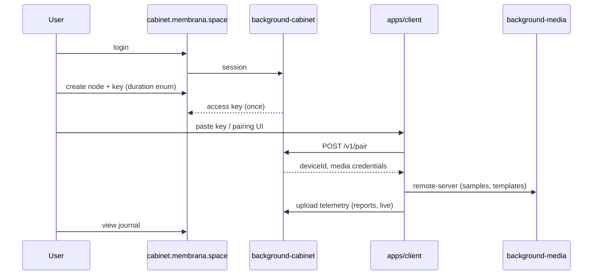

# Membrane Platform — личный кабинет и облачное поле

> **Статус:** спецификация v1 (документация; код — эпик [#67](https://github.com/officefish/Membrana/issues/67)).  
> **Связано:** [`BACKGROUND_SERVERS.md`](./BACKGROUND_SERVERS.md), [`MEDIA_LIBRARY_ARCHITECTURE.md`](./MEDIA_LIBRARY_ARCHITECTURE.md), [`ARCHITECTURE.md`](./ARCHITECTURE.md).

---

## Назначение

**Membrane Platform** связывает веб-кабинет, идентичность пользователя и полевой клиент `apps/client` через единую модель **Мембрана → Узел → Устройство**. Data-plane (сэмплы, шаблоны, квоты) остаётся в `background-media`; учётные записи и ключи — в новом `background-cabinet`.

| URL (цель) | Роль |
|------------|------|
| `membrana.space` | Маркетинг + вход (login) |
| `cabinet.membrana.space` | Личный кабинет (`apps/cabinet`) |
| `media.membrana.space` | Data-plane (`background-media`) |
| `apps/client` (браузер) | Полевой анализ в вебе; **автономный узел** или pairing |
| **Membrana Studio** (`apps/membrana-studio`) | Настольная **расширенная** версия: тот же `apps/client`, Electron + FS |
| **Membrana Device** (`apps/membrana-device`, план) | Настольный **узкий** конфигуратор: pairing + device-board только |

---

## Линейка полевых приложений

**Решение Teamlead (2026-06-17):** три SKU в одной платформе — веб-кабинет + полевой клиент + два настольных приложения разной глубины. Один renderer (`apps/client`) для web и Studio; Device — отдельный узкий shell.

| Продукт | Пакет | Аудитория | Состав UI | Хранение |
|---------|-------|-----------|-----------|----------|
| **Web client** | `apps/client` в браузере | Обычный полевой сценарий в браузере | Полный каталог модулей и плагинов | localStorage / IndexedDB / server (paired) |
| **Cabinet** | `apps/cabinet` | Управление мембраной, ключами, журналом в облаке | Веб-кабинет на `cabinet.membrana.space` | Сервер |
| **Membrana Studio** | `apps/membrana-studio` | **Продвинутые пользователи**, раннее тестирование новых возможностей через модульно-плагинную архитектуру; работа с контентом через **sample library** (в перспективе — **медиа-студия**) | Полный каталог (как web) | `electron-system-files` + server при paired |
| **Membrana Device** | `apps/membrana-device` (план) | Оператор прибора на объекте | **Только** pairing + **device-board** (текущий сценарий устройства, редактируемый) | `electron-system-files` при автономии; **без sample library** (осознанное ограничение v1) |

**Studio** — настольная «расширенная» рабочая станция: микрофон, журнал, библиотека, device-board, MP7 WebSocket; канал для beta/feature preview.

**Device** — лёгкое настольное приложение: линковка с сервером по ключу + device-board. Автономный режим через ФС допустим (сценарий, настройки), но **медиа-библиотека в Device не планируется** — нет продуктового смысла для узкого SKU.

**Архитектура shell (Studio MS1–MS3):** Electron main хранит journal / media-library / trends на диске и отдаёт в renderer через `electronAPI`; бизнес-логика анализа остаётся в `apps/client` + `packages/services/*`. Дублирование FS в shell — граница ОС, не второй доменный слой.

Эпики: Studio — [`prompts/MEMBRANA_STUDIO_DESKTOP_EPIC_PROMPT.md`](./prompts/MEMBRANA_STUDIO_DESKTOP_EPIC_PROMPT.md) (`membrana-studio-desktop`, Issue [#93](https://github.com/officefish/Membrana/issues/93)); Device — отдельный эпик после MS4 (общий опыт упаковки).

---

## Глоссарий

| Термин | Определение |
|--------|-------------|
| **Мембрана (Membrane)** | Единый контекст поля для пользователя: квоты, узлы, облачный журнал. v1: **одна на пользователя**. |
| **Узел (Node)** | Логический шлюз между мембраной и одним экземпляром `apps/client`. v1: **один на мембрану**. |
| **Ключ доступа (Node Access Key)** | Секрет для pairing клиента с узлом. **Формат** в UI = выбор **срока действия** (TTL), не тип QR/файл. |
| **Устройство (Device)** | Запись paired-клиента; маппится на `deviceId` в `background-media`. |
| **Режим узла (Node connection mode)** | Состояние полевого клиента (`apps/client` / Studio / Device): **связанный** (pairing с кабинетом) или **автономный** (локальная ФС, без облака). Пользователь **всегда** может выбрать автономный режим. |
| **Membrana Studio** | Настольное приложение — полный полевой клиент в Electron (`apps/membrana-studio` → renderer `apps/client`). |
| **Membrana Device** | Настольное приложение — только pairing + device-board (`apps/membrana-device`, отдельный эпик). |
| **Тариф (Tariff)** | Лимиты пользовательского хранилища (`userStorageQuotaBytes`), буфера live (`bufferQuotaBytes`) и **состав** системного dataset (`datasetCatalogId`). v1 seed: `free-v1`. |
| **TelemetryReport** | Серверная сущность: отчёт/снимок анализа (аналог записи client journal). |
| **TelemetryLiveRecord** | Серверная сущность: live-сессия / потоковая запись. |

---

## Форматы ключа: enum срока (TTL)

Поле **`duration`** типа `NodeAccessKeyDuration`. Пользователь выбирает один из пяти сроков; сервер выставляет `expiresAt`.

| `NodeAccessKeyDuration` | UI (RU) | Вычисление `expiresAt` |
|-------------------------|---------|-------------------------|
| `hours_4` | 4 часа | `createdAt + 4h` |
| `days_3` | 3 дня | `createdAt + 3d` |
| `weeks_2` | 2 недели | `createdAt + 14d` |
| `month_1` | 1 месяц | `createdAt` + 1 календарный месяц |
| `months_3` | 3 месяца | `createdAt` + 3 календарных месяца |

```typescript
/**
 * Срок действия ключа доступа к узлу.
 * Не описывает носитель (QR, файл) — только TTL.
 */
export enum NodeAccessKeyDuration {
  hours_4 = 'hours_4',
  days_3 = 'days_3',
  weeks_2 = 'weeks_2',
  month_1 = 'month_1',
  months_3 = 'months_3',
}

export interface NodeAccessKey {
  id: string;
  nodeId: string;
  /** Хэш секрета; plaintext показывается один раз при создании */
  secretHash: string;
  duration: NodeAccessKeyDuration;
  expiresAt: string; // ISO 8601
  revokedAt: string | null;
  createdAt: string;
}
```

**API (cabinet):** `POST /v1/nodes/:nodeId/access-keys` body `{ duration: NodeAccessKeyDuration }` → `{ key: string, expiresAt, duration }` (plaintext key только в ответе создания).

**Pairing (client):** `POST /v1/pair` с `{ accessKey: string }` → session + `deviceId` + media token.

---

## Тариф, квоты и dataset

Тариф задаёт **три независимые оси** — не смешивать в одно поле:

| Ось | Поле Tariff | Тип | Назначение |
|-----|-------------|-----|------------|
| **Пользовательские библиотеки** | `userStorageQuotaBytes` | байты | Суммарный объём звуков, которые пользователь хранит в **своих** коллекциях на сервере (paired) |
| **Буфер live** | `bufferQuotaBytes` | байты | Ёмкость `__buffer__`; live-запись пишет сюда; больший буфер → больше устройств мембраны может обрабатывать одновременно |
| **Системный dataset** | `datasetCatalogId` | каталог (id) | Read-only библиотека от разработчиков; **состав** звуков по тарифу; в будущем — база для обучения детекторов (дороже тариф → больше звуков → выше чувствительность) |

```typescript
export interface Tariff {
  id: string; // e.g. 'free-v1'
  name: string;
  userStorageQuotaBytes: number; // лимит user-коллекций (суммарно)
  bufferQuotaBytes: number;       // лимит buffer-коллекции
  datasetCatalogId: string;       // e.g. 'free-v1-catalog' — не байтовая квота
  maxActiveKeysPerNode?: number;  // default 1
}
```

**Квоты не суммируются:** `GET /v1/devices/:deviceId/quota` (media) возвращает:

```typescript
{
  userStorage: QuotaUsage;  // used/limit по kind=user (tariff-dataset не входит)
  buffer: QuotaUsage;       // used/limit по kind=buffer
  dataset: { catalogId: string; sampleCount: number }; // информационно, read-only каталог
}
```

Media-server читает лимиты из tariff мембраны при upload (MP4: копируются на `Device` при pair/register; env — fallback для legacy).

### Автономный режим (`nodeConnectionMode: autonomous`)

| Слой | Paired (облако) | Autonomous (локально) |
|------|-----------------|------------------------|
| User-коллекции | Сервер, `userStorageQuotaBytes` | Локальная ФС, без облачной квоты |
| Buffer | Сервер, `bufferQuotaBytes` | Локальный буфер |
| System dataset | Каталог `datasetCatalogId` в media | **Bundled library** в сборке client — фиксированный мини-набор, не зависит от тарифа |

Seed v1 (полная матрица на 3 тарифа — [`TARIFF_MATRIX.md`](./TARIFF_MATRIX.md)):

| id | userStorage | buffer | datasetCatalogId | samples в каталоге |
|----|-------------|--------|------------------|-------------------|
| `free-v1` | 1 GiB | 1 GiB | `free-v1-catalog` | **120** |
| `indie-v1` | 10 GiB (черновик) | 5 GiB (черновик) | `indie-v1-catalog` | **600** (план) |
| `business-v1` | 50 GiB (черновик) | 20 GiB (черновик) | `business-v1-catalog` | **3000** (план) |

> Тариф `state-v1` (12 000 сэмплов) — вне scope v1 матрицы; отдельный контракт после stage-gate.

В cabinet тарифный каталог показывается **один раз на мембрану**; буфер и user-коллекции — **per-node** (`deviceId`). См. [`discussions/cabinet-sample-library-consilium-2026-06-14.md`](./discussions/cabinet-sample-library-consilium-2026-06-14.md).

---

## Режимы работы узла (`apps/client`)

Полевой клиент **не обязан** быть связан с кабинетом. Pairing — опция, не единственный путь.

| Режим | `nodeConnectionMode` | Хранилище данных | Связь с платформой |
|-------|----------------------|------------------|-------------------|
| **Автономный** | `autonomous` | Файловая система (`electron-fs` / локальный fallback в web) | Нет pairing; сэмплы, шаблоны, журнал — локально |
| **Связанный** | `paired` | `remote-server` (`background-media`, scope мембраны) | Pairing по ключу из кабинета; sync журнала (MP5) |

### Правила UX (MP3, канон)

1. **Выбор при старте и в настройках** — пользователь в любой момент может выбрать «Автономный узел» или «Связь с мембраной» (pairing по ключу).
2. **Футер** — при `autonomous` в футере `apps/client` постоянное предупреждение: узел работает автономно (данные только локально, облачный кабинет не используется). При `paired` — индикатор связи (мембрана / узел / статус media).
3. **Ошибка связи с сервером** — если клиент в режиме `paired` и запрос к `background-cabinet` или `background-media` завершается сетевой/доступностной ошибкой, UI **предлагает перейти в автономный режим** (не блокирует работу анализа). Переход сохраняет локальные данные; повторный pairing — отдельное действие пользователя.
4. **Отвязка и отзыв ключа** — в режиме `paired` панель «Связь с мембраной» показывает метаданные связи и кнопку «Разорвать связь»; отзыв ключа в кабинете инвалидирует сессию клиента (`GET /v1/pair/status`, poll ~60 с).
4. **Автономный режим не требует** cabinet, media-server, ключа доступа или интернета для основной работы (микрофон, анализ, локальная библиотека).

Существующие индикаторы `StorageRuntimeIndicator` / `MediaLibraryStorageMode` расширяются в MP3: помимо backend хранения показывают **режим узла** (autonomous vs paired).

```typescript
/** Режим связи полевого узла с Membrane Platform (MP3). */
export type NodeConnectionMode = 'autonomous' | 'paired';
```

---

## Поток данных



---

## Пакеты и границы

| Пакет | Порт (dev) | Stateful | Назначение |
|-------|------------|----------|------------|
| `@membrana/background-cabinet` | 3020 | **Да** | Auth, users, membranes, nodes, keys, tariffs, telemetry index |
| `@membrana/background-media` | 3010 | **Да** | Blobs, collections, templates (scope: `membraneId` / `deviceId`) |
| `apps/cabinet` | 5174 | — | SPA кабинета |
| `apps/client` | 5173 | — | Полевой клиент + pairing |

**В `background-cabinet` НЕ добавлять:** хранение WAV, вызовы Claude/Linear, FFT-логику.

**В `background-media` НЕ добавлять:** login/password, CRUD пользователей (только service-to-service или token от cabinet).

Подробнее о семействе серверов: [`BACKGROUND_SERVERS.md`](./BACKGROUND_SERVERS.md).

---

## Облачный журнал телеметрии

Две сущности на стороне cabinet (метаданные + blob/payload ref при необходимости):

| Тип | Назначение | Пересечение с client |
|-----|------------|----------------------|
| `TelemetryReport` | Завершённый отчёт, снимок метрик | Shared **render payload** для карточки в UI |
| `TelemetryLiveRecord` | Активная/недавняя live-сессия | Те же компоненты, другой lifecycle badge |

Клиентский `@membrana/telemetry-service` остаётся источником на узле; sync в cabinet — MP5 (базовый upload + список).

**Retention и export по тарифу** — [`TARIFF_MATRIX.md`](./TARIFF_MATRIX.md) §«Облачный журнал»: export на всех тарифах; hot 3 / 10 / 30 дней; архив 40 GiB только на `business-v1`.

**Отложено (post-v1):** калибровка журнала и **единый рендеринг** client ↔ cabinet (parity карточек, live-badge, фильтры) — отдельная дорожная карта после консилиума; не блокирует MP6.

**Транспорт live-sync (2026-06-17):** push журнала и live-сигналов микрофона — **WebSocket** (см. §«Транспорт узла»); финальные отчёты и история — REST. Device-board и sample library — вне первого эпика (MP7).

---

## Транспорт узла (REST vs WebSocket)

> Источник: [`discussions/membrane-realtime-transport-consilium-2026-06-17.md`](./discussions/membrane-realtime-transport-consilium-2026-06-17.md) (полевые испытания + консилиум команды).

### Что такое MP7

**MP7** — рабочее имя **следующей фазы** roadmap Membrane Platform после MP6 (MP0…MP6 — эпик [#67](https://github.com/officefish/Membrana/issues/67)). Это не отдельный продукт: предполагаемый реестр `membrane-node-realtime-gateway`. Эпик в `docs/tasks/registry.json` **ещё не заведён**.

**Scope MP7 (уточнение product):** WebSocket только для **модуля микрофона** (live brief/level) и **журнала** (live append, presence). **Device-board** и **sample library** в MP7 не входят.

Связь **paired**-узла (`apps/client`) с платформой — **два канала**, не один протокол на всё:

| Плоскость | Транспорт | Сервер | Назначение |
|-----------|-----------|--------|------------|
| **Документы и blobs** | REST | `background-media`, `background-cabinet` | Pairing, квоты, сэмплы, `device-scenario`, upload отчётов, пагинация журнала |
| **События live (MP7)** | **WebSocket (WSS)** | `background-cabinet` (`NodeRealtimeGateway`) | Push журнала, mic-live brief/level, presence |
| **Сигнал и DSP** | — (локально) | узел | Web Audio, live-окна микрофона; **сырой PCM по сети не передаём** |

**Автономный режим** (`nodeConnectionMode: autonomous`) WebSocket **не использует**.

### REST — без изменения границ

Идемпотентные и крупные операции остаются на HTTP: `POST /v1/pair`, CRUD ключей и узла, **sample library** (blobs, templates), `GET/PUT .../device-scenario`, `POST` финального `TelemetryReport`, `GET` истории журнала с cursor.

### WebSocket — scope MP7

| Категория | Примеры | Зачем |
|-----------|---------|-------|
| Journal live | `journal.append`, live-session badge | Кабинет без poll |
| Mic live | `analysis.brief`, `analysis.level`, `mic.session` | Оперативная связь после окон 3 с |
| Presence / security | `node.online`, `session.invalidated` | Отзыв ключа без только poll 60 с |

Envelope: `{ v, channel, type, ts, payload }`; каналы MP7: `journal | mic-live | presence`. При обрыве — reconnect + cursor; fallback **REST poll**.

### Вне MP7 (отдельно)

| Тема | Когда |
|------|-------|
| Device-board runtime по WS | **MP7b** — после существенных правок device-board; канон ядра: [`SCENARIO_RUNTIME.md`](./SCENARIO_RUNTIME.md) |
| Sample library и WS | **Отдельный консилиум**; до решения — только REST |

### Что не делаем в MP7

- PCM/opus stream с микрофона в облако
- WebSocket в `background-media` или `background-office`
- Device-board и sample library на сокетах

### Roadmap (транспорт)

| Фаза | id | Содержание |
|------|-----|------------|
| MP7 | `membrane-node-realtime-gateway` | Gateway; **журнал + микрофон** |
| MP7b | `membrane-node-runtime-remote` | Device-board ↔ WS (RT0–RT7): канал `runtime` (run/stop/mode), headless `ScenarioRuntime`, multi-node, UX доски, reconnect + персист режима |
| TBD | `media-library-realtime` | Консилиум: нужен ли WS для библиотеки |
| MP8 | `membrane-realtime-hardening` | Reconnect, backpressure, нагрузка |

Контракты событий MP7 — ветка **`vesnin`**, типы в `@membrana/core`.

---

## Roadmap (эпик)

| Фаза | Реестр `id` | Результат |
|------|-------------|-----------|
| MP0 | `membrane-platform-mp0-domain` | Этот документ + consilium |
| MP1 | `membrane-platform-mp1-auth-cabinet` | Auth + shell cabinet |
| MP2 | `membrane-platform-mp2-membrane-node-keys` | Domain + TTL keys |
| MP3 | `membrane-platform-mp3-client-pairing` | Pairing + **автономный режим узла** в client |
| MP4 | `membrane-platform-mp4-media-membrane` | Media per membrane |
| MP5 | `membrane-platform-mp5-telemetry-journal` | Cloud journal |
| MP6 | `membrane-platform-mp6-prod-deploy` | Финальная prod-регрессия + runbook |
| MP7 | `membrane-node-realtime-gateway` | WebSocket: **журнал + микрофон** (NR0–NR6, [#92](https://github.com/officefish/Membrana/issues/92)) |

**Приёмка фаз:** деплой на прод → prod-smoke → архив в реестре. Подробно: [`deploy/MEMBRANE_PLATFORM_DEPLOY.md`](./deploy/MEMBRANE_PLATFORM_DEPLOY.md).

Промпт эпика: [`prompts/MEMBRANE_PLATFORM_V1_EPIC_PROMPT.md`](./prompts/MEMBRANE_PLATFORM_V1_EPIC_PROMPT.md).

---

## Ветка разработки

Изменения затрагивают auth, новый `background-*`, pairing и контракты media → **`vesnin`** (см. [`CONTRIBUTING.md`](./CONTRIBUTING.md)).

---

*Версия: 2026-06-17 · Источники: [`discussions/membrane-platform-consilium-2026-06-13.md`](./discussions/membrane-platform-consilium-2026-06-13.md); транспорт узла — [`discussions/membrane-realtime-transport-consilium-2026-06-17.md`](./discussions/membrane-realtime-transport-consilium-2026-06-17.md).*
