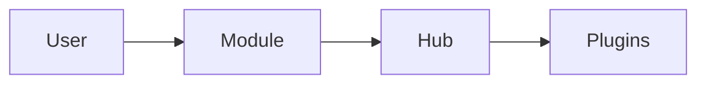

# Модуль: <!-- id --> — <!-- человекочитаемое имя -->

> **Catalog-спецификация** (живая правда о модуле).  
> Реестр: `docs/catalog/client/registry.json` · статус: `draft` | `stable` | `deprecated`  
> Task-промпты (история построения): <!-- ссылки docs/prompts/... -->

---

## 1. Идентичность

| Поле | Значение |
|------|----------|
| **id** | `<!-- registerLazyModule id -->` |
| **Версия модуля** | `<!-- из registerClientModules -->` |
| **Категория** | `<!-- Устройства / Анализ / … -->` |
| **Lead-роль** | `<!-- Vesnin / Ozhegov / … -->` |
| **Статус catalog** | `draft` |

---

## 2. Зачем пользователю

<!-- Сценарий 3–5 шагов: что пользователь делает и зачем. -->

1. …
2. …

---

## 3. UX-состояния

| Состояние | UI | a11y |
|-----------|-----|------|
| idle | … | … |
| loading | … | `aria-busy` / спиннер |
| active | … | … |
| error | … | `role="alert"` или `aria-live` |
| empty | … | … |

Заголовок модуля — только в `ModuleRenderer` ([`MODULE_AND_PLUGIN_UI.md`](../../MODULE_AND_PLUGIN_UI.md) §1). Не дублировать в теле модуля.

---

## 4. Архитектура

| Слой | Путь | Ответственность |
|------|------|-----------------|
| Модуль | `apps/client/src/modules/…` | … |
| Регистрация | `apps/client/src/modules/registerClientModules.ts` | `MembranaRegistry.registerLazyModule` |
| Сервисы | `@membrana/…-service` | … |
| Hub / coordinator | `…` | … |

### Запрещённые импорты

- Прямой Web Audio (`AudioContext`, `getUserMedia`, …) — только `@membrana/audio-engine-service`
- Импорт из других плагинов (кроме публичных panel API)
- `dist/` и deep paths пакетов

---

## 5. Конфиг

```ts
// defaultConfig из registerClientModules
interface <!-- Name -->Config {
  // …
}
```

- Persist: через Zustand store agenda (rehydrate).
- Sidebar плагинов: `apps/client/src/pluginSidebarDetails.tsx` (если есть).

---

## 6. Потоки данных



<!-- Уточнить: microphoneStreamHub, journal, engine, … -->

---

## 7. Плагины модуля

| plugin id | Catalog prompt | Кратко |
|-----------|----------------|--------|
| `…` | `prompts/plugins/….md` | … |

---

## 8. Сервисы

| Пакет | Использование |
|-------|----------------|
| `@membrana/audio-engine-service` | … |

---

## 9. Тестирование

| Область | Минимум |
|---------|---------|
| Unit | `*.test.ts` рядом с coordinator/hub |
| Ручной | … |
| Headless CI | Нет микрофона — не блокер |

---

## 10. Связанные task-промпты

- [`…`](../../prompts/….md) — archived / active

---

## 11. Changelog

| Дата | Изменение |
|------|-----------|
| YYYY-MM-DD | Создан catalog-промпт (draft) |
