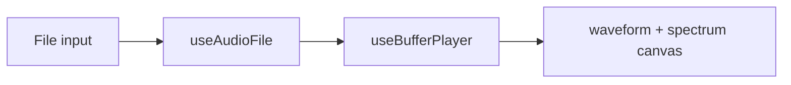

# Модуль: `audio-file-upload` — Загрузка аудио

> **Catalog-спецификация** · статус: **draft**  
> Реестр: `docs/catalog/client/registry.json`

---

## 1. Идентичность

| Поле | Значение |
|------|----------|
| **id** | `audio-file-upload` |
| **Версия** | `1.0.0` |
| **Категория** | Анализ |
| **Lead** | Ozhegov |
| **Статус catalog** | `draft` |

---

## 2. Зачем пользователю

1. Загрузить локальный аудиофайл (WAV, MP3, OGG, …).
2. Увидеть превью waveform до воспроизведения.
3. Слушать файл и опционально смотреть live-спектр.

---

## 3. UX-состояния

| Состояние | UI |
|-----------|-----|
| empty | dropzone / file input |
| loaded | waveform preview |
| playing | play/stop + spectrum canvas |
| error | decode / unsupported format |

---

## 4. Архитектура

| Слой | Путь | Ответственность |
|------|------|-----------------|
| Модуль | `apps/client/src/modules/AudioFileUploadModule.tsx` | UI, canvas |
| Engine | `@membrana/audio-engine-service` | `useAudioFile`, `useBufferPlayer` |
| Utils | `utils/downsamplePeaks.ts` | waveform downsampling |
| Регистрация | `registerClientModules.ts` | lazy module |

### Запрещено

- `decodeAudioData`, `AudioContext` вне engine

---

## 5. Конфиг

```ts
interface AudioFileUploadConfig {
  fftSize: 512 | 1024 | 2048 | 4096;
  waveformBins: number;
  showSpectrumWhilePlaying: boolean;
}
```

---

## 6. Потоки данных



---

## 7. Плагины модуля

Нет.

---

## 8. Сервисы

| Пакет | Использование |
|-------|----------------|
| `@membrana/audio-engine-service` | decode + buffer playback |
| `@membrana/fft-analyzer-service` | spectrum frames |

---

## 9. Тестирование

| Область | Минимум |
|---------|---------|
| Ручной | WAV/MP3 load, play/stop, spectrum toggle |

---

## 10. Связанные task-промпты

- —

---

## 11. Changelog

| Дата | Изменение |
|------|-----------|
| 2026-06-17 | Создан catalog-промпт (draft) |
