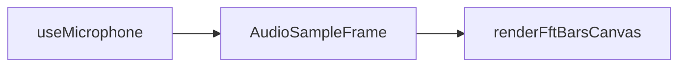

# Модуль: `fft-analyzer` — FFT Анализатор

> **Catalog-спецификация** · статус: **draft**  
> Реестр: `docs/catalog/client/registry.json`

---

## 1. Идентичность

| Поле | Значение |
|------|----------|
| **id** | `fft-analyzer` |
| **Версия** | `1.0.0` |
| **Категория** | Анализ |
| **Lead** | Ozhegov + Музыкант |
| **Статус catalog** | `draft` |

---

## 2. Зачем пользователю

1. Захватить live-микрофон и увидеть FFT-спектр в реальном времени.
2. Настроить `fftSize`, smoothing, диапазон dB.
3. Демонстрация интеграции `useMicrophone` + canvas viz.

---

## 3. UX-состояния

| Состояние | UI |
|-----------|-----|
| idle | canvas пустой, кнопки настроек |
| live | бары спектра обновляются |
| error | ошибка доступа к mic (engine) |

Заголовок — в `ModuleRenderer`, не в `FFTModule`.

---

## 4. Архитектура

| Слой | Путь | Ответственность |
|------|------|-----------------|
| Модуль | `apps/client/src/modules/FFTModule.tsx` | sampler + canvas |
| Engine | `@membrana/audio-engine-service` | `useMicrophone`, AnalyserNode |
| Viz | `@membrana/audio-data-viz` | `renderFftBarsCanvas` |
| Регистрация | `registerClientModules.ts` | lazy module, без plugins |

### Запрещено

- `new AudioContext()`, `getUserMedia` вне audio-engine

---

## 5. Конфиг

```ts
interface FFTConfig {
  fftSize: 512 | 1024 | 2048 | 4096;
  smoothingTimeConstant: number;
  minDecibels: number;
  maxDecibels: number;
}
```

---

## 6. Потоки данных



---

## 7. Плагины модуля

Нет (standalone demo module).

---

## 8. Сервисы

| Пакет | Использование |
|-------|----------------|
| `@membrana/audio-engine-service` | capture + analyser |
| `@membrana/fft-analyzer-service` | опционально для расширений |

---

## 9. Тестирование

| Область | Минимум |
|---------|---------|
| Ручной | mic permission, смена fftSize |

---

## 10. Связанные task-промпты

- —

---

## 11. Changelog

| Дата | Изменение |
|------|-----------|
| 2026-06-17 | Создан catalog-промпт (draft) |
