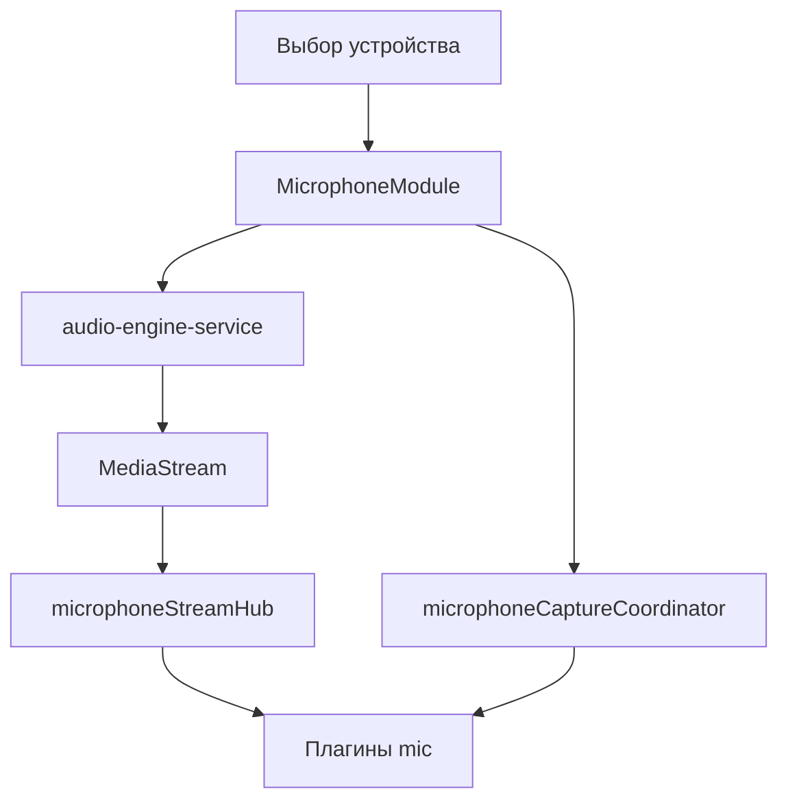

# Модуль: `microphone` — Микрофон

> **Catalog-спецификация** · статус: **stable**  
> Реестр: `docs/catalog/client/registry.json`  
> Task-история: [`DSP_DRONE_DETECTOR_PROMPT.md`](../../../prompts/DSP_DRONE_DETECTOR_PROMPT.md), [`TRENDS_FFT_MICROPHONE_PLUGIN_PROMPT.md`](../../../prompts/TRENDS_FFT_MICROPHONE_PLUGIN_PROMPT.md)

---

## 1. Идентичность

| Поле | Значение |
|------|----------|
| **id** | `microphone` |
| **Версия** | `1.0.0` |
| **Категория** | Устройства |
| **Lead** | Музыкант + Ozhegov |

---

## 2. Зачем пользователю

1. Выбрать входное аудиоустройство (микрофон).
2. Запустить live-поток для анализа и визуализации.
3. Активировать плагины модуля (FFT, детекторы, запись в буфер, trends).
4. Видеть ошибки доступа к устройству и состояние «в эфире».

Модуль — **единственная точка захвата микрофона** в client; плагины не вызывают `getUserMedia` сами.

---

## 3. UX-состояния

| Состояние | UI |
|-----------|-----|
| loading devices | спиннер списка устройств |
| idle | выбор устройства, кнопка старт |
| live | индикатор потока; панели активных плагинов |
| error | текст ошибки (permission / device) |
| device change | перезахват потока при смене `selectedDeviceId` |

Заголовок «Микрофон» — в `ModuleRenderer`, не в `MicrophoneModule`.

---

## 4. Архитектура

| Слой | Путь | Ответственность |
|------|------|-----------------|
| Модуль | `apps/client/src/modules/microphone/MicrophoneModule.tsx` | устройства, capture, hub |
| Coordinator | `microphoneCaptureCoordinator.ts` | единый owner start/stop для плагинов |
| Hub | `microphoneStreamHub.ts` | `publishMicrophoneStream` / `subscribeMicrophoneStream` |
| Engine | `@membrana/audio-engine-service` | `getAudioInputDevices`, `acquireMicrophone`, `releaseMediaStream` |
| Регистрация | `registerClientModules.ts` | lazy module + 8 plugins |

### Запрещено

- `new AudioContext()`, `getUserMedia` вне audio-engine
- Прямой импорт внутренностей плагинов (кроме panel exports для компоновки UI)

---

## 5. Конфиг

```ts
interface MicrophoneConfig {
  /** Пустая строка — устройство по умолчанию браузера */
  selectedDeviceId: string;
}
```

Persist через agenda store. Смена устройства → `onUpdateConfig`.

---

## 6. Потоки данных



---

## 7. Плагины модуля

| id | Catalog | Назначение |
|----|---------|------------|
| `microphone-stream-viz` | [stable](../plugins/microphone-stream-viz.md) | waveform / spectrum / quality |
| `fft-threshold-test` | draft | пороговый FFT-тест |
| `fft-indices-viz` | draft | centroid / flux / RMS live |
| `sound-quality-viz` | draft | SNR, clarity |
| `harmonic-detector-viz` | draft | гармонический детектор |
| `trends-fft-analyzer` | [stable](../plugins/trends-fft-analyzer.md) | классификация сцен |
| `mic-buffer-recorder` | draft | запись в media-library |
| `mic-live-drone-analysis` | draft | live drone brief/detailed |

---

## 8. Сервисы

| Пакет | Использование |
|-------|----------------|
| `@membrana/audio-engine-service` | устройства и MediaStream |

---

## 9. Тестирование

| Область | Файл |
|---------|------|
| Coordinator | `microphoneCaptureCoordinator.test.ts` |
| Ручной | разрешение mic, смена устройства, stop освобождает stream |

---

## 10. Changelog

| Дата | Изменение |
|------|-----------|
| 2026-06-17 | stable catalog (эпик module-catalog-v1, MC-2) |
