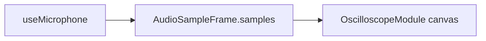

# Модуль: `oscilloscope` — Осциллограф

> **Catalog-спецификация** · статус: **draft**  
> Реестр: `docs/catalog/client/registry.json`

---

## 1. Идентичность

| Поле | Значение |
|------|----------|
| **id** | `oscilloscope` |
| **Версия** | `1.0.0` |
| **Категория** | Визуализация |
| **Lead** | Ozhegov + Музыкант |
| **Статус catalog** | `draft` |

---

## 2. Зачем пользователю

1. Видеть временную форму сигнала с микрофона.
2. Масштабировать время и амплитуду, сетку, цветовую схему.
3. Режимы trigger: auto / normal / single.

---

## 3. UX-состояния

| Состояние | UI |
|-----------|-----|
| idle | canvas + controls |
| live | waveform scroll/update |
| error | mic access (engine) |

---

## 4. Архитектура

| Слой | Путь | Ответственность |
|------|------|-----------------|
| Модуль | `apps/client/src/modules/OscilloscopeModule.tsx` | canvas draw |
| Engine | `@membrana/audio-engine-service` | `useMicrophone`, time-domain frames |
| Регистрация | `registerClientModules.ts` | lazy module |

### Запрещено

- `ScriptProcessorNode` и прямой Web Audio

---

## 5. Конфиг

```ts
interface OscilloscopeConfig {
  timeScale: number;
  amplitudeScale: number;
  showGrid: boolean;
  triggerMode: 'auto' | 'normal' | 'single';
  colorScheme: 'classic' | 'neon' | 'monochrome';
}
```

---

## 6. Потоки данных



---

## 7. Плагины модуля

Нет.

---

## 8. Сервисы

| Пакет | Использование |
|-------|----------------|
| `@membrana/audio-engine-service` | live time-domain data |

---

## 9. Тестирование

| Область | Минимум |
|---------|---------|
| Ручной | trigger modes, scale sliders |

---

## 10. Связанные task-промпты

- —

---

## 11. Changelog

| Дата | Изменение |
|------|-----------|
| 2026-06-17 | Создан catalog-промпт (draft) |
