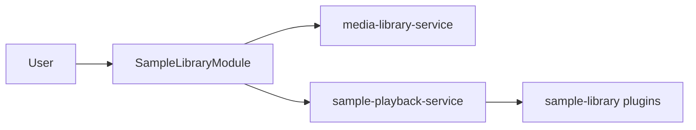

# Модуль: `sample-library` — Библиотека сэмплов

> **Catalog-спецификация** · статус: **draft**  
> Реестр: `docs/catalog/client/registry.json`

---

## 1. Идентичность

| Поле | Значение |
|------|----------|
| **id** | `sample-library` |
| **Версия** | `0.1.0` |
| **Категория** | Данные / датасет |
| **Lead** | Rodchenko + Ozhegov |
| **Статус catalog** | `draft` |

---

## 2. Зачем пользователю

1. Просматривать буфер и коллекции сэмплов (WAV, квоты, метки).
2. Импортировать файлы для датасета и benchmark.
3. Воспроизводить выбранный сэмпл и запускать плагины анализа.
4. Управлять label/notes и экспортом blob.

---

## 3. UX-состояния

| Состояние | UI |
|-----------|-----|
| loading | спиннер списка / quota |
| empty buffer | подсказка импорта |
| sample selected | playback bar + панели плагинов |
| quota full | `MediaLibraryQuotaBanner` |
| error | import / remote mutation |

---

## 4. Архитектура

| Слой | Путь | Ответственность |
|------|------|-----------------|
| Модуль | `apps/client/src/modules/SampleLibraryModule.tsx` | список, импорт, playback hub |
| Hub bridge | `lib/mediaLibraryHubBridge.ts` | quota, clear buffer |
| Регистрация | `registerClientModules.ts` | lazy module + 4 plugins |

### Запрещено

- Прямой Web Audio вне `@membrana/audio-engine-service` / `sample-playback-service`
- Дублирование playback-логики в плагинах

---

## 5. Конфиг

Persist через agenda store. Детали — `SampleLibraryModule` + defaults в `registerClientModules.ts`.

---

## 6. Потоки данных

---

## 7. Плагины модуля

| plugin id | Catalog | Кратко |
|-----------|---------|--------|
| `sample-library-player` | [draft](../plugins/sample-library-player.md) | крупный плеер |
| `sample-library-drone-analysis` | draft | DSP на сэмпле |
| `sample-library-fft-threshold-test` | draft | FFT пороги |
| `trends-fft-sample-analyzer` | draft | trends на сэмпле |

---

## 8. Сервисы

| Пакет | Использование |
|-------|----------------|
| `@membrana/media-library-service` | буфер, коллекции, импорт |
| `@membrana/audio-engine-service` | decode при необходимости |
| `@membrana/sample-playback-service` | выбор и play/pause |

---

## 9. Тестирование

| Область | Минимум |
|---------|---------|
| Unit | hub bridge, playback bind |
| Ручной | импорт, quota, play + plugin analyze |

---

## 10. Связанные task-промпты

- `media-library-a2-ui`, `sample-library-drone-detection` — см. `docs/tasks/registry.json`

---

## 11. Changelog

| Дата | Изменение |
|------|-----------|
| 2026-06-17 | Создан catalog-промпт (draft) |
