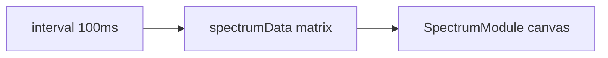

# Модуль: `spectrum-3d` — 3D Спектрограмма

> **Catalog-спецификация** · статус: **draft**  
> Реестр: `docs/catalog/client/registry.json`

---

## 1. Идентичность

| Поле | Значение |
|------|----------|
| **id** | `spectrum-3d` |
| **Версия** | `1.0.0` |
| **Категория** | Визуализация |
| **Lead** | Rodchenko |
| **Статус catalog** | `draft` |

---

## 2. Зачем пользователю

1. Увидеть «водопад» спектра (time × frequency).
2. Настроить colormap, сетку, persistence.
3. Прототип UI перед подключением реального FFT-потока.

---

## 3. UX-состояния

| Состояние | UI |
|-----------|-----|
| active | canvas 3D-спектрограмма (scroll history) |
| settings | colormap / grid / persistence controls |

> **Draft:** сейчас данные — synthetic random (не live mic).

---

## 4. Архитектура

| Слой | Путь | Ответственность |
|------|------|-----------------|
| Модуль | `apps/client/src/modules/SpectrumModule.tsx` | canvas + synthetic feed |
| Viz | `@membrana/audio-data-viz` | theme colors |
| Регистрация | `registerClientModules.ts` | lazy module |

### Запрещено

- Прямой Web Audio до интеграции с engine

---

## 5. Конфиг

```ts
interface SpectrumConfig {
  colormap: string;
  showGrid: boolean;
  persistence: number;
}
```

---

## 6. Потоки данных



План: заменить synthetic на `fft-analyzer-service` / mic hub.

---

## 7. Плагины модуля

Нет.

---

## 8. Сервисы

| Пакет | Использование |
|-------|----------------|
| `@membrana/fft-analyzer-service` | planned live feed |

---

## 9. Тестирование

| Область | Минимум |
|---------|---------|
| Ручной | colormap, persistence slider |

---

## 10. Связанные task-промпты

- —

---

## 11. Changelog

| Дата | Изменение |
|------|-----------|
| 2026-06-17 | Создан catalog-промпт (draft) |
