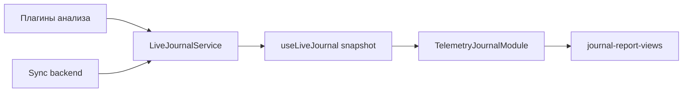

# Модуль: `telemetry-journal` — Журнал телеметрии

> **Catalog-спецификация** · статус: **stable**  
> Task-история: [`TELEMETRY_JOURNAL_REPORT_VIZ_PROMPT.md`](../../../prompts/TELEMETRY_JOURNAL_REPORT_VIZ_PROMPT.md), [`TELEMETRY_JOURNAL_LIVE_EPIC_PROMPT.md`](../../../prompts/TELEMETRY_JOURNAL_LIVE_EPIC_PROMPT.md)

---

## 1. Идентичность

| Поле | Значение |
|------|----------|
| **id** | `telemetry-journal` |
| **Версия** | `1.0.0` |
| **Категория** | Мониторинг |
| **Lead** | Rodchenko + Ozhegov |

---

## 2. Зачем пользователю

1. Просматривать live-записи и отчёты анализа (треки, FFT, trends, drone brief/detailed).
2. Фильтровать: все / треки / отчёты / обнаружения; поиск по тексту.
3. Пагинация по отфильтрованному списку.
4. Очистить журнал (с синхронизацией remote при server mode).
5. Воспроизвести трек сэмпла (через sample-playback + media-library blob).

---

## 3. UX-состояния

| Состояние | UI |
|-----------|-----|
| loading | snapshot пуст / version меняется |
| empty | «Нет записей» по фильтру |
| list | `LiveJournalItemRow` + карточки отчётов |
| clearing | busy на кнопке clear, `clearError` |
| storage mode | бейдж: Сервер / Desktop FS / Локально |

Auto-refresh: `useLiveJournalAutoRefresh` (hub + poll).

---

## 4. Архитектура

| Слой | Путь | Ответственность |
|------|------|-----------------|
| Модуль | `TelemetryJournalModule.tsx` | фильтры, pager, clear |
| Hooks | `useLiveJournalAutoRefresh.ts` | подписка на journal hub |
| Renderers | `reportRenderers/`, `components/LiveJournalReportCard.tsx` | типизированные карточки |
| Adapters | `adapters/*FromItem.ts` | client → report views |
| Сервис | `@membrana/telemetry-journal-service` | `useLiveJournal`, storage backends |
| Shared UI | `@membrana/journal-report-views` | parity с cabinet |

### Запрещено

- Парсинг report payload без guards/adapters
- Дублирование рендеров cabinet — выносить в `journal-report-views`

---

## 5. Конфиг

`TelemetryJournalModuleConfig` — `{}` (пустой default). Расширения — через registry без ломки persist.

---

## 6. Потоки данных

---

## 7. Report types (основные)

| reportType | Рендер client |
|------------|----------------|
| fft-threshold-test | `FftThresholdTelemetryReportCard` |
| trends-fft | `TrendsFftReportView` |
| drone-detection-brief/v1 | brief adapter + `LiveJournalReportCard` |
| drone-detection / DDR | `TelemetryReportCard` + detector-report |

**Cabinet parity:** те же типы через `@membrana/journal-report-views` в `CabinetLiveJournalReportCard`. При добавлении типа — обновлять lib + cabinet в одном эпике.

---

## 8. Сервисы

| Пакет | Использование |
|-------|----------------|
| `@membrana/telemetry-journal-service` | snapshot, filters, pagination helpers |
| `@membrana/media-library-service` | blob для playback |
| `@membrana/sample-playback-service` | `bindSamplePlaybackBlobReader` |
| `@membrana/journal-report-views` | shared report UI |

---

## 9. Тестирование

| Файл | Что |
|------|-----|
| `useLiveJournalAutoRefresh.test.ts` | refresh semantics |
| `adapters/*.test.ts` | parse guards |
| `filters/matchesTagFilter.test.ts` | фильтр detection |

---

## 10. Changelog

| Дата | Изменение |
|------|-----------|
| 2026-06-17 | stable catalog (MC-4) |
