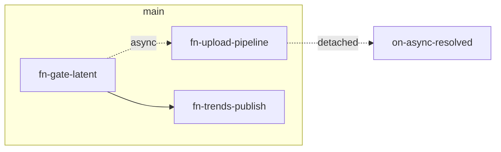

# Concept — Team Beta (Ozhegov + Dynin)

> **Phase 1 draft** · sprint `comp-mvp-async-v2-2026-06-25` · наследие v1: [Measured modular UserCase](../../comp-mvp-packaging-2026-06-21/team-beta/CONCEPT.md)

## One-liner

**«Measured modular UserCase — async edition»** — upload pipeline, trends publish и detached report как **измеримые functions** с контрактами pins; verify-layout + smoke v2.0-async = acceptance badge.

## Product thesis

«Красиво» для async = **структурно проверяемо**: каждый Promise node в своей function, main orchestrator ≤6 visible nodes, metrics C7 Async clarity через layout, не prose.

## Architecture

| Слой | Решение |
|------|---------|
| **id** | `usercase-mvp-microphone-beta-async-v2` |
| **Модульность** | 3–4 user functions + thin main |

### User functions (≥2)

| id | name | Inputs | Outputs |
|----|------|--------|---------|
| `fn-beta-async-gate` | Latent recording gate | stream, policy | trackRef, Then-2 trigger |
| `fn-beta-async-upload` | Upload pipeline | trackRef | jobId (non-blocking) |
| `fn-beta-async-trends` | Trends on gate | stream, fftPolicy | publish event |
| `fn-beta-async-detached` | Detached drone | job resolved | report published |

### Comment groups (≥4) — engineering map

| id | title | frameColor |
|----|-------|------------|
| `ucg-beta-async-orchestrator` | Main spine | primary |
| `ucg-beta-async-gate` | Latent Sequence gate | warning |
| `ucg-beta-async-upload` | Async upload pipeline | info |
| `ucg-beta-async-detached` | Detached report | success |

## Key decisions

| ID | Решение | Альтернатива | Почему |
|----|---------|--------------|--------|
| BV-B1 | Upload = отдельная function | Внутри gate function | Измеримый контракт pins |
| BV-B2 | Detached = 4-я function или branch frame | Inline on main | main density target |
| BV-B3 | verify-layout strict exec-lr-v1 | Manual layout | Dynin metrics |

## Trade-offs

| Плюс | Минус |
|------|-------|
| Клонируемые async blocks | Больше functions = pin CRUD |
| CI gates объективны | Меньше «поэзии» чем Alpha |

## Phase 2 plan

### 2α

- fn-gate-latent + fn-upload-pipeline collapsed; main orchestrator visible

### 2β

- F1–F7 + verify-competition + smoke PASS

## Risks & mitigations

| Risk | Mitigation |
|------|------------|
| Then-2 trends regression | Golden parity test, не менять wiring |
| Over-collapse hides Promise nodes | verify pre-run async refs |

## Demo narrative

Orchestrator walk: Policy → Gate (latent) → Trends sync → Upload async strip → log detached resolve.

---

*Team Beta · Phase 1 · comp-mvp-async-v2-2026-06-25*
