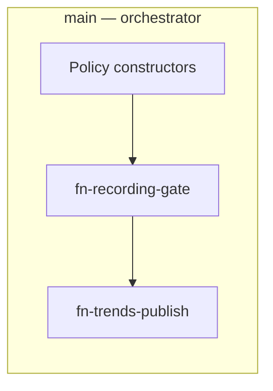

# Concept — Team Beta (Ozhegov + Dynin)

## One-liner

**«Measured modular UserCase»** — MVP разложен на **измеримые user functions** с контрактами pins; layout проходит **verify-layout** как доказательство «аккуратности», не субъективного вкуса.

## Product thesis

«Красиво» = **структурно предсказуемо**: monotonic exec spine, grid 8 px, overlap = 0, function depth ≤ 1. Dynin переводит эстетику в **метрики**; Ozhegov упаковывает runtime в **переиспользуемые blocks**, которые другой автор UserCase сможет клонировать.

## Architecture

| Слой | Решение |
|------|---------|
| **id** | `usercase-mvp-microphone-beta` |
| **Модульность** | 3 user functions + thin main orchestrator |
| **Layout** | `exec-lr-v1` strict; CI gate `usercase:verify-layout` = acceptance badge |

### User functions (3)

| id | name | Inputs | Outputs |
|----|------|--------|---------|
| `fn-beta-policy-build` | Build policies | — | recordingPolicy, fftTrendsPolicy |
| `fn-beta-recording-gate` | Recording gate window | stream, policy | trackRef event |
| `fn-beta-trends-publish` | Trends classify & publish | stream, fftPolicy, journal | report published |

Main visible nodes: **Event tick → 3 function call nodes → ∞** (target **≤6** scenario nodes on main canvas).

### Comment groups (4) — **engineering map**, not marketing

| id | title | frameColor |
|----|-------|------------|
| `ucg-beta-main-orchestrator` | Orchestrator spine | primary |
| `ucg-beta-fn-gate` | Function: recording gate | warning |
| `ucg-beta-fn-trends` | Function: trends publish | info |
| `ucg-beta-fn-policy` | Function: policy build | neutral |

## Key decisions

| ID | Решение | Альтернатива | Почему |
|----|---------|--------------|--------|
| B1 | 3 functions (separation of concerns) | 1 mega-function | Testable collapse units |
| B2 | verify-layout hard gate in DoD | Manual LGTM | Competition = metrics |
| B3 | Policy function on main **or** initial — on main for single-tick visibility | Policies only in initial | Demo parity one screen |
| B4 | Duplicate MVP node semantics exactly — remap ids only | Simplify graph | F1–F6 parity |

## Trade-offs

| Плюс | Минус |
|------|-------|
| Objectively scores high on C3/C5 | Может выглядеть «сухо» vs Gamma |
| Reusable function templates | Больше work collapse/ref-mapping |
| Strong Ozhegov boundary story | 3 functions → pin CRUD careful |

## Phase 2 plan

### 2α

- Copy MVP → beta folder; identify collapse ranges from main v08 JSON
- Implement `fn-beta-recording-gate` only; thin main calls it
- verify-kinds + partial verify-layout (main spine)
- Demo F2 gate PASS

### 2β

- All 3 functions + orchestrator groups
- Full verify-layout; document metrics in CONCEPT (node counts, max rank width)
- Parity smoke scripts

## Risks

| Risk | Mitigation |
|------|------------|
| Collapse breaks exec edges | Marquee collapse tests in device-board; Run validation |
| Function depth >1 | Collapse only leaf subgraphs |

## Demo narrative

1. «Main — **оркестратор**: три вызова function, exec слеva направo монотонен.»
2. «Открываем function **Recording gate** — внутри чистый subgraph, verify-layout green.»
3. «Metrics: N nodes main, M in function, overlap 0.»

---

*Team Beta · Phase 1 · comp-mvp-packaging-2026-06-21*
