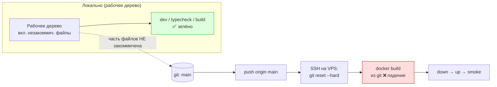
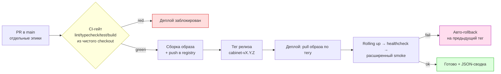

# Постмортем деплоя MP7b — 2026-06-18

> Артефакт для консилиума по процессу деплоя. Описывает полный ход выката эпика **MP7b**
> (`membrane-node-runtime-remote`) на прод `cabinet.membrana.space`, все возникшие проблемы,
> их причины и предложения по улучшению процесса.

- **Дата:** 2026-06-18
- **Сервис:** `apps/cabinet` + `background-cabinet` (стек cabinet, VPS, Docker Compose, Caddy)
- **Итоговый коммит на проде:** `8e65e60` (ветка `main`)
- **Результат:** ✅ успешно со второй попытки. Первый запуск упал на сборке.
- **Простой прода:** 0 (падение произошло на этапе сборки, до остановки старых контейнеров).

---

## 1. Контекст и цель

Задача от заказчика: «Хочу, чтобы **все изменения** уже появились на проде, при этом раздел
**Узлы и ключи** остаётся **единым** (как сейчас)».

То есть нужно было:
1. Выкатить весь серверный стек эпика MP7b (рантайм-канал WebSocket, multi-node, и т.д.).
2. **Скрыть** UI-разделение «Узлы»/«Ключи» (фаза RT5), сохранив новую функциональность.

## 2. Что деплоили (фактический scope)

При проверке оказалось, что `main` отстаёт от рабочей ветки `ozhegov-module-catalog-v1`
на **20 коммитов**, а прод тянет именно `main` (`CABINET_GIT_BRANCH=main`). В выкат вошли:

- MP7b RT0–RT7 (8 коммитов) — рантайм-канал, multi-node, UI-узлы, device-board UX, персист.
- MP7 Node Realtime Gateway — **обязательная зависимость** RT5.
- module-catalog-v1 (эпик #90) — отдельный крупный эпик.
- device-board H2a/H2d, detector-report фикс, docker-фиксы, HORIZON-доки.

Заказчик **явно подтвердил**, что выкатываем все 20 коммитов вместе (см. §4, проблема B).

## 3. Хронология

1. Анализ механики деплоя: скрипт `scripts/_ssh-cabinet-deploy.mjs` по SSH делает на сервере
   `git fetch origin <branch>` + `git reset --hard FETCH_HEAD`, затем `docker build` →
   `down` → `up` → smoke. Ветка по умолчанию — `main`.
2. Подтверждено, что миграция RT4 (multi-node Prisma) применяется автоматически: entrypoint
   контейнера cabinet выполняет `prisma migrate deploy`.
3. Введён фича-флаг `VITE_CABINET_NODES_KEYS_SPLIT` (по умолчанию OFF): на проде один раздел
   «Узлы и ключи», RT5-разделение скрыто. Typecheck + тесты кабинета зелёные. Коммит `868c190`.
4. Согласование стратегии веток с заказчиком → fast-forward `main` до `868c190`, push.
5. **Запуск деплоя №1 → провал на сборке** (см. проблема A).
6. Диагностика, дозакоммит недостающих исходников (`8e65e60`), локальная сборка `turbo build`
   целевых пакетов — зелёно. Push в `main`.
7. **Запуск деплоя №2 → успех.** Smoke: health `ok`, SPA `200`, контейнеры healthy,
   RT4-миграция применена.

## 4. Проблемы и трудности

### A. 🔴 Главная: незакоммиченные зависимости → падение сборки на проде
**Симптом:** docker build `background-cabinet` упал с
`error TS2339: Property 'NODE_REALTIME_ENABLED' does not exist ...`
(`node-realtime.gateway.ts:61`).

**Корневая причина:** в ходе предыдущей сессии коммиты делались инкрементально (по фазам),
но **часть зависимых файлов осталась в рабочем дереве незакоммиченной**:
`config/env.schema.ts` (объявление поля `NODE_REALTIME_ENABLED`), обвязка модуля
node-realtime, `telemetry-journal` port и др. Уже закоммиченный код (`gateway.ts`) ссылался
на символ, чьё определение в коммит не попало.

**Почему не поймали раньше:** локальные `dev` / `typecheck` / `build` собирают из **рабочего
дерева** (где файлы есть), а прод собирает из **git** (где их нет). Классический рассинхрон
«источник истины при проверке ≠ источник истины при деплое» → «works on my machine».

**Как починили:** дозакоммитили недостающие исходники (`8e65e60`); предварительно прогнали
`turbo run build` целевых пакетов, убедились в зелёном статусе, и только потом переотправили в
`main`. Из 14 застейдженных файлов реально изменились лишь 6 — остальные числились
«modified» только из-за CRLF/LF (см. проблему D).

### B. 🟠 `main` отставал на 20 коммитов разных эпиков
**Симптом:** «слить MP7b в main» фактически означало выкатить 20 коммитов, включая чужой
крупный эпик module-catalog #90.

**Причина:** длинная feature-ветка `ozhegov-module-catalog-v1` накопила несколько эпиков, а
прод деплоится строго с `main`. На `main` ничего из этого не было.

**Как обработали:** явно показали заказчику полный список коммитов и получили подтверждение
выкатить всё вместе. Риск непреднамеренного выката снят ручным решением, **но процессом не
застрахован**.

### C. 🟠 Коммиты были только локально — прод тянет git
**Симптом:** первый «push» (с пайпом в shell) не выполнился; `origin/main` остался старым.
Без push на проде не появилось бы ничего.

**Причина:** деплой работает «из git origin», а вся работа велась локально. Между «готово
локально» и «готово на проде» есть обязательный шаг push, который легко забыть/недовыполнить.

### D. 🟡 CRLF/LF шум в git
**Симптом:** десяток файлов числились `modified`, хотя по содержимому совпадали с HEAD;
это затрудняло понимание реальной дельты и заставило перепроверять каждый файл.

**Причина:** Windows-машина без жёсткой нормализации окончаний строк (нет `.gitattributes`
с `eol=lf`).

### E. 🟡 Нестабильная среда выполнения / диагностика
**Симптом:** команды с пайпами и часть сетевых/`git diff` команд не отдавали статус/вывод
(`git diff` висел на пейджере; piped-команды «no exit status»). Диагностика заметно
замедлилась.

**Причина:** особенности shell-харнесса на Windows + интерактивный пейджер git. Для команды
важен вывод: **деплой и проверки должны давать однозначный, машиночитаемый результат**.

### F. 🟡 Полевой клиент `apps/client` не имеет прод-деплоя
**Симптом:** изменения RT2/RT7 (headless-рантайм, персист режима) живут в `apps/client`,
который **не хостится** этим VPS-процессом. Они не доезжают до операторов через текущий деплой.

**Причина:** в процессе деплоя нет пайплайна доставки полевого клиента (только cabinet + media).

### G. 🟢 Введение фича-флага «на лету»
Чтобы выкатить функциональность, но скрыть UI-разделение, пришлось ad-hoc вводить флаг
`VITE_CABINET_NODES_KEYS_SPLIT`. Практика хорошая, но возникла реактивно, а не как часть
плана выката.

## 5. Что сработало хорошо

- **Сборка идёт ДО остановки старых контейнеров** → провал сборки **не уронил прод** (нулевой
  простой на неудачной попытке). Это сильная сторона текущего скрипта.
- **Авто-миграция через entrypoint** (`prisma migrate deploy`) — RT4 применилась без ручных
  шагов.
- **Smoke встроен в скрипт** (local + https health + SPA код ответа).
- **Фича-флаг** позволил разделить «выкат кода» и «включение UI» — выкат без видимых
  пользователю изменений.

## 6. Реализовавшиеся и потенциальные риски

| Риск | Статус | Последствие |
|------|--------|-------------|
| Незакоммиченные зависимости | **Реализовался** | Провал сборки на проде (без простоя) |
| Непреднамеренный выкат чужого эпика (#90) | Снят вручную | Мог попасть незрелый код на прод |
| Забытый push | Снят вручную | Деплой «пустой» |
| Нет rollback-процедуры | Открыт | При провале smoke после `up` — нет быстрого отката |
| Клиент не доставляется | Открыт | Часть фич не доходит до операторов |

## 7. Рекомендации по улучшению процесса (на обсуждение)

### Приоритет 1 — устранить класс ошибки A
1. **CI-гейт до деплоя.** GitHub Actions на push в `main` (или в деплой-ветку):
   обязательный зелёный `turbo run lint typecheck test build`. Деплой-скрипт **проверяет
   статус CI** деплоируемого коммита через `gh` и отказывается стартовать на красном.
2. **Сборка из чистого checkout / образ как артефакт.** Либо деплой-скрипт перед push
   собирает из чистого clone деплоируемого коммита, либо переходим на модель «build image в
   CI → push в registry → на проде только `pull` + `up`». Это **полностью устраняет** класс
   «незакоммичено / works on my machine», т.к. прод запускает ровно тот образ, что собран в CI.
3. **Проверка чистоты рабочего дерева.** Перед push/деплоем — gate «нет незакоммиченных
   изменений в собираемых пакетах» (предупреждение/блок).

### Приоритет 2 — управляемость и откат
4. **Деплой из immutable-тега, а не ветки.** Тегировать релиз (`cabinet-vX.Y.Z`), деплоить
   тег; хранить предыдущий тег/образ.
5. **Документированный и автоматизированный rollback** на предыдущий образ/коммит при провале
   smoke.
6. **Zero-downtime.** Rolling update вместо `down`→`up` (поднять новый контейнер, healthcheck,
   затем переключение), чтобы убрать окно простоя на успешном деплое.

### Приоритет 3 — гигиена и охват
7. **`.gitattributes` c `* text=auto eol=lf`** для исходников — убрать CRLF-шум и ложные diff.
8. **Правило мержа в `main`:** только отдельные ревью-нутые PR по эпикам; не смешивать эпики в
   одной длинной ветке. `main` = всегда деплоируемое состояние.
9. **Пайплайн доставки полевого клиента `apps/client`** (HTTPS-хостинг билда / автообновление),
   чтобы клиентские изменения тоже доезжали и попадали в smoke.
10. **Расширить smoke** за пределы health/SPA-200: login, список узлов, `prisma migrate status`,
    функциональная проверка runtime-команды.
11. **Машиночитаемый итог деплоя** (JSON-сводка + сохранённый лог-артефакт), чтобы не парсить
    «простыню» вывода.

## 7a. Текущий vs предлагаемый пайплайн

**Сейчас** — единственный источник истины при проверке (рабочее дерево) расходится с тем, что
собирает прод (git):

**Предлагается** — единый источник истины (собранный артефакт/образ) проходит CI-гейт, на прод
едет ровно то, что проверено:

## 8. Открытые вопросы для консилиума

1. Переходим ли на модель «build в CI → registry → pull на проде» (устраняет проблему A
   радикально), или достаточно CI-гейта + сборки из чистого checkout?
2. Нужен ли zero-downtime сейчас, или допустимо текущее короткое окно `down→up`?
3. Как организуем доставку полевого клиента `apps/client` на прод?
4. Вводим ли запрет на длинные мульти-эпиковые ветки и обязательные PR-в-`main`?
5. Кто владелец деплой-раннбука и rollback-процедуры?

---

### Приложение: ключевые факты

- Падение: `node-realtime.gateway.ts:61` — `NODE_REALTIME_ENABLED` отсутствовал в `env.schema.ts`.
- Фикс-коммит: `8e65e60` (`env.schema.ts` + telemetry-journal port + cabinet dep).
- Прод-коммит: `8e65e60` на `main`.
- Smoke №2: `{"status":"ok","version":"0.1.0"}`, `cabinet SPA: 200`, 3 контейнера healthy.
- Фича-флаг: `VITE_CABINET_NODES_KEYS_SPLIT` (OFF на проде → единый раздел «Узлы и ключи»).
