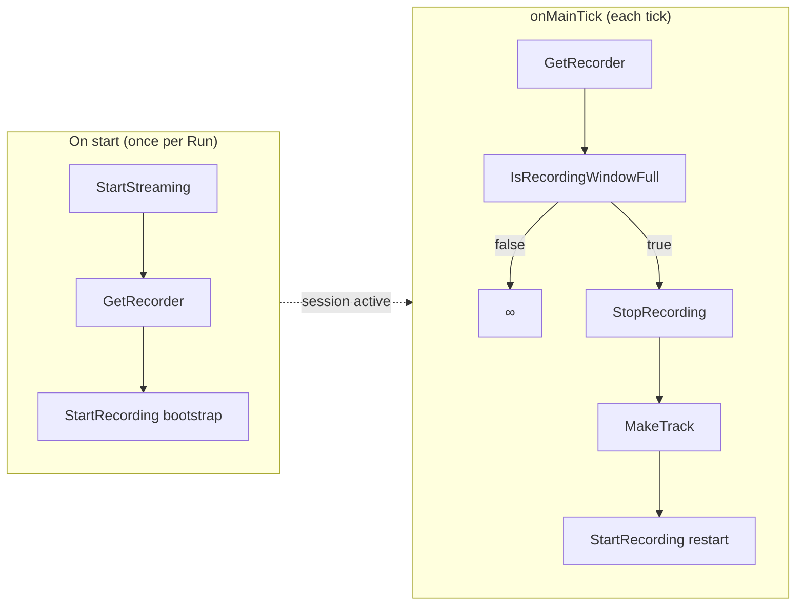

# UserCase MVP — microphone (device-board)

> **id:** `usercase-mvp-microphone`  
> **Статус:** **v0.8 LGTM 2026-06-21** (flat graph) · **v0.9-functions cutover 2026-06-24** (bundled default + migrate).  
> Sign-off v0.8: [`USERCASE_MVP_MICROPHONE_LGTM.md`](./USERCASE_MVP_MICROPHONE_LGTM.md) · v0.9 addendum: тот же файл § v0.9-functions.  
> Smoke: `runId 7e8a289c` · `yarn logs:parse` · [`CLIENT_LOGS_PARSING.md`](./CLIENT_LOGS_PARSING.md).  
> **Канон:** [`DEVICE_BOARD_CONCEPT.md`](../../packages/device-board/DEVICE_BOARD_CONCEPT.md) §16.5 + §16.5.1  
> **Recording topology (RGC2):** bootstrap `StartRecording` в **onStart**; main — gate без hot-path start · [`DEVICE_BOARD_RECORDING_GRAPH_CLARITY_EPIC_PROMPT.md`](../prompts/DEVICE_BOARD_RECORDING_GRAPH_CLARITY_EPIC_PROMPT.md)  
> **Main loop (v0.9):** user functions + inline `MakeFftTrendsPolicy` → gate → track + trends report (+ optional track report)  
> **Дальше (не сегодня):** async user functions для track/report/publish — не блокировать main tick · [`DEVICE_BOARD_POST_USERCASE_ROADMAP.md`](../prompts/DEVICE_BOARD_POST_USERCASE_ROADMAP.md)

Когда persist сбрасывает граф, доска раньше откатывалась к D0-заглушкам (`select-microphone`, `write-journal`). С **v0.8** bundled usercase — дефолт в `@membrana/device-board`; JSON ниже — для ручного re-import.

**v0.9-functions cutover (2026-06-24):** `yarn usercase:build-mvp-microphone` читает golden [`golden/usercase-mvp-microphone-v09-functions.document.json`](./golden/usercase-mvp-microphone-v09-functions.document.json) и собирает embedded document с **`scenario.functions[]`** (2 функции: `fn-1` StartRecording, `fn-3` GetAudioStream). Flat v0.8 при hydrate заменяется автоматически (`needsBundledV09FunctionsMigration`, BD5).

**Импорт ветки без функций:** по **BD1** bundled cutover — только **full `device-scenario`** (launcher JSON / Export full UserCase). Branch-import `branch-scenario` **не** подмешивает `scenario.functions[]`; subgraph `Name::fn-id` требует уже существующие тела на доске. `referencedFunctions[]` в branch-export — follow-up эпик (см. [`DEVICE_BOARD_BUNDLED_MVP_V09_SPRINT_PROMPT.md`](../prompts/DEVICE_BOARD_BUNDLED_MVP_V09_SPRINT_PROMPT.md) P3).

---

## Файлы (bundle)

| # | Обработчик UI | branch | JSON |
|---|---------------|--------|------|
| 1 | **On connect** | `onConnect` | [`usercase-mvp-microphone/01-onConnect.json`](./usercase-mvp-microphone/01-onConnect.json) |
| 2 | **On start** | `initial` | [`usercase-mvp-microphone/02-onStart.json`](./usercase-mvp-microphone/02-onStart.json) |
| 3 | **onMainTick** | `main` | [`usercase-mvp-microphone/03-onMainTick.json`](./usercase-mvp-microphone/03-onMainTick.json) |
| 4 | **onAlarmTick** | `alarm` | [`usercase-mvp-microphone/04-onAlarmTick.json`](./usercase-mvp-microphone/04-onAlarmTick.json) |
| 5 | **On stop** | `onStop` | [`usercase-mvp-microphone/05-onStop.json`](./usercase-mvp-microphone/05-onStop.json) |
| 6 | **On disconnect** | `onDisconnect` | [`usercase-mvp-microphone/06-onDisconnect.json`](./usercase-mvp-microphone/06-onDisconnect.json) |

Те же JSON дублируются в корень `device-board-scripts/` (`device-scenario-microphone-*.json`) для старых ссылок.

Пересборка:

```bash
yarn usercase:build-mvp-microphone
```

После сборки embedded-документ попадает в `@membrana/device-board` и используется как **дефолт** для новых пользователей microphone (без ручного import).

---

## Импорт на доску (ручной)

> **Не обязателен** для первого открытия: `@membrana/device-board` уже гидрирует этот usercase по умолчанию и сохраняет в localStorage / media-server при первом визите.

Если нужно **перезаписать** текущий граф (или восстановить после сбоя persist):

1. Hard refresh client (`vesnin`), device-board → microphone, **online**.
2. Для **каждой** вкладки слева: Import → выбрать JSON из таблицы → сопоставить ref-переменные:
   - `device1` → DeviceRef
   - `microphone1` → MicrophoneRef
   - `audiostream1` → AudioStreamRef
   - `journal1` → JournalRef
   - `server1` → ServerRef (onConnect)
   - `datetime1` → DateTime (onStart)
3. **Порядок импорта** (рекомендуется): On start → On connect → onMainTick → onAlarmTick → On stop → On disconnect.
4. Проверка **onStart**: после `StartStreaming` — `GetRecorder` → `StartRecording (bootstrap)` (один раз при Run).
5. Проверка **main (v0.9-functions):** `GetAudioStream` (fn-3) → gate; на gate-true: `StopRecording` → `MakeTrack` → `GetAudioStream` (2-й вызов) → `StartRecording` (fn-1) → `FlushSpectralAnalyser` → trends → `PublishReport` → `∞`.
6. Run ≥ 60 s → `yarn logs:parse` или chain-log: [`SCENARIO_CHAIN_LOG_COOKBOOK.md`](./SCENARIO_CHAIN_LOG_COOKBOOK.md) · [`CLIENT_LOGS_PARSING.md`](./CLIENT_LOGS_PARSING.md); ожидаем ≥2× gate-true, `publish-done` (trends); `upload-ok` может отставать (async).

---

## v0.9-functions — допущения bundled

| Допущение | Статус |
|-----------|--------|
| **Policy внутри user function** | `StartRecording` (`fn-1`) инкапсулирует `MakeRecordingPolicy` (5s · WAV); на main не выносить отдельным узлом |
| **Guard внутри user function** | `GetAudioStream` (`fn-3`) — `isValid` / mic-stream guard в теле; на parent main не дублировать |
| **Multi-insert функций** | Одна функция — несколько subgraph-блоков (`fn-3-block`, `fn-3-block-2`) — норма |
| **Дубли геттеров на ветке** | Несколько `GetDevice` / `GetRecorder` / `GetSpectralAnalyser` рядом с потребителем — **UX-канон**, не антипаттерн |
| **CollectSamples на hot path** | Допустимо в v0.9-functions (batches → `MakeTrack.samples`); flat v0.8 по-прежнему без CollectSamples |
| **Два PublishReport** | trends (`MakeReportFromAnalysis`) + track (`MakeReportFromTrack`); track-report может `drone-skip: track-not-in-journal` при гонке с async upload — известно |
| **Sync exec на gate-true** | `MakeTrack` / `PublishReport` **блокируют** tick до завершения — interim; цель — async functions (см. ниже) |
| **Экспорт / импорт** | **Full document** (BD1): Export full UserCase / launcher JSON. Branch-only import — функции на доске должны уже существовать; `referencedFunctions[]` — follow-up |

Черновик main для ревью: `device-scenario-microphone-main (8).json` (+ live-правка: `∞` после последнего `PublishReport`).

---

## Топология записи (канон после RGC2)



| Ветка | StartRecording | Когда |
|-------|----------------|-------|
| **onStart** | `node-start-recording-bootstrap-v08-2` | Один раз после `StartStreaming` — открывает clip |
| **main** | `node-start-recording-mqv07-36` | Только после `StopRecording` на gate-true (рестарт окна) |
| **main hot path** | — | `GetRecorder` exec → gate **напрямую**; не вызывать bootstrap каждый tick |

Pre-run lint (`start-recording-unconditional-loop-path`) предупреждает, если `start-recording` достижим от `onTick` без предшествующего `stop-recording` на том же exec-пути. Host-идемпотентность (`start-recording-idempotent`) — предохранитель, не норма.

---

## Что в каждом обработчике

### On connect

`Event(server)` → isValid(ServerRef) → GetJournal(server) → set journal1.

### On start

`Event` → isValid(journal1)? → GetJournal / set refs → GetMicrophone → StartStreaming → **GetRecorder → StartRecording (bootstrap)** с policy dataflow (`MakeRecordingPolicy` 5s · WAV). Bootstrap выполняется **один раз** при старте Run; не дублировать на каждом main tick.

### onMainTick (§16.5 / §16.5.1 v0.9-functions)

```text
onTick → GetAudioStream (fn-3) → GetSample → GetFFTFrame → CollectFftFrames
  → CollectSamples → GetRecorder → gate: IsRecordingWindowFull
       ├─ false → ∞
       └─ true → StopRecording → MakeTrack
            → GetAudioStream (fn-3, 2-й блок) → StartRecording (fn-1, restart)
            → FlushSpectralAnalyser → MakeFftTrendsAnalysis (+ MakeFftTrendsPolicy inline)
            → MakeReportFromAnalysis → PublishReport
            → MakeReportFromTrack → PublishReport → ∞
```

**MakeRecordingPolicy** — внутри `fn-1`, не на parent.  
**MakeFftTrendsPolicy** (pure, data-only) — inline на parent: `{ 20×500ms, catalog: DRONE_TIGHT + WIND/QUIET/TRAFFIC/BIRDS/VOICE }`.

#### Roadmap (не сегодня): async delivery

Track upload, report assembly и journal publish на gate-true **не должны блокировать** следующий main tick. Целевая форма — **user functions с async exec** (fire-and-continue или отдельная worker-ветка). Текущий bundled v0.9-functions — синхронный interim с подтверждённым smoke на сервере.

### onAlarmTick

MVP stub: `onTick → ∞` (наблюдение и запись — в main; alarm journal out of scope P0).

### On stop

isValid(microphone1) → StopStreaming.

### On disconnect

GetJournal(device) → set journal1 (invalidate on disconnect semantics).

---

## Не использовать

| Файл | Причина |
|------|---------|
| `device-scenario-microphone-main-mvp.json` | legacy CollectSamples + `new-track` |
| `device-scenario-microphone-initial (1).json` | устаревший черновик (до RGC2 bootstrap в onStart) |
| `device-scenario-microphone-main (1..5).json` | черновики до v0.7 gate |

---

## Связанные промпты

- Recording parity v0.8: [`DEVICE_BOARD_RECORDING_PARITY_V08_EPIC_PROMPT.md`](../prompts/DEVICE_BOARD_RECORDING_PARITY_V08_EPIC_PROMPT.md)
- Recording graph clarity (bootstrap / lint / operator notes): [`DEVICE_BOARD_RECORDING_GRAPH_CLARITY_EPIC_PROMPT.md`](../prompts/DEVICE_BOARD_RECORDING_GRAPH_CLARITY_EPIC_PROMPT.md)
- UserCases (будущий UI): § Future в том же промпте
