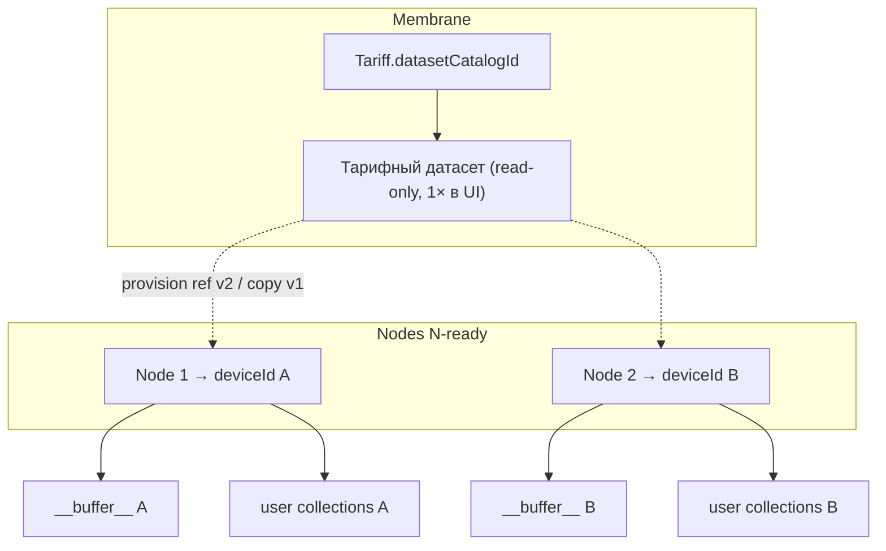

# Консилиум: библиотека сэмплов в cabinet + multi-node readiness

> **Дата:** 2026-06-14  
> **Участники:** Teamlead (Vesnin), product (пользователь), виртуальная команда  
> **Эпик:** [`CABINET_SAMPLE_LIBRARY_V1_EPIC_PROMPT.md`](../prompts/CABINET_SAMPLE_LIBRARY_V1_EPIC_PROMPT.md)  
> **Связь:** MP4 (#67), tariff-dataset-v1, [`MEDIA_LIBRARY_ARCHITECTURE.md`](../MEDIA_LIBRARY_ARCHITECTURE.md)

---

## Контекст

Полевой `apps/client` имеет `SampleLibraryModule` и `mic-buffer-recorder`, пишущий в `__buffer__` через `@membrana/media-library-service` + `ServerStorageBackend`. В `apps/cabinet` раздела библиотеки нет. Нужна **идентичная семантика** с разделением scope: тарифный датасет — мембрана; буфер и user-коллекции — узел (`deviceId`).

---

## Решения product (зафиксировано 2026-06-14)

| # | Вопрос | Решение |
|---|--------|---------|
| 1 | Сколько узлов в v1 | **Один узел** в UI и домене v1; **структура UI и API готова к N узлов** (список узлов, переключатель scope). |
| 2 | Тарифный датасет | Показывается **один раз** на уровне мембраны. При смене тарифа — другой `datasetCatalogId` и другой корпус. |
| 3 | Действия в cabinet | **delete / move / import** в user-коллекции и буфер **удалённо** (через cabinet → media API). Запись с микрофона — только полевой client. |
| 4 | Офлайн / разрыв связи | Узел без cloud: **electron-fs** (desktop), **browser-limited** (сессия), **пустое состояние** в cabinet. При разрыве paired-связи client **переориентируется** на доступные источники (server → electron → local fallback) — уже реализовано в `resolveMediaLibraryBackend`. |

---

## Тарификация системного датасета (ориентир)

Размер read-only каталога по тарифу (`datasetCatalogId` → N сэмплов):

| Тариф (id) | Сэмплов в каталоге | Примечание |
|------------|-------------------|------------|
| `free-v1` | **120** | Реализовано (DS1–DS5) |
| `indie-v1` | **600** | Будущий корпус + provision |
| `business-v1` | **3000** | Будущий корпус + provision |
| `state-v1` | **12000** | Будущий корпус + provision |

`dataset` — не байтовая квота, а **состав каталога**. Смена тарифа → re-provision / swap каталога на мембране (не дублировать под каждый узел в UI).

Технически v1 хранит blobs per `deviceId` (DS5); **v2** — ref-модель: один blob-store на `catalogId`, ссылки на устройствах (CSL4, out of scope v1).

---

## Модель данных (scope)



| Слой | Scope | Cabinet | Client (paired) | Client (autonomous) |
|------|-------|---------|-----------------|---------------------|
| Tariff dataset | Мембрана / тариф | Read-only, один пункт меню | Read-only (bundled или server) | Bundled free-v1 |
| Buffer | `deviceId` | View + delete/move; no mic record | Write (mic-recorder) + CRUD | Local FS / session |
| User collections | `deviceId` | Full CRUD + import | Full CRUD + import | Local FS / session |

---

## Источники данных при разрыве связи (client)

Приоритет (канон, MP3 + media-library):

1. **remote-server** — paired и media-server доступен  
2. **electron-fs** — desktop shell, `electronAPI.mediaLibrary`  
3. **browser-limited-fallback** — in-memory сессия (предупреждение в UI)

Cabinet **не** читает electron/session напрямую: только то, что синхронизировано на `background-media`. Для offline-узла в cabinet — empty state + метка «данные только на полевом узле».

---

## IA cabinet (v1, N-ready)

```text
Библиотека сэмплов
├── Базовый набор ({datasetCatalogId}, badge «тариф»)
└── Узлы
    └── {node.label}          ← v1: один; v2: список
        ├── Буфер (__buffer__)
        └── Мои коллекции (+ создать)
```

---

## Фазы реализации

См. [`CABINET_SAMPLE_LIBRARY_V1_EPIC_PROMPT.md`](../prompts/CABINET_SAMPLE_LIBRARY_V1_EPIC_PROMPT.md): CSL1 API → CSL2 UI → CSL3 remote ops.

---

## Открыто на v2+

- Дедупликация blob каталога между `deviceId` (ref storage).  
- Несколько узлов на мембрану в domain (сейчас 1:1 в консилиуме MP).  
- Синхронизация autonomous → cloud (ручной export / batch).  
- Связная сеть узлов (TDOA): библиотека остаётся per-node; cross-node — журнал и детекция.
