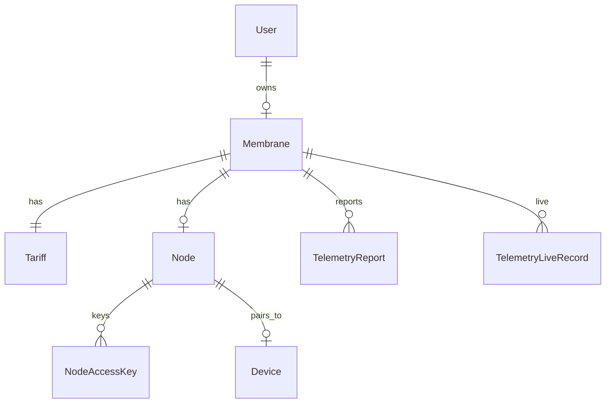

# Консилиум: Membrane Platform v1

> **Дата:** 2026-06-13  
> **Участники:** Teamlead (Vesnin), пользователь (product)  
> **Итог:** зафиксированы домен, UX cabinet, pairing, тарифы, облачный журнал.  
> **Канон:** [`MEMBRANE_PLATFORM.md`](../MEMBRANE_PLATFORM.md)  
> **Эпик:** [#67](https://github.com/officefish/Membrana/issues/67)

---

## Контекст

После деплоя `background-media` (data-plane по `deviceId`) нужен **личный кабинет** и модель «пользователь → поле → узел → клиент». Вход с `membrana.space` ведёт в `cabinet.membrana.space`. Десктоп остаётся **`apps/client`** — отдельное приложение не создаём.

---

## Решения (зафиксировано)

| # | Тема | Решение v1 |
|---|------|------------|
| 1 | Аутентификация | Login + password (без OAuth в v1) |
| 2 | Десктоп | Тот же `apps/client`; **автономный узел** (ФС) или «Связь с мембраной» |
| 3 | **Формат ключа доступа** | **Не** QR/токен-тип, а **срок действия (TTL)** — enum `NodeAccessKeyDuration` |
| 4 | Квоты | Отдельно **userStorage** (user-коллекции) и **buffer** (live); **dataset** — состав каталога (`datasetCatalogId`), не байтовая квота |
| 5 | Журнал | Серверные сущности **TelemetryReport** + **TelemetryLiveRecord**; shared render payload с клиентским журналом |

---

## Форматы ключа доступа (TTL enum)

Пользователь при создании ключа выбирает **срок**, не «тип носителя». Сервер вычисляет `expiresAt` от `createdAt` + длительность.

| Enum value | Метка UI (RU) | Длительность |
|------------|---------------|--------------|
| `hours_4` | 4 часа | `4 * 60 * 60` сек |
| `days_3` | 3 дня | `3 * 24 * 60 * 60` сек |
| `weeks_2` | 2 недели | `14 * 24 * 60 * 60` сек |
| `month_1` | 1 месяц | календарный +1 месяц (UTC) |
| `months_3` | 3 месяца | календарный +3 месяца (UTC) |

- Ротация: отзыв старого ключа + выпуск нового с тем же или другим `duration`.
- Один активный ключ на узел в v1 (или явный лимит в Tariff — по умолчанию 1).
- Значение enum хранится в БД; `expiresAt` — денормализованное поле для индекса и проверки.

```typescript
/** Срок действия ключа доступа к узлу (не формат носителя). */
export enum NodeAccessKeyDuration {
  hours_4 = 'hours_4',
  days_3 = 'days_3',
  weeks_2 = 'weeks_2',
  month_1 = 'month_1',
  months_3 = 'months_3',
}
```

---

## Доменная модель (v1)



| Сущность | v1 лимит | Назначение |
|----------|----------|------------|
| **User** | — | Учётная запись (login/password) |
| **Membrane** | 1 на пользователя | Единое поле/контекст устройств и квот |
| **Tariff** | seed `free-v1` | `userStorageQuotaBytes`, `bufferQuotaBytes`, `datasetCatalogId` |
| **Node** | 1 на мембрану | Шлюз к десктопному `apps/client` |
| **NodeAccessKey** | управляемые | Секрет + `duration` enum + `expiresAt` |
| **Device** | 1 на paired client | Связь с `deviceId` в `background-media` |
| **TelemetryReport** | — | Снимки/отчёты анализа (как в client journal) |
| **TelemetryLiveRecord** | — | Потоковые/live записи сессий |

---

## UX-поток (cabinet)

1. Пользователь логинится на **membrana.space** → редирект в **cabinet.membrana.space**.
2. Видит мембрану (создаётся автоматически при регистрации), тариф `free-v1`, квоты userStorage/buffer, `datasetCatalogId`.
3. Создаёт **узел** → генерирует **ключ** с выбором срока (4ч … 3мес).
4. На полевом ПК открывает `apps/client` → «Связь с мембраной» → ввод ключа → pairing.
5. Клиент работает в `remote-server` против `background-media`, scope по `membraneId` / `deviceId`.
6. Журнал: карточки Report/LiveRecord в cabinet; те же render-компоненты, что в client (shared payload type).

---

## Архитектура пакетов

| Слой | Путь | Ответственность |
|------|------|-----------------|
| Cabinet SPA | `apps/cabinet` | Auth UI, мембрана, узлы, ключи, журнал |
| Identity + domain API | `packages/background-cabinet` | Users, sessions, membranes, nodes, keys, tariffs, telemetry metadata |
| Data-plane (расширение) | `packages/background-media` | Сэмплы/шаблоны по `membraneId` + квоты из tariff |
| Desktop | `apps/client` | Pairing, remote-server, локальный журнал + sync upload |
| Shared types | `@membrana/core` (позже, ветка `vesnin`) | `NodeAccessKeyDuration`, journal payload — только при необходимости cross-package |

**Не смешивать:** Claude/Linear → `background-office`; blobs/templates → `background-media`; auth/users → `background-cabinet`.

---

## Фазы roadmap (MP0–MP6)

| Фаза | id реестра | Содержание |
|------|------------|------------|
| MP0 | `membrane-platform-mp0-domain` | Глоссарий, `MEMBRANE_PLATFORM.md`, consilium |
| MP1 | `membrane-platform-mp1-auth-cabinet` | `background-cabinet` bootstrap, login/password, shell `apps/cabinet` |
| MP2 | `membrane-platform-mp2-membrane-node-keys` | Membrane, Tariff, Node, ключи с TTL enum |
| MP3 | `membrane-platform-mp3-client-pairing` | Pairing + автономный режим узла в `apps/client` |
| MP4 | `membrane-platform-mp4-media-membrane` | Media scope по мембране, отдельные квоты |
| MP5 | `membrane-platform-mp5-telemetry-journal` | Report + LiveRecord, shared journal UI |
| MP6 | `membrane-platform-mp6-prod-deploy` | DNS `cabinet.membrana.space`, TLS, env |

Архитектурные изменения (auth, новый `background-*`, контракты) — ветка **`vesnin`**.

---

## Out of scope v1

- OAuth / SSO
- Несколько мембран на пользователя
- Несколько узлов на мембрану (без явного расширения Tariff)
- Биллинг и оплата (объект Tariff есть, платежей нет)
- Org / team admin
- ML inference на сервере

---

## Открытые вопросы (не блокируют MP0)

- Точный алгоритм sync журнала client → cabinet (batch vs realtime).
- Миграция существующих анонимных `deviceId` на paired Device.

---

*LGTM: product + Teamlead, 2026-06-13*
