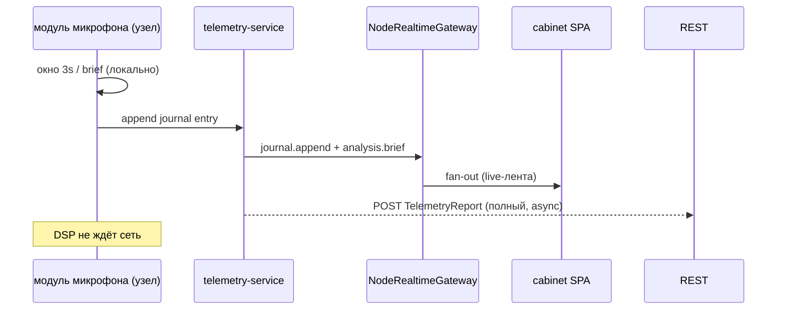

# Консилиум: транспорт узла — REST vs WebSocket (live + device-board)

> **Дата:** 2026-06-17  
> **Инициатор:** product (полевые испытания)  
> **Участники:** Teamlead (Vesnin), Структурщик (Ozhegov), Математик (Dynin), Музыкант, Верстальщик (Rodchenko)  
> **Канон:** [`MEMBRANE_PLATFORM.md`](../MEMBRANE_PLATFORM.md) §«Транспорт узла»  
> **Контекст:** pairing и data-plane уже на REST; live-микрофон (циклы 3+2 с) и синхронизация журнала cabinet↔client требуют субсекундной доставки событий. Device-board и sample library — см. §«Уточнение scope» ниже.

---

## Уточнение scope (product, 2026-06-17)

| Тема | Решение |
|------|---------|
| **Что такое MP7** | Следующая фаза roadmap **Membrane Platform** после MP6 — **рабочее имя**, не отдельный продукт. Реестр: `membrane-node-realtime-gateway` (эпик ещё **не** заведён в `registry.json`). |
| **Scope первого эпика (MP7)** | WebSocket **только** для связки **модуль микрофона** (live-анализ, brief/level) + **журнал** (live append, presence). |
| **Device-board** | В MP7 **не входит**. Перелинковка с WS — при **существенных правках** device-board, отдельная фаза (рабочее имя MP7b). Стратегически runtime остаётся локальным; WS для фаз — будущий слой. |
| **Sample library** | В MP7 **не трогаем** — остаётся **REST** (`background-media`). Рефакторинг под WebSocket — **отдельный консилиум** позже (библиотека «под большим вопросом»). |

---

## Входные данные (поле)

1. Для **полноценного сбора и анализа в live** одного REST недостаточно: задержка round-trip и отсутствие server→client push мешают оперативной реакции кабинета и узла.
2. **Device-board** вводит короткие циклы (alarm loop pause 400 мс, переходы initial → main → alarm) — удалённое наблюдение и команды по HTTP-poll неприемлемы.
3. Существующие эпики (MP5, TJ*, LP*) уже откладывали SSE/WebSocket как post-v1; полевые данные **снимают отложенность** для **сигнального** слоя, не для всего API.

---

## Позиции ролей

### [Teamlead] (Vesnin)

Разделяем **три плоскости**, не один «протокол на всё»:

| Плоскость | Где исполняется | Транспорт |
|-----------|-----------------|-----------|
| **Сигнал и DSP** | Только на узле (`audio-engine`, плагины, `ScenarioRuntime`) | Локально; по сети — **не** сырой PCM в v1 |
| **Документы и blobs** | `background-media` | **REST** (идемпотентность, LWW, multipart) |
| **События узла и live-зеркало** | `background-cabinet` (+ fan-out в cabinet SPA) | **WebSocket** (WSS), с REST fallback |

WebSocket — **не замена** REST, а **дополнительный канал** для paired-узла. Автономный режим (`nodeConnectionMode: autonomous`) WebSocket **не требует**.

Шлюз realtime: **`background-cabinet`** (владеет Node, Device, сессией pairing). В `background-media` и `background-office` WebSocket **не добавляем** — см. [`BACKGROUND_SERVERS.md`](../BACKGROUND_SERVERS.md).

Контракты событий и версии сообщений — ветка **`vesnin`**, типы в `@membrana/core` (или отдельный `node-transport` модуль core), чтобы client и cabinet не дублировали схемы.

**LGTM** на стратегию; **первая реализация** — эпик после MP6 (рабочее имя **MP7** / `membrane-node-realtime-gateway`): **микрофон + журнал**; device-board и media-library — вне scope MP7.

---

### [Структурщик] (Ozhegov)

**REST остаётся** для всего, что:

- крупное, редкое, идемпотентное;
- редактируется человеком с debounce;
- хранится как blob или JSON-документ.

**WebSocket обязателен в MP7** для:

- push новых записей/дельт журнала (cabinet live-лента без poll);
- статуса узла (online, paired, revoked key);
- live-сигналов **модуля микрофона** (brief, level, lifecycle окна).

**Отложено (не MP7):** фазы и команды **device-board runtime**; любые события sample library.

Клиентская архитектура:

```
apps/client
  ├── nodeRestClient      (существующий: media, cabinet CRUD, upload)
  └── nodeRealtimeClient  (новый: один WS на paired-сессию, reconnect + cursor)
```

Один физический WebSocket на узел; в MP7 каналы envelope: `journal | mic-live | presence` (канал `runtime` — зарезервировать в схеме, не реализовывать). Не открывать отдельный сокет на каждый плагин.

Cabinet SPA: тот же WS (cookie/session) или **server-sent fan-out** из cabinet API — предпочтение **один gateway на cabinet**, подписка по `membraneId` / `nodeId`.

Device-board **не** входит в MP7; при будущей перелинковке — исполнение графа только на клиенте, сервер — события/команды (отдельный эпик).

---

### [Математик] (Dynin)

Латентность live-анализа задана локально ([`LIVE_PARALLEL_DETECTION.md`](../LIVE_PARALLEL_DETECTION.md)): finalize brief ≤ 500 мс после окна; период stream-auto 5 с. **Передавать по сети нужно результат анализа**, не окно сэмплов.

По WebSocket — **агрегаты и метки времени**:

- `analysisBrief` (schema id + scalar metrics + confidence);
- `frameTick` / пороговые пересечения (FFT, trends) — компактные struct, не полные матрицы кадров;
- полные `TelemetryReport` / DDR — по-прежнему **REST upload** после завершения (или по запросу LP1b).

Требование к джиттеру канала journal/mic-live: доставка `journal.append` и `analysis.brief` — **p95 ≤ 300 мс** до UI cabinet. Локальный анализ микрофона **не ждёт** подтверждения сети.

---

### [Музыкант]

Микрофонный поток (48 kHz, буферы engine) **остаётся в Web Audio на узле**. По WebSocket в v1 **запрещён** непрерывный PCM — bandwidth, jitter, приватность.

Допустимо позже (post-v1): сжатый side-channel (opus chunks) для удалённого прослушивания оператором — **отдельный эпик**, не смешивать с control plane.

Для live-достаточно: события «окно закрыто», RMS/уровень для индикатора в кабинете, ссылка на buffer-track после импорта в media (REST).

---

### [Верстальщик] (Rodchenko)

Индикатор **канала** (WS connected / reconnecting / REST-only fallback) — в client и cabinet.

Журнал: при активном WS — append карточки без ручного refresh (закрывает боль TJ7/LJ*). При fallback — существующий pull + интервал, не ломаем MP5.

Микрофон live: badge активной сессии и краткие метрики в cabinet синхронно с client. Device-board UI в MP7 **без** WS-оверлея фаз.

---

## Решения (зафиксировано)

| # | Тема | Решение |
|---|------|---------|
| R1 | Роль WebSocket | **Сигнальный слой** paired-узла: события, push, короткие команды |
| R2 | Роль REST | **Data-plane и CRUD**: auth, pairing bootstrap, media blobs, device-scenario JSON, финальные отчёты, пагинация журнала |
| R3 | Где живёт WS | **`background-cabinet`** — `NodeRealtimeGateway` (NestJS `@WebSocketGateway` или Fastify ws) |
| R4 | Автономный узел | WS **не используется**; локальный журнал и ФС без изменений |
| R5 | Device-board runtime | **Вне MP7**; стратегически — локально + WS позже (MP7b); в MP7 не реализуем |
| R6 | Live-микрофон | DSP на узле; по WS — briefs и lifecycle, полные отчёты — REST |
| R7 | Сырой аудиопоток | **Out of scope** realtime v1 |
| R8 | Fallback | При обрыве WS: exponential reconnect + **REST poll** (`GET /v1/journal?since=`) и poll pair status (как сейчас) |
| R9 | Безопасность | WSS, тот же bearer/session что REST; привязка к `nodeId` + `deviceId`; revoke key → `session.invalidated` по WS |
| R10 | Версионирование | Envelope `{ v: 1, channel, type, ts, payload }`; breaking — новый `v` |
| R11 | Sample library | **REST only** в MP7; WS для media — **отдельный консилиум** |

---

## Граница REST vs WebSocket (детально)

### Только REST (без изменений стратегии)

| Операция | Endpoint / паттерн | Почему REST |
|----------|-------------------|-------------|
| Login, сессия cabinet | `background-cabinet` | Редко, cookie |
| Pairing bootstrap | `POST /v1/pair` | Один раз; выдаёт credentials |
| Ключи узла, тариф, квоты | cabinet CRUD | Админ-операции |
| Sample upload/download | `background-media` | Blob, multipart, квоты |
| Trends template pack | `PUT .../template-pack` | Крупный JSON |
| Device scenario document | `GET/PUT .../device-scenario` | LWW, debounce редактора |
| Финальный TelemetryReport | `POST` upload + blob ref | Идемпотентность, retry |
| История журнала, фильтры, export | `GET` + cursor pagination | Запрос по требованию |
| Health / smoke | `GET /health` | — |

### WebSocket — scope MP7 (paired)

| Категория | Направление | Примеры `type` | SLA (ориентир) |
|-----------|-------------|----------------|----------------|
| **Presence** | server ↔ client | `node.online`, `node.offline`, `session.invalidated` | — |
| **Journal live** | client → server → cabinet | `journal.append`, `journal.liveSession` | p95 ≤ 300 мс до UI cabinet |
| **Journal ack** | server → client | `journal.acked` (cursor) | — |
| **Mic live** | client → server → cabinet | `analysis.brief`, `analysis.level`, `mic.session` | не чаще 2 Hz агрегат |

Полные payload отчётов (матрицы кадров, waveform) — **не** в WS; cabinet запрашивает REST по id из события.

### WebSocket — отложено (не MP7)

| Категория | Когда |
|-----------|-------|
| **Runtime state/command** (device-board) | MP7b, после существенных правок device-board |
| **Sample library** sync/events | Отдельный консилиум; до решения — **только REST** |
| **Control** `config.scenarioUpdated` | С device-board / MP7b |

---

## Микрофон и журнал (scope MP7)



| Компонент | Локально на узле | По WebSocket (MP7) | По REST |
|-----------|------------------|-------------------|---------|
| Захват микрофона | ✓ | — | — |
| FFT / drone brief | ✓ | `analysis.brief`, `mic.session` | — |
| Live-журнал | ✓ | `journal.append` | history, export |
| Полный DDR / waveform | ✓ | — | upload report |
| Sample library | ✓ | — (отдельный консилиум) | blobs, templates |
| Device-board runtime | ✓ | — (MP7b) | `device-scenario` |

---

## Пакеты (без нового `background-*` в v1)

| Пакет | Изменение |
|-------|-----------|
| `packages/background-cabinet` | `NodeRealtimeGateway`, fan-out, хранение cursor журнала для reconnect |
| `apps/client` | `nodeRealtimeClient`, bridge: **модуль микрофона** → telemetry → WS |
| `apps/cabinet` | подписка на WS, live journal + mic-live badge |
| `@membrana/core` | типы envelope, journal + mic-live events (ветка `vesnin`) |
| `packages/background-media` | **без WS** (sample library — REST; отдельный консилиум) |
| `@membrana/device-board` | **без изменений в MP7** |

---

## Roadmap

| Фаза | id (предложение) | Содержание |
|------|------------------|------------|
| **MP7** | `membrane-node-realtime-gateway` | Gateway; WS: **журнал + микрофон live**; presence |
| **MP7b** | `membrane-node-runtime-remote` | Device-board ↔ WS (после крупных правок графа) |
| **—** | `media-library-realtime` (TBD) | Отдельный консилиум: нужен ли WS для sample library |
| **MP8** | `membrane-realtime-hardening` | Reconnect, backpressure, метрики, load test |

Зависимости MP7: MP3 (pairing) ✓, MP5 (journal REST) — база для fallback; модуль микрофона + `@membrana/telemetry-service`.

Промпт эпика — оформить по [`TASK_PROMPT_WORKFLOW.md`](../prompts/TASK_PROMPT_WORKFLOW.md) после принятия product.

---

## Out of scope MP7

- PCM/opus streaming с микрофона в облако
- WebSocket в `background-media` / `background-office` (в т.ч. sample library — **отдельный консилиум**)
- Device-board runtime по WS (MP7b)
- Исполнение scenario graph на сервере
- Несколько одновременных WS на один узел (кроме dev tools)
- SSE как второй параллельный канал (выбран **один** WS)

---

## Закрытые вопросы из MP0

| Вопрос (2026-06-13) | Ответ |
|---------------------|-------|
| Sync журнала batch vs realtime | **Гибрид:** WS для live append + REST для history/backfill |
| Poll pair status 60 с | **WS `session.invalidated`** + REST fallback poll |

---

## Definition of Done (стратегия)

- [x] Граница REST / WS / локально согласована пятью ролями
- [x] Канон в `MEMBRANE_PLATFORM.md`
- [ ] Эпик MP7 в `docs/tasks/registry.json` (по запросу product)
- [ ] Контракты в `@membrana/core` (ветка `vesnin`)

---

*LGTM: Vesnin (Teamlead) + product input, 2026-06-17 · scope MP7 уточнён product 2026-06-17 (микрофон + журнал only)*
