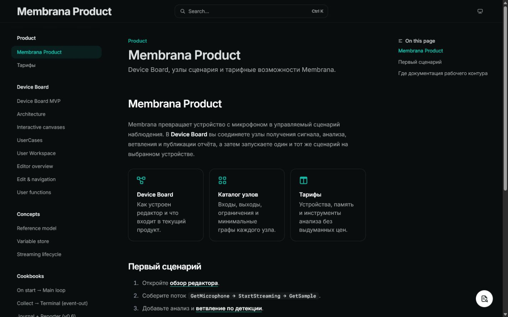
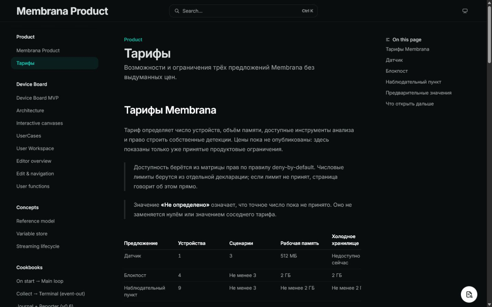
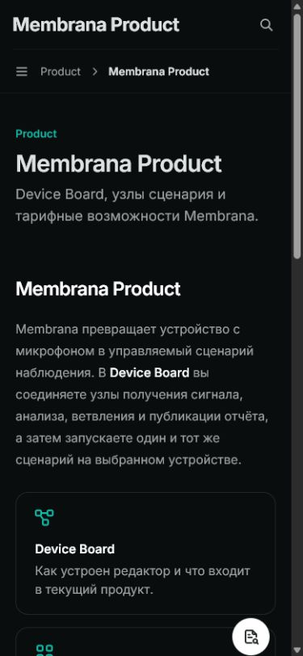

# Product Mintlify visual report

**Preview:** `https://membrana-codex-product-docs-container.mintlify.site`
**Deployment:** PR #1640, Mintlify Preview Deployment `5713447519`
**Checked:** 2026-08-02T14:52:00+03:00

## Desktop 1440×900

- Product is the first navigation group; Device Board and node documentation
  remain visible below it.
- Overview cards fit one row without overlap; the table header and first three
  tariff rows remain readable in the tariffs viewport.
- The right-side page outline and floating preview control do not cover the
  primary text or table.

## Mobile 390×844

- The desktop sidebars collapse into the mobile header and breadcrumb.
- Overview cards stack vertically and retain readable titles and descriptions.
- Tariff introduction and callouts wrap inside the viewport without horizontal
  overlap; the table follows below the captured first screen.

## Verdict

PASS. The Product landing page and tariff page render as a usable Mintlify
surface at both required viewports. This report closes the visual-evidence gap;
it does not claim production DNS or `product.mmbrn.tech` activation.
