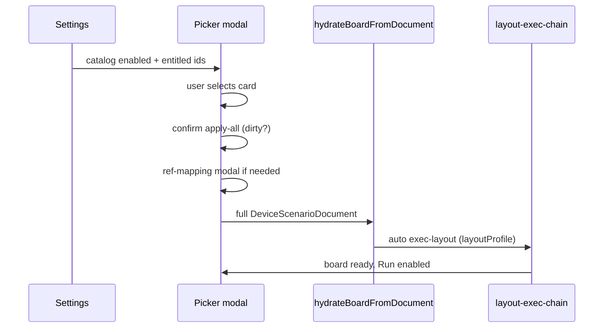

# Промпт (эпик): Device-Board — UserCases catalog (U9)

> **Task-промпт** · [`TASK_PROMPT_WORKFLOW.md`](./TASK_PROMPT_WORKFLOW.md)  
> **Реестр:** `id` = **`db-usercases-catalog-u9`**  
> **Родитель:** [`DEVICE_BOARD_POST_USERCASE_ROADMAP.md`](./DEVICE_BOARD_POST_USERCASE_ROADMAP.md) (направление **U9**, поглощает **U1**)  
> **Консилиум:** [`device-board-usercases-consilium-2026-06-21.md`](../discussions/device-board-usercases-consilium-2026-06-21.md)  
> **Предшественники:** UserCase MVP LGTM · U8 (`db-canvas-groups-functions`, PR #134) · U8a (`db-node-align-advanced`, PR #135)  
> **GitHub Issue:** [#136](https://github.com/officefish/Membrana/issues/136)  
> **Статус:** **archived** · LGTM Teamlead 2026-06-21 · ветка `feat/db-usercases-catalog-u9`  
> **Ветка:** `feat/db-usercases-catalog-u9` от `main` / `techies68` (после merge U8/U8a)

> **Sibling (agents):** programmatic pack/collapse — [`USERCASE_GENERATION_REGULATION.md`](../device-board-scripts/USERCASE_GENERATION_REGULATION.md) → [`DEVICE_BOARD_USERCASE_GENERATION_PROMPT.md`](./DEVICE_BOARD_USERCASE_GENERATION_PROMPT.md) (не путать с U9 catalog UI).

---

## Контекст

**UserCase** — единый комплексный JSON (`DeviceScenarioDocument` v2), описывающий **все шесть веток** сценария, **пользовательские функции** (`scenario.functions[]`) и **визуальные группы** (`scenario.commentGroups[]`).

**Цель продукта:** оператор включает каталог в **настройках**, выбирает UserCase в **modal** на device-board → получает готовый сценарий с **аккуратным LR-layout**, проходит Run end-to-end без ручного import JSON. Ощущение: лёгкость восприятия цепочки, логичная последовательность.

**Runtime MVP уже доказан:** bundled `usercase-mvp-microphone` (LGTM 2026-06-21). Эпик U9 — **каталог + entitlement + apply-flow + layout canon + docs**, не повтор runtime.

**Дистрибуция:**

| Фаза | Источник | v1 |
|------|----------|-----|
| Bundled | `docs/device-board-scripts/usercase-*/` | `usercase-mvp-microphone` — free |
| Tariff | cabinet SKU → client entitlement hook | stub OK (locked card + copy) |
| Community / marketplace | manifest `tier: 'community'` | schema only, **out of scope** |

---

## Product decisions (консилиум · LGTM)

| ID | Тема | Решение |
|----|------|---------|
| **D-UC-DOC** | Единица поставки | Full `DeviceScenarioDocument` v2 + `manifest.json`; не loose branch JSON |
| **D-UC-APPLY** | Apply v1 | **apply-all** document; confirm + dirty check + ref-mapping; signal layer **не** меняется |
| **D-UC-GATE** | Доступ | **Settings** (toggle + entitlement) → **modal picker** на board (не header dropdown) |
| **D-UC-TIER** | Entitlement | `bundled` + `tariff`; `community` — поле schema без UI |
| **D-UC-LAYOUT** | Визуал | `layoutProfile: 'exec-lr-v1'`; post-apply auto exec-layout; CI `usercase:verify-layout` |
| **D-UC-DEPS** | Hard deps | U8 + U8a merged (groups, functions, align, dagre, snap) |
| **D-UC-CORE** | Граница core | Tariff/entitlement **не** в `@membrana/core`; optional additive `meta.userCaseId` |

---

## Scope

### In scope (волны R0 → L1 → C1 → G1 → P1 → D1)

| Wave | Task id | Deliverable |
|------|---------|-------------|
| **R0** | `db-uc-r0-schema` | Manifest contract, generalized `yarn usercase:build`, `yarn usercase:verify-kinds` |
| **L1** | `db-uc-l1-layout-canon` | Editorial layout MVP doc + comment group frames + `yarn usercase:verify-layout` |
| **C1** | `db-uc-c1-catalog` | `UserCaseCatalogService` (bundled index); load manifest + embedded document |
| **G1** | `db-uc-g1-settings-gate` | Settings UI: секция UserCases, toggle каталога, entitlement badges |
| **P1** | `db-uc-p1-picker-modal` | Modal picker + apply-all + confirm + ref-mapping + post-apply exec-layout |
| **D1** | `db-uc-d1-docs` | CONCEPT §20, package README, apps/docs page |

### Out of scope v1

- Marketplace upload / community moderation / user-authored UserCases UI
- apply-single-branch (v1.1)
- Server-side UserCase CRUD в `background-media` (после C1, отдельная задача S*)
- Undo stack после apply-all
- Tariff billing / payment (только entitlement read hook)

---

## Архитектура

### Слой → путь

| Слой | Путь | Ответственность |
|------|------|-----------------|
| Scripts | `scripts/build-usercase-*.mjs`, `scripts/verify-usercase-*.mjs` | Build embedded TS + manifest; CI verify |
| Core | `device-scenario.ts` (existing) | Parse/validate v2; `functions[]`, `commentGroups[]` |
| Graph | `hydrate-board-from-document.ts`, **new** `apply-user-case.ts` | apply-all hydrate; ref-mapping hooks |
| Graph ops | `layout-exec-chain.ts`, `layout-snap-guides.ts` | Post-apply layout canon |
| device-board | `device-board-shell.tsx`, **new** `board-usercase-picker-modal.tsx` | Modal UX, dirty confirm |
| client | **new** `user-case-catalog-service.ts`, settings module section | Catalog index, entitlement |
| cabinet (stub) | tariff SKU lookup (future) | `tariffSku` in manifest → locked/unlocked |

### Manifest contract (v1)

```typescript
/** Metadata + entitlement; graph lives in embedded DeviceScenarioDocument. */
export interface DeviceBoardUserCaseManifest {
  readonly id: string; // kebab: usercase-mvp-microphone
  readonly title: string;
  readonly description?: string;
  readonly deviceKind: DeviceKind;
  readonly tier?: 'bundled' | 'tariff' | 'community';
  readonly tariffSku?: string;
  readonly layoutProfile: 'exec-lr-v1';
  readonly minEditorFeatures: readonly (
    | 'align'
    | 'groups'
    | 'functions'
    | 'exec-layout'
  )[];
  /** Repo path → build output (embedded .ts or JSON). */
  readonly embeddedDocument: string;
  readonly preview?: {
    readonly branchStats?: Record<
      string,
      { readonly nodeCount: number; readonly edgeCount: number }
    >;
  };
}
```

### Apply flow (P1)



1. Load manifest + document from catalog service.
2. `deviceKind` mismatch → block with RU copy.
3. Dirty document → second confirm.
4. Ref-mapping для `journalId` / `deviceId` placeholders (reuse branch-import patterns).
5. `hydrateBoardFromDocument(document)` — signal graph unchanged.
6. If `layoutProfile === 'exec-lr-v1'`: run exec-chain layout on `main`, `initial`, `alarm` scopes (preserve anchors per U8a).

---

## Layout verify (L1 · Dynin)

`yarn usercase:verify-layout <id>` — pure checks, CI gate on bundled UserCases:

| Check | Severity v1 |
|-------|-------------|
| All node positions on 8 px grid | hard fail |
| Main/alarm exec spine: monotonic x (LR) | hard fail |
| Same-rank node overlap | hard fail |
| Branch symmetry \|Δy\| heuristic | warning |
| Function depth ≤ 1, pins ≤ 9/side | hard fail |

Reuse: `layout-exec-chain.ts`, `snapBoardLayoutCoordinate`, `validate-function-depth.ts`.

---

## UI (Rodchenko)

### Settings (`apps/client`)

Секция **«UserCases»** / **«Сценарии по подписке»**:

- Toggle «Показывать каталог на device-board».
- List entitled UserCases: badge `Bundled` / `Tariff` / `Locked`.
- Locked: disabled row + «Доступно в тарифе …» (stub copy).

### Board modal (`board-usercase-picker-modal.tsx`)

```text
┌─ Загрузить UserCase ─────────────────────────────┐
│  [card] MVP microphone          microphone  Bundled │
│  6 веток · N функций · recording gate v0.8          │
│  [card] … (locked)              Tariff      🔒      │
├─────────────────────────────────────────────────────┤
│  [ Отмена ]              [ Применить сценарий ]     │
└─────────────────────────────────────────────────────┘
```

- Confirm destructive: «Заменить текущий сценарий? Несохранённые изменения будут потеряны.»
- Primary apply — по DESIGN.md (destructive styling).
- После apply — toast «UserCase применён» + optional «Упорядочить вручную» link (exec layout already ran).

---

## Yarn scripts (R0)

| Script | Назначение |
|--------|------------|
| `yarn usercase:build-mvp-microphone` | Existing; refactor target for generic `usercase:build` |
| `yarn usercase:build <id>` | R0: generalize from MVP script |
| `yarn usercase:verify-kinds <id>` | Node kinds ⊆ `SCENARIO_NODE_KINDS` |
| `yarn usercase:verify-layout <id>` | L1: layout metrics |

CI: verify on PR touching `docs/device-board-scripts/usercase-*/`.

---

## Definition of Done (эпик)

- [x] R0: manifest contract + build/verify-kinds scripts; MVP manifest validates
- [x] L1: MVP document passes `verify-layout`; comment group semantic frames on main
- [x] C1: catalog service lists bundled `usercase-mvp-microphone`
- [x] G1: settings section + toggle; bundled always entitled
- [x] P1: modal apply-all → hydrate → Run main loop без manual JSON import
- [x] D1: CONCEPT §20 UserCases; README + apps/docs stub page
- [x] Tariff locked card stub (disabled + copy)
- [x] `@membrana/device-board` + client tests green; CI verify scripts in pipeline

---

## Порядок реализации (Teamlead)

```text
R0 (schema) → L1 (layout canon) → C1 (catalog) → G1 (settings) → P1 (modal) → D1 (docs)
```

G1 и C1 можно параллелить после R0. P1 блокируется C1 + G1 + merge U8/U8a.

---

## Мнение команды (консилиум · 2026-06-21)

Полный протокол: [`device-board-usercases-consilium-2026-06-21.md`](../discussions/device-board-usercases-consilium-2026-06-21.md).

```text
[Teamlead — Vesnin]:
UserCases = продуктовый слой, не runtime. Issue + prompt после протокола. Core без tariff.

[Структурщик — Ozhegov]:
Manifest ≠ graph. apply-all через hydrate; signal layer intact. Catalog service в client.

[Математик — Dynin]:
verify-layout обязателен; «аккуратность» = метрики, не вкус.

[Музыкант]:
MVP microphone — единственный bundled v1; deviceKind gate hard.

[Верстальщик — Rodchenko]:
Settings → modal, не dropdown. Confirm destructive. Post-apply exec-layout auto.
```

---

## Связанные документы

- [`USERCASE_MVP_MICROPHONE_LGTM.md`](../device-board-scripts/USERCASE_MVP_MICROPHONE_LGTM.md)
- [`usercase-mvp-microphone/manifest.json`](../device-board-scripts/usercase-mvp-microphone/manifest.json)
- [`DEVICE_BOARD_CANVAS_GROUPS_FUNCTIONS_EPIC_PROMPT.md`](./DEVICE_BOARD_CANVAS_GROUPS_FUNCTIONS_EPIC_PROMPT.md) (U8)
- [`DEVICE_BOARD_NODE_ALIGN_ADVANCED_EPIC_PROMPT.md`](./DEVICE_BOARD_NODE_ALIGN_ADVANCED_EPIC_PROMPT.md) (U8a)
- [`DEVICE_BOARD_RECORDING_PARITY_V08_EPIC_PROMPT.md`](./DEVICE_BOARD_RECORDING_PARITY_V08_EPIC_PROMPT.md) § Future (superseded UX)
- [`DESIGN.md`](../DESIGN.md) — modals, grid 8 px, destructive actions
