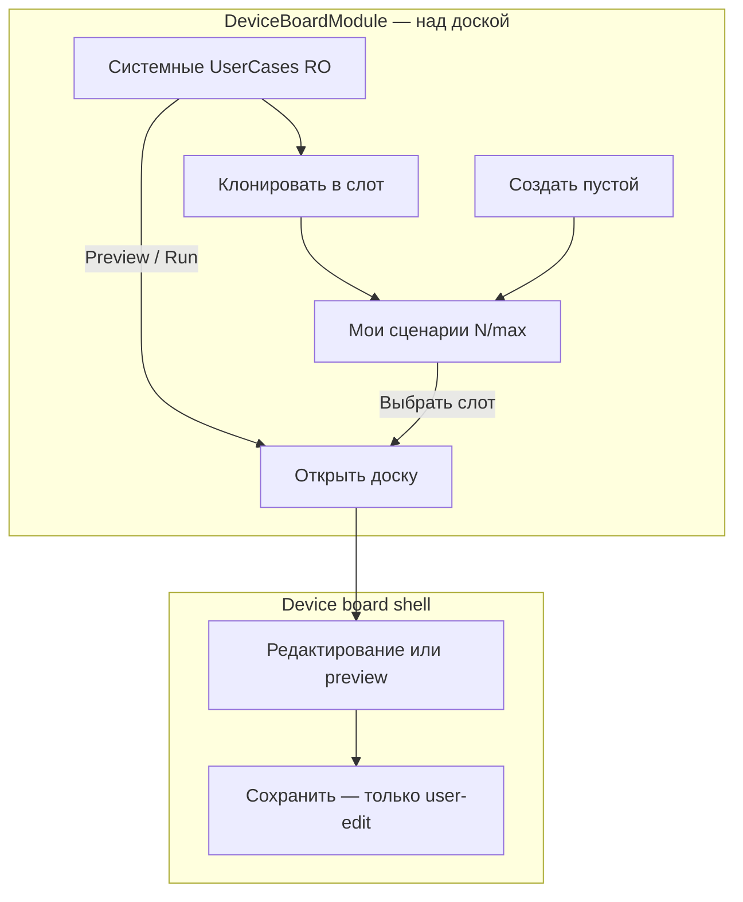
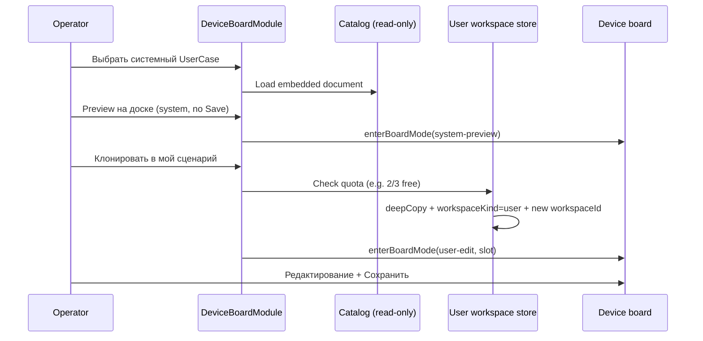

# Промпт (эпик): Device-Board — User Workspace (U10)

> **Task-промпт** · [`TASK_PROMPT_WORKFLOW.md`](./TASK_PROMPT_WORKFLOW.md)  
> **Реестр:** `id` = **`db-user-workspace-u10`**  
> **Родитель:** [`DEVICE_BOARD_POST_USERCASE_ROADMAP.md`](./DEVICE_BOARD_POST_USERCASE_ROADMAP.md) (направление **U10**, после **U9**)  
> **Предшественник:** U9 catalog (`db-usercases-catalog-u9`, #136) · manual save (#108)  
> **GitHub Issue:** [#147](https://github.com/officefish/Membrana/issues/147)  
> **Статус:** **active** · intake 2026-06-23  
> **Размер:** **L** (3–5 PR)

---

## Контекст (продукт)

Оператор редактирует обработчики и пользовательские функции на device-board, жмёт **Сохранить**, но после **пересборки client** (`yarn build` / HMR remount) изменения пропадают — снова эталонный bundled MVP.

**Желаемая модель:**

| Слой | Поведение |
|------|-----------|
| **Системный UserCase (каталог)** | Bundled / tariff — **только чтение** на доске; поставляется тарифом; **редактировать нельзя** |
| **Клонирование** | «Скопировать в мой сценарий» → новый слот в user workspace (в счёт квоты тарифа, free = **3**) |
| **User Workspace** | До **3** редактируемых копий на **free-v1**; полный `DeviceScenarioDocument` v2; правки только здесь |
| **Persist** | User workspace переживает rebuild client, reload; paired mode — sync с `background-media` |

**Поток оператора (целевой UX · LGTM 2026-06-23):**

1. На **уровне модуля** «Доска устройства» (до входа в board mode) оператор выбирает **контекст сессии** — не переключает его в шапке открытой доски.
2. **Системный UserCase** — read-only preview / «прогон» на доске; Save и mutating ops недоступны; можно **клонировать** в свободный user-слот.
3. **Свой сценарий** — один из слотов user workspace (до 3 на free); только здесь полноценное редактирование + Save.
4. После выбора контекста — **«Открыть доску»**; на доске нет переключателя между «моими» сценариями (это слишком «липкий» глобальный выбор для шапки конкретного кейса).

U9 **явно исключил** user-authored UI (`DEVICE_BOARD_USERCASES_EPIC_PROMPT.md` → Out of scope v1). U10 закрывает этот gap.

---

## UX revision (2026-06-23)

| Было (interim W2) | Стало (целевой продукт) |
|-------------------|-------------------------|
| «Мои сценарии» + badge `N/3` в **шапке device-board** | Launcher на **уровне модуля** (`DeviceBoardModule`) |
| UserCase picker в dropdown настроек доски | Системные шаблоны — секция модуля; clone/create — там же |
| «Открыть доску» без явного контекста | Сначала выбор: системный preview **или** свой слот → затем board mode |

**Обоснование:** переключение user workspace — выбор **режима работы**, а не действие внутри редактирования одного сценария. Шапка доски — про Save/Run текущей сессии, не про смену «чей это сценарий».

**Interim-код (снят 2026-06-23):** `BoardWorkspacePickerModal` в shell удалён в `db-uw-w2-deprecate-shell`.

---

## Диагностика (текущий код)

| Проблема | Где |
|----------|-----|
| Один слот persist | `deviceScenarioPersistence.ts` → `membrana.device-scenario.v1` |
| Migrate-on-load затирает сохранённое | `device-board-graph-context.tsx` → `isLegacyHackathonDefaultScenario` / `needs*Migration` → `getDefaultMvpMicrophoneDocument()` |
| Каталог apply-all = overwrite | `apply-user-case.ts` — сейчас пишет в единственный слот; нужен режим preview + clone |
| Системный кейс редактируем | Нет `workspaceKind: 'system'` + read-only shell; Save не должен быть доступен на каталоге |
| Нет quota user cases | `TARIFF_MATRIX.md` — квоты storage/buffer, не «N workspace slots» |

**P0 (можно отдельным S-PR до U10):** не запускать migrate-to-bundled, если документ помечен `meta.workspaceKind: 'user'` или `updatedAt` после явного Save.

---

## Product decisions (intake · LGTM pending)

| ID | Тема | Решение (draft) |
|----|------|-----------------|
| **D-UW-ENTRY** | Точка входа | Выбор системный / свой / клон — **модуль** `DeviceBoardModule`; **не** шапка board shell |
| **D-UW-SESSION** | Board session | В board mode один фиксированный контекст (`system-preview` \| `user-edit`); выход → модуль для смены |
| **D-UW-SPLIT** | Каталог vs workspace | Каталог = **системные** шаблоны (read-only); workspace = редактируемые копии оператора |
| **D-UW-SYSTEM-RO** | Системный кейс | `meta.workspaceKind: 'system'` или просмотр без active user slot — **нет Save**, нет mutating ops на canvas |
| **D-UW-CLONE** | Клон из каталога | Действие **«Клонировать в мой сценарий»**: deep-copy `DeviceScenarioDocument`, `workspaceKind: 'user'`, новый `workspaceId`, `meta.clonedFromUserCaseId` |
| **D-UW-QUOTA** | Лимит free | **3** user workspace; системные шаблоны каталога **не** входят в лимит; **клон** занимает 1 слот |
| **D-UW-STORAGE** | Autonomous | IndexedDB (multi-record), ключ `deviceId` + `workspaceId` |
| **D-UW-STORAGE-P** | Paired | `GET/PUT .../device-workspaces` на media (новый контракт) или расширение device-scenario |
| **D-UW-RESET** | Эталон | Повторное открытие системного кейса = свежая копия из embedded/tariff; не трогает user slots |
| **D-UW-META** | Маркер | `meta.workspaceId`, `meta.workspaceKind: 'system' \| 'user'`, optional `meta.clonedFromUserCaseId` |

---

## Scope

### Статус волн (2026-06-23)

| Wave | Task id | Статус | Deliverable |
|------|---------|--------|-------------|
| **P0** | `db-uw-p0-migrate-guard` | **done** | `meta.workspaceKind` guard; не затирать user-saved при migrate-on-load |
| **W1** | `db-uw-w1-indexeddb` | **done** | `DeviceBoardWorkspaceStore`: CRUD, list, active workspace id |
| **W3** | `db-uw-w3-persist-adapter` | **done** | Persist adapter → active user workspace; legacy localStorage migrate |
| **W2-interim** | `db-uw-w2-shell-interim` | **done · deprecate** | Прототип picker в shell (шапка) — **снять** в W2-deprecate-shell |
| **W2-module** | `db-uw-w2-module-launcher` | **done** | Launcher в `DeviceBoardModule`: системные RO + мои слоты + quota `N/max` |
| **W2b** | `db-uw-w2-clone-catalog` | **done** | Клон системного UserCase → user slot (**из модуля**) |
| **W2-deprecate** | `db-uw-w2-deprecate-shell` | **done** | Убрать «Мои сценарии» / UserCase… из шапки shell |
| **W4** | `db-uw-w4-tariff` | **done** | `maxUserWorkspaces` в Tariff + client entitlement |
| **W5** | `db-uw-w5-media-api` | **done** | Paired: media API workspaces |
| **D1** | `db-uw-d1-docs` | **done** | CONCEPT §22, apps/docs, TARIFF_MATRIX |

### In scope (волны · описание)

| Wave | Task id | Deliverable |
|------|---------|-------------|
| **P0** | `db-uw-p0-migrate-guard` | Не затирать user-saved doc migrate-on-load; unit-тест |
| **W1** | `db-uw-w1-indexeddb` | `DeviceBoardWorkspaceStore`: CRUD, list, active workspace id |
| **W3** | `db-uw-w3-persist-adapter` | `DeviceBoardPersistAdapter` → active **user** workspace; Save/load; legacy migrate |
| **W2-module** | `db-uw-w2-module-launcher` | **Модуль** (над доской): секция «Системные UserCases» (RO preview/run) + «Мои сценарии» (слоты 1..max); create / rename / delete; badge `N/max`; кнопка «Открыть доску» только после выбора контекста |
| **W2b** | `db-uw-w2-clone-catalog` | На карточке системного кейса в модуле: **«Клонировать в мой сценарий»** → слот; read-only board для preview |
| **W2-deprecate** | `db-uw-w2-deprecate-shell` | Удалить `BoardWorkspacePickerModal` и badge из `device-board-shell`; перенести catalog toggle UX в модуль |
| **W4** | `db-uw-w4-tariff` | `maxUserWorkspaces` в Tariff + client entitlement read |
| **W5** | `db-uw-w5-media-api` | Paired: media API workspaces (expand contract) |
| **D1** | `db-uw-d1-docs` | CONCEPT §22, `user-workspace.mdx`, TARIFF_MATRIX `maxUserWorkspaces` |

### Out of scope v1

- Community marketplace upload
- CRDT / merge conflict UI (LWW достаточно)
- Server-side UserCase authoring pipeline (остаётся `yarn usercase:build` для bundled)

---

## Архитектура

| Слой | Путь | Ответственность |
|------|------|-----------------|
| Core | `device-scenario.ts` | Optional `meta.workspaceId`, `meta.workspaceKind` |
| Persist | `apps/client/.../deviceScenarioPersistence.ts` | Multi-workspace adapter |
| Store | `device-board-workspace-store.ts` | IndexedDB CRUD |
| Session | **new** `device-board-session-context.ts` (client) | `system-preview` \| `user-edit`; active workspace / catalog id; передаётся в shell при enter board |
| Graph | `device-board-graph-context.tsx` | Load session context; read-only если `system`; убрать silent migrate |
| Graph | **new** `clone-user-case-to-workspace.ts` | Deep copy catalog document → user workspace slot |
| UI **module** | `DeviceBoardModule.tsx`, `UserCaseSettingsPanel` → **launcher** | Выбор контекста, clone, create slot, quota; **не** шапка доски |
| UI board | `device-board-shell.tsx` | Save/Run **текущей** сессии; read-only banner для system; **без** workspace switcher |
| Cabinet | `background-cabinet` Tariff | `maxUserWorkspaces` |
| Media | `background-media` | Optional REST workspaces collection |

### Module launcher flow (W2-module)

### Clone flow (W2b · из модуля)

**Граница:** tariff quota в cabinet; blobs/scenario JSON в media — см. [`BACKGROUND_SERVERS.md`](../BACKGROUND_SERVERS.md).

---

## Промпт целиком (для агента)

### Кто ты

Координатор Membrana (Vesnin). Эпик **L** — U10 **закрыт** (W5 media API + client hybrid host).

### DoD эпика

- [x] **Модуль** (не шапка доски): выбор системный preview / свой слот / клон / create; quota `N/max`
- [x] Системный UserCase: на доске **read-only**, кнопка Save недоступна
- [x] **Клонировать** системный кейс в пустой user-слот из модуля; при 3/3 — понятный блокер
- [x] Free: ≤3 user workspace; save → rebuild client → reload — клон на месте; системный шаблон не изменён
- [x] В шапке board **нет** переключателя «Мои сценарии»
- [x] Paired (W5): второй браузер видит тот же user workspace после Save
- [x] CI green: device-board + client tests

---

## Заметки для постановщика

- Issue #147 · consilium summary в комментарии Issue
- Связать с W0 strategic wave
- **UX LGTM 2026-06-23:** launcher на уровне `DeviceBoardModule`; shell picker — interim, снять в `db-uw-w2-deprecate-shell`
- P0 / W1 / W3 — реализованы в main; W2 shell — прототип, не финальный UX
