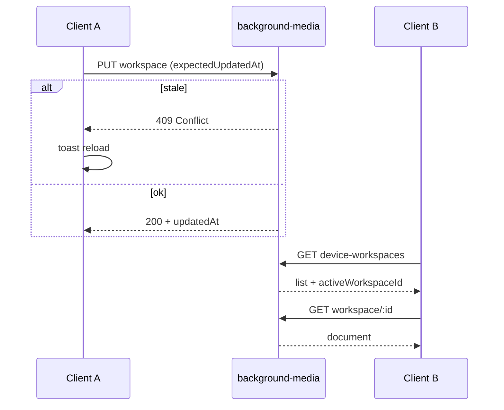

# Промпт (эпик): Device-Board — User Workspace U11 (paired hardening S2→S3)

> **Task-промпт** · [`TASK_PROMPT_WORKFLOW.md`](./TASK_PROMPT_WORKFLOW.md)  
> **Реестр:** `id` = **`db-user-workspace-u11`**  
> **Родитель:** [`DEVICE_BOARD_POST_USERCASE_ROADMAP.md`](./DEVICE_BOARD_POST_USERCASE_ROADMAP.md) (направление **S2→S3**, после **U10**)  
> **Предшественник:** U10 (`db-user-workspace-u10`, #147, PR #148)  
> **GitHub Issue:** [#149](https://github.com/officefish/Membrana/issues/149)  
> **Статус:** **active** · intake 2026-06-23  
> **Размер:** **L** (3–4 PR)

---

## Контекст (продукт)

U10 доставил:

- Launcher + user slots (IndexedDB autonomous);
- paired: `background-media` REST `/v1/devices/:deviceId/device-workspaces`;
- cabinet: только **`Tariff.maxUserWorkspaces`** в pair/status — **не** хранит JSON сценария.

Оператор в **paired** режиме ожидает:

1. Создал/клонировал workspace на одном client → **другой client с той же парой** видит тот же список и документ (после открытия launcher / reload).
2. Reinstall client / очистка IndexedDB → данные **восстанавливаются с media**.
3. Два редактора Save почти одновременно → **LWW** + понятное сообщение, без тихой потери правок.

Сейчас (после U10): API и базовый LWW на load (`pickNewer` по `updatedAt`) есть; **нет** server-side stale reject, conflict UX, launcher refresh при возврате на вкладку, расширенного paired smoke.

---

## Границы пакетов

| Пакет | U11 |
|-------|-----|
| `apps/client` | hybrid host, persist, launcher, conflict UI |
| `packages/device-board` | опционально: типы результата save/load conflict |
| `packages/background-media` | S3: optional `updatedAt` precondition на PUT → 409 |
| `packages/background-cabinet` | **Out of scope** (pair/quota уже в U10) |
| `packages/core` | только если additive DTO для conflict (без vesnin) |

---

## Product decisions (intake)

| ID | Тема | Решение |
|----|------|---------|
| **D-U11-REMOTE-FIRST** | Paired + workspaces API | **Remote-first** для list/CRUD/active; IndexedDB — cache, не source of truth |
| **D-U11-REFRESH** | Launcher | `visibilitychange` / focus → `refreshWorkspaces()`; после pair reconnect — сброс hybrid mode cache |
| **D-U11-LWW** | Конфликт | Client шлёт `expectedUpdatedAt` на PUT; media **409** если stale; load — merge + флаг `remoteNewer` |
| **D-U11-UX** | UI | Toast DaisyUI: «На сервере новее. Перезагрузить?» — не modal blocker |
| **D-U11-CABINET** | Cabinet | **Не менять** бизнес-логику cabinet в U11 |

---

## Scope — волны

| Wave | Task id | Deliverable |
|------|---------|-------------|
| **S2-W1** | `db-uw11-s2-remote-first` | Hybrid host remote-first; сброс `isDeviceWorkspacesApiAvailable` cache on pair change; tests |
| **S2-W2** | `db-uw11-s2-launcher-recovery` | Launcher refresh on visibility; reinstall path: empty IDB → pull list from media |
| **S2-W3** | `db-uw11-s2-paired-smoke` | Расширить `u10-workspace-prod-smoke` или sibling: create workspace + PUT doc + GET second check |
| **S3-W1** | `db-uw11-s3-lww-media` | Media PUT: body/query `expectedUpdatedAt`; 409 `WorkspaceConflict`; unit tests |
| **S3-W2** | `db-uw11-s3-lww-client` | `device-workspaces-api` + persist adapter: handle 409; `PersistSaveResult` conflict metadata |
| **S3-W3** | `db-uw11-s3-conflict-ux` | Shell/launcher: toast + «Загрузить с сервера» при conflict / remoteNewer on load |
| **D1** | `db-uw11-d1-docs` | `user-workspace.mdx`, CONCEPT §22 paired paragraph, deploy doc note |

### Out of scope v1

- WebSocket live sync списка workspace (MP7)
- CRDT / three-way merge UI
- Изменения tariff/pair в cabinet
- Autonomous-only operator path (отдельный спринт)

---

## Архитектура

### Paired data flow (целевой)

### Ключевые файлы

| Файл | Изменения |
|------|-----------|
| `createHybridDeviceBoardWorkspaceHost.ts` | remote-first, invalidate cache |
| `deviceScenarioPersistence.ts` | conflict on save/load |
| `device-workspaces-api.ts` | `expectedUpdatedAt`, 409 handling |
| `DeviceBoardLauncher.tsx` | visibility refresh |
| `device-workspaces.service.ts` | LWW precondition |
| `device-workspaces.controller.ts` | 409 mapping |

---

## DoD эпика

- [ ] Paired: два client с одной парой — одинаковый workspace list после refresh
- [ ] Reinstall / пустой IndexedDB — workspaces с media
- [ ] Stale PUT → 409 + UX toast (не silent overwrite)
- [ ] Prod smoke U11 checks green
- [ ] **Ноль** обязательных PR в `background-cabinet`
- [ ] Registry archive `db-user-workspace-u11`

---

## Промпт целиком (для агента)

Координатор Membrana (Teamlead). Прочитай U10 prompt и этот эпик. Работай волнами **S2-W1 → S2-W3 → S3-W1 → S3-W3 → D1**. Не расширяй scope на cabinet/MP7/autonomous polish.

Перед кодом: план на 1 экран (файлы + тесты). Каждая волна — отдельный PR с `Closes` подзадачи Issue.

**Stop rule:** 2 CI fail подряд на одной волне — handoff с блокером.

Роли: Ozhegov (media + persist), Rodchenko (launcher UX), Vesnin (smoke + LGTM).
