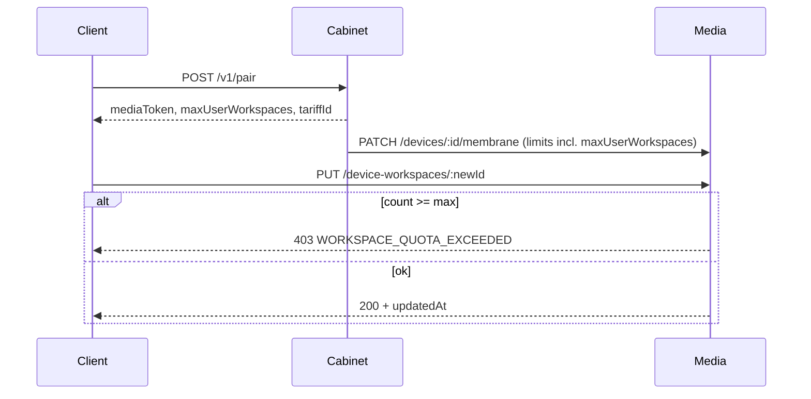

# Промпт (эпик): Server Tariff Enforcement v1 (workspace quota)

> **Task-промпт** · [`TASK_PROMPT_WORKFLOW.md`](./TASK_PROMPT_WORKFLOW.md)  
> **Реестр:** `id` = **`server-tariff-enforcement-v1`**  
> **Родитель:** [`membrane-platform-v1`](./MEMBRANE_PLATFORM_V1_EPIC_PROMPT.md) · продолжение user workspace (U10/U11)  
> **Предшественник:** U10 W4 tariff read (#147), U11 paired hardening (#149), client bugfix `8db252a`  
> **GitHub Issue:** _TBD_ (создать при triage)  
> **Статус:** **active** · intake 2026-06-23  
> **Размер:** **L** (3–4 PR)

---

## Контекст (продукт)

Сейчас квота **редактируемых user workspace** (`maxUserWorkspaces`) работает так:

| Слой | Факт |
|------|------|
| **Cabinet** | `Tariff.maxUserWorkspaces` в Prisma; отдаётся в `/v1/pair` и `/v1/pair/status` |
| **Media** | Хранит `userStorageQuotaBytes`, `bufferQuotaBytes`, `datasetCatalogId` на `Device`; **нет** `maxUserWorkspaces`; PUT workspace **без** проверки слотов |
| **Client** | `resolveWorkspaceTariff()` — paired: из pair; autonomous: local mirror `free-v1` (3); проверка `used >= max` **только на клиенте** |

Проблемы:

1. Обход квоты прямым API / старым client / race двух вкладок.
2. Media не знает лимит после смены тарифа, если cabinet не передал поле при sync.
3. Оператор видит «лимит тарифа», хотя реальная причина — сбой persist (исправлено в `8db252a`, но сервер остаётся без enforcement).

**Цель v1:** для оси **User workspace** сделать **media source of truth** при paired mode: лимит копируется на device при pair/sync; создание **нового** workspace отклоняется сервером при `count >= max`.

---

## Product decisions (intake)

| ID | Тема | Решение |
|----|------|---------|
| **D-STE-TARIFF** | Сущность тарифа | Канон — `Tariff` в cabinet; на media — **snapshot** лимитов на `Device` (как storage/buffer), не отдельная таблица Tariff |
| **D-STE-OFFLINE** | Autonomous | Локальный тариф **всегда** `free-v1` mirror (`maxUserWorkspaces: 3`); сервер не участвует |
| **D-STE-ENFORCE** | Где enforce | **Media** `device-workspaces` PUT: новый `workspaceId` → `count >= maxUserWorkspaces` → **403** `WORKSPACE_QUOTA_EXCEEDED` |
| **D-STE-UPDATE** | Существующий слот | PUT с тем же `workspaceId` — **разрешён** (rename/save), даже если тариф позже уменьшили (grandfather до delete) |
| **D-STE-SYNC** | Обновление лимита | Cabinet `PATCH /v1/devices/:id/membrane` расширить полем `maxUserWorkspaces`; вызывать при pair и при смене tariff membrane |
| **D-STE-CLIENT** | Client | Обрабатывать 403; paired quota из pair **и** опционально `GET .../quota` если расширим DTO |
| **D-STE-BILLING** | Апгрейд тарифа | Out of scope v1 — только free-v1 seed + поля в API |

---

## Границы пакетов

| Пакет | In scope |
|-------|----------|
| `packages/background-media` | Prisma `Device.maxUserWorkspaces`, resolve limits, enforce PUT, quota API |
| `packages/background-cabinet` | Передача `maxUserWorkspaces` (+ `tariffId` в membrane context) на media sync |
| `apps/client` | 403 handling, `WorkspacePersistError` code, prod-smoke optional |
| `packages/core` | Только если additive error code constant (без vesnin) |
| `packages/device-board` | Минимально — типы host result при quota exceeded |

**Запрещено:**

- Billing / Stripe / смена tariff UI в cabinet
- Enforce квот storage/buffer (уже есть) — не рефакторить в этом эпике
- WebSocket push лимита

---

## Scope — волны

| Wave | Task id | Deliverable |
|------|---------|-------------|
| **W1** | `ste-v1-w1-media-quota` | Media: migration `maxUserWorkspaces` on Device; `resolveDeviceLimits`; PUT new workspace → 403; unit tests |
| **W2** | `ste-v1-w2-cabinet-sync` | Cabinet: membrane context + pair flow → media sync includes `maxUserWorkspaces`; integration test |
| **W3** | `ste-v1-w3-client-403` | Client: map 403 → quota message; `GET quota` workspace fields if added; hybrid host tests |
| **D1** | `ste-v1-d1-docs` | `TARIFF_MATRIX.md` server enforcement; `background-media` README; deploy note |

### Out of scope v1

- Indie/business tariff seeds и billing
- Server enforce для `maxNodesPerMembrane`, journal retention
- Удаление «лишних» workspace при downgrade тарифа

---

## Архитектура

---

## Промпт целиком (для вставки агенту)

### Кто ты

Координатор виртуальной команды Membrana (Vesnin). Следуй [`VIRTUAL_TEAM_PROMPT.md`](../VIRTUAL_TEAM_PROMPT.md). Пакеты: **media → cabinet → client → docs**.

### Что построить

1. **Media W1:** `Device.maxUserWorkspaces Int?`; default via env `MEDIA_DEFAULT_MAX_USER_WORKSPACES=3`; `resolveDeviceLimits` returns it; `DeviceWorkspacesService` before insert checks count; 403 body `{ code: 'WORKSPACE_QUOTA_EXCEEDED', maxUserWorkspaces, used }`.
2. **Cabinet W2:** extend `RegisterDeviceDto.membrane` / `PatchDeviceMembraneContextDto` with `maxUserWorkspaces`; `pair.service` / membrane register calls media sync with tariff fields.
3. **Client W3:** `device-workspaces-api` — 403 → `WorkspacePersistError` with `code: 'WORKSPACE_QUOTA_EXCEEDED'`; launcher shows `formatWorkspaceQuotaMessage`.
4. **D1:** document paired vs autonomous tariff mirror.

### Definition of Done

- [ ] Media rejects 4th workspace on free-v1 device (integration test)
- [ ] Cabinet pair updates media device limits including workspace count
- [ ] Client shows quota only on 403 or `used >= max`, not on generic PUT failure
- [ ] `yarn turbo run lint typecheck test build --continue` green for touched packages
- [ ] LGTM Teamlead

### Порядок ролей

1. **Teamlead** — волны W1→W2→W3→D1, отдельные PR
2. **Структурщик** — snapshot limits on Device, no new Tariff table on media
3. **Музыкант** — N/A
4. **Верстальщик** — launcher error copy only

---

## Заметки для постановщика

1. Создать GitHub Issue (wish/imperfection) со ссылкой на этот файл.
2. Prod deploy: media migration + cabinet image; client — local build until client deploy pipeline.
3. Consilium опционально перед W2 если спорят про grandfather при downgrade.
