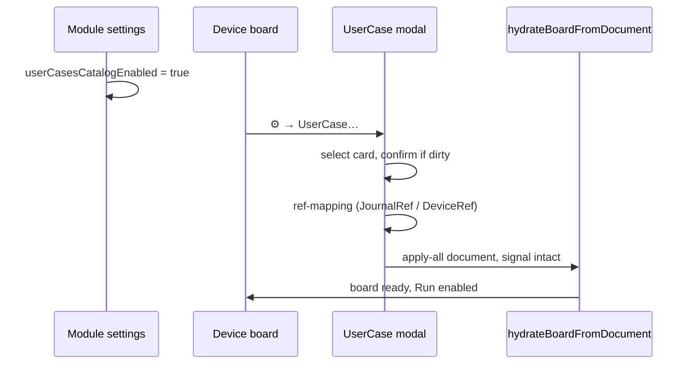
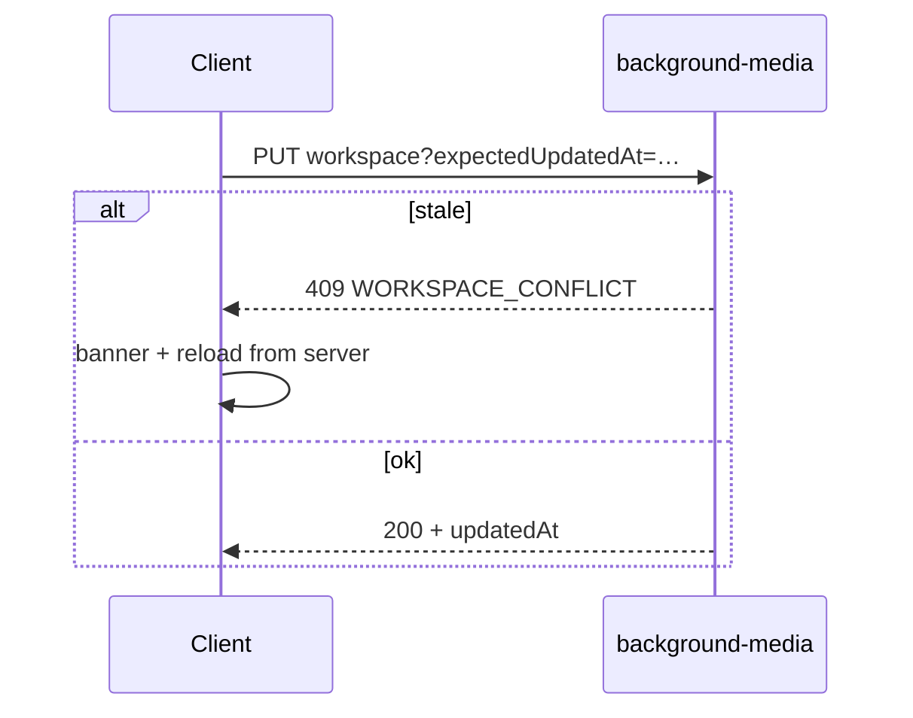

# DEVICE_BOARD_CONCEPT.md

**Концепт `@membrana/device-board`: signal graph + scenario graph (visual scripting).**

> Документ описывает, **что такое device-board в Membrana**, зачем он нужен, как
> ложится на уже зафиксированную архитектуру (`docs/ARCHITECTURE.md`,
> `docs/SERVICES.md`, `docs/MODULE_AND_PLUGIN_UI.md`) и каким контрактам он
> обязана подчиняться. Это не дизайн-док конкретной реализации и не план
> релиза — это «север» для пакета `device-board`, к которому будут сверяться
> PR агентов AI-команды.
>
> Статус: **v0.7 — canvas groups & functions (U8)** (marquee, comment groups, user
> functions, align MVP). v0.6 — journal + reporter. v0.5 — collectors.
> v0.4 — signal + scenario + переменные + dataflow-ссылки, обработчики событий (§15).
> Контракты `@membrana/core`: v0.4 + v0.5 collectors (§16); schema-версия документа → 2.
> Предыдущие версии: v0.3 (хакатон 1), v0.2 (2026-06, `@xyflow/react`). Хранитель: Teamlead.
> Бриф и интервью: [`docs/prompts/DEVICE_BOARD_HACKATHON_BRIEF.md`](../../docs/prompts/DEVICE_BOARD_HACKATHON_BRIEF.md),
> [`docs/seanses/hackathon-brief-interview-2026-06-17.md`](../../docs/seanses/hackathon-brief-interview-2026-06-17.md).
> При конфликте с `WHITE_PAPER.md` / `ARCHITECTURE.md` выигрывают они.

---

## 1. Зачем нод-доска

Membrana — это сенсорная сеть. Каждый клиент строится **под конкретный тип
прибора** (микрофон, радиоантенна, сонар, тепловизор и т.д.), и для этого
прибора собирается цепочка обработки: захват → аналайзеры → выдача
наблюдений в transport-service для fusion-сервера.

Сейчас цепочка задаётся **через сайдбар плагинов** (`docs/MODULE_AND_PLUGIN_UI.md`
§3): пользователь активирует плагины модуля, и они подписываются на shared-хабы
(см. `microphoneStreamHub` как эталон). Это удобно для разработки, но плохо
показывает **топологию обработки сигнала** — особенно когда цепочка становится
нетривиальной (несколько источников, ветвления, параллельные аналайзеры).

Нод-доска даёт **альтернативное представление** того же конвейера: ноды —
зарегистрированные модули и плагины, рёбра — подписки между ними. Это:

1. **Делает топологию видимой** — оператор сразу понимает, какие данные куда
   текут, без чтения исходников.
2. **Снижает порог входа для операторов прибора** — настройка клиента
   превращается в манипуляции с графом, а не с абстрактным списком плагинов.
3. **Материализует этапы WHITE_PAPER** — переход «этап 1 → этап 2 → этап 3»
   виден как добавление новых нод и связей, а не как невидимая магия активаций.
4. **Готовит почву под мульти-устройство** — два микрофона в решётке или две
   антенны для пеленга — это просто две ноды-источника в графе.

Нод-доска **не отменяет сайдбар** и **не вводит второго audio-движка**
(см. §3). Это редактор и декларация двух связанных слоёв (§1.1), а не
отдельная подсистема исполнения сигнала.

### 1.1 Продуктовая цель (visual scripting)

Primary user: специалист по безопасности (в т.ч. оператор ПВО), доступ по тарифу.

Пользователь без уверенного программирования должен:

1. Войти в **режим device-board** (клиент или кабинет).
2. Собрать **сценарий поведения устройства** из блоков: initial, main loop,
   alarm loop, триггеры, (позже) scheduled jobs.
3. Запустить сценарий и наблюдать работу через **журнал устройства**.

Эталонный сценарий хакатона 1: микрофон → поток → 5–30 с чанки → trends FFT
детектор → журнал → alarm loop по громкости (плагин качества звука) → возврат
в main loop. Подробно — бриф §2.

### 1.2 Два слоя доски

| Слой | Вкладка UI | Назначение | Исполнение |
| ---- | ---------- | ---------- | ---------- |
| **Signal graph** | `Signal` | Топология захват → анализ → observation | Engine + shared-хабы + `plugin.install` / teardown |
| **Scenario graph** | `Scenario` | Поведение: initial, loops, triggers, schedule | **Scenario runtime** в `device-board` (чистое ядро); вызывает сервисы и плагины, не Web Audio напрямую |

Решение интервью (B1): **две вкладки** в v1. Если UX не зайдёт — откат к
единому канвасу отдельным эпиком. Предпочтительно **одновременная видимость**
обоих слоёв (split-view или синхронизированные вкладки, P5).

Signal graph остаётся **view-only** над dataflow (v0.2). Scenario graph
добавляет **control flow** (exec-рёбра) и data-рёбра между блоками при
поддержке типов узлом (V1).

---

## 2. Что НЕ делает нод-доска

Чтобы исключить распространённые ошибки на ранних PR:

- **Не исполняет dataflow самостоятельно.** Реальные данные текут через
  engine-сервисы (`audio-engine-service`, будущий `rf-engine-service` и т.д.)
  и shared-хабы. Нод-доска только декларирует связи.
- **Не дублирует функции сайдбара.** Параметры плагина по-прежнему живут в
  сайдбаре (`renderPluginSidebarDetails` в `pluginSidebarDetails.tsx`).
  Нода показывает связи и компактный статус, а не полный набор контролов.
- **Не вводит «универсальные ноды».** Ноды намеренно специфичны под тип
  прибора: `AcousticFFT`, `RFSpectrumAnalyzer`, `ThermalBlobDetector` — даже
  если внутри они вызывают похожий код. Универсальность живёт на уровне
  контрактов (`@membrana/core`), а не нод.
- **Не дублирует `MembranaRegistry`.** Регистрация плагинов — только через
  registry; доска читает метаданные и `nodeKind`.
- **Не генерирует исполняемый TypeScript/Python** из графа (out of scope v1).
- **Scenario runtime не создаёт AudioContext.** Микрофон, чанки, FFT — только
  через `audio-engine-service` и существующие плагины/сервисы.

## 3. Принципы

1. **Нода = view зарегистрированного модуля/плагина.** У ноды нет собственного
   состояния, она читает `MembranaRegistry` и рендерит компактное представление
   модуля или плагина. Удаление ноды = деактивация плагина; добавление = его
   активация.

2. **Ребро = подписка на shared-хаб.** Создание ребра между сокетами вызывает
   тот же механизм подписки, что и `plugin.install()` сейчас. Удаление ребра
   вызывает teardown. То есть lifecycle `install` / teardown
   (`MODULE_AND_PLUGIN_UI.md` §0) **не меняется** — меняется только триггер.

3. **Один источник истины — `MembranaRegistry`.** Граф не хранит дубликатов
   метаданных модулей и плагинов. Он хранит только: список нод (id + позиция
   на доске), список рёбер (source/target + sourceHandle/targetHandle), и
   serialized JSON конфига графа.

4. **Контракты `@membrana/core` важнее визуализации.** Если новый тип сокета
   нужен — сначала добавляется тип в `@membrana/core`, потом он появляется на
   доске. Не наоборот.

5. **Граф каждого клиента уникален, контракт выхода — общий.** В каждом графе
   обязательно есть терминальная нода `ObservationEmitter`, которая сводит
   специфичные для прибора потоки к общему `AcousticObservation`-контракту
   (WHITE_PAPER §7). Граф невалиден, пока этот терминал не подключён.

6. **Декларативная сериализация.** Граф сериализуется в JSON и хранится в
   persisted-store рядом с `pendingModulePrefs`. При rehydrate сначала
   регистрируются модули и плагины (старый путь через `registerClientModules`),
   потом восстанавливается граф, потом активируются связи.

7. **Пресеты графов поставляются вместе с плагинами прибора.** Микрофонный
   клиент при первом запуске имеет готовый signal-граф `Mic → FFT → Detector →
   Emitter` и scenario-пресет (бриф §2). Пресет — JSON рядом с регистрацией
   модулей прибора (см. §6.4).

8. **Системные ветки сценария фиксированы.** На каждом устройстве четыре
   обязательные цепочки: `initial`, `onStop`, `base loop` (main), `alarm loop`
   + пользовательские `custom` триггеры (P4). Имена стабильны в JSON schema.

9. **Предзапусковая валидация.** Перед Run сценарий проверяется (обрывы,
   несовместимые типы, отсутствие обязательных веток) — как compile errors (P3).

---

## 4. Выбор библиотеки

**Используется `@xyflow/react` (React Flow / XYFlow).** Не Rete.js и не
кастомный canvas-редактор с нуля.

Обоснование зафиксировано здесь, чтобы будущие агенты не возвращались к выбору
без нового stage-gate. В **2026-06** проведён сравнительный анализ (внешний
research по кандидатам 2024–2026); вывод совпадает с первоначальным решением
v0.1 и уточняет границы «что даёт библиотека» vs «что строим сами».

### 4.1 Решение в одном абзаце

Нам нужен **view-only** редактор графа поверх уже существующего движка
исполнения (`audio-engine-service`, shared-хабы, `plugin.install` / teardown).
Библиотека должна быть **React-native**, дружить с **TypeScript**, позволять
**кастомные ноды на DaisyUI/Tailwind** и сериализовать граф в **plain JSON**
без навязанной семантики runtime. Под этот профиль лучше всего подходит
`@xyflow/react`. Rete.js v2 — запасной вариант, если когда-нибудь понадобится
встроенная модель typed sockets **и** клиентский execution engine; сейчас это
конфликтует с архитектурой Membrana.

### 4.2 Сравнение кандидатов (2026-06)

Краткая матрица. Оценки относительные, для нашего стека (React 18+, TS strict,
SaaS, граф ~100 нод).

| Библиотека | React / TS | View-only | DaisyUI в нодах | Typed pins | JSON без runtime | Поддержка | Вердикт |
| ---------- | ---------- | --------- | --------------- | ---------- | ---------------- | --------- | ------- |
| **@xyflow/react** | отлично | да | да (ноды = React-компоненты) | через `isValidConnection` | да | высокая | **выбор** |
| **Rete.js v2** | хорошо (плагин) | частично (есть DataflowEngine) | хорошо, layout жёстче | из коробки (sockets) | привязка к модели Rete | высокая | запасной |
| LiteGraph.js | canvas, imperative | нет (engine-centric) | плохо | базово | свой формат | умеренная | отклонён |
| Drawflow | imperative | да | HTML-сниппеты, не React | ad-hoc | простой JSON | низкая | отклонён |
| Flume | React-native | да | хорошо | data-flow only | да | умеренная | отклонён |
| JointJS / GoJS | обёртки | да | свои шаблоны, не React | ports + rules | да | высокая (часть — платно) | отклонён |
| Blockly | блоки, не граф | engine встроен | плохо | block types | XML/код | высокая | отклонён |
| Node-RED editor | не reusable | runtime-bound | — | runtime typing | tied to Node-RED | — | отклонён |
| baklavajs | React — вручную | да | если дописать интеграцию | metadata | да | нишевый | отклонён |
| Reaflow | React-native | да | да | ad-hoc | да | умеренная | отклонён (DAG-viz, не editor) |

Детальное сравнение React Flow vs Rete (ядро решения v0.1):

| Критерий | @xyflow/react | Rete v2 |
| -------- | ------------- | ------- |
| Встроенный движок dataflow | нет | есть |
| Подходит для «view-only» графа | да | избыточен |
| Интеграция с React + DaisyUI + Tailwind | нативная | через `Presets` |
| Типизация сокетов | `isValidConnection` + каталог `@membrana/core` | sockets из коробки |
| Порог входа | низкий | высокий |
| Активность сообщества | высокая | средняя |

Главный аргумент против Rete: у нас **уже есть движок исполнения** — это
engine-сервисы и shared-хабы. Введение второго движка (Rete `DataflowEngine`)
породит конкуренцию двух источников истины («граф нарисован — почему звук не
идёт?»).

Минус React Flow — типизацию сокетов и валидацию соединений пишем сами. Это
функция вида `(connection) => boolean` поверх каталога `SocketType` из
`@membrana/core`. Принимаемая цена.

### 4.3 Уроки UE Blueprints и n8n (архитектура, не выбор npm-пакета)

**Unreal Engine Blueprints** и **n8n** не используют готовые JS-библиотеки —
у них собственные редакторы, глубоко связанные с runtime. Полезны как образец
**разделения слоёв**, а не как аргумент «переписать свой Slate/Vue-редактор»:

| Паттерн | Blueprints | n8n | Membrana (`device-board`) |
| ------- | ---------- | --- | ------------------------- |
| Граф vs исполнение | граф компилируется в IR, UI ≠ runtime | JSON workflow → отдельный engine | JSON граф → `applyGraph` → хабы / `install` |
| Типы на соединениях | pins с типами, exec vs data | типы нод и валидация на save | `SocketType` + `isValidConnection` |
| Шаблоны | macro / function graphs | workflow templates, clone | `*.graph.json` пресеты по `DeviceKind` |
| Collapse / группы | Collapse to Function / Collapsed Graph | — | marquee → function или comment group (§18) |
| Палитра | context search, node catalog | searchable node palette | ноды из `MembranaRegistry` + `nodeKind` |
| Настройки ноды | details panel | node parameters panel | сайдбар плагина (§8, MODULE_AND_PLUGIN_UI §3) |

Вывод: **не копируем** их UI-стек; **копируем** контракт «редактор = UI над
JSON», типы явные, исполнение снаружи.

### 4.4 Что строим поверх `@xyflow/react` (наш слой, не библиотека)

XYFlow даёт примитивы: ноды, рёбра, pan/zoom, drag, handles, minimap.
Паттерны «как Blueprint / n8n» — ответственность пакета `device-board`:

1. **Типизированные handles** — `sourceHandle` / `targetHandle` совпадают с
   именами сокетов в `nodeKind` плагина (§9).
2. **Валидация рёбер** — `isValidConnection` читает каталог `SocketType` из
   `@membrana/core`; несовместимые соединения не создаются.
3. **Стили рёбер по семантике** — при необходимости exec vs data (как в
   Blueprints): custom `edgeTypes`, цвет/штрих из `docs/DESIGN.md`; на D0–D1
   достаточно data-flow сокетов прибора.
4. **Палитра нод** — список плагинов с `nodeKind` для текущего `DeviceKind`;
   drag из палитры → `activatePlugin` + нода в graph state (§7.2).
5. **Пресеты графов** — JSON рядом с регистрацией клиента прибора; аналог
   n8n templates, без отдельного маркетплейса на D0.
6. **Состояния нод** — `active` / `inactive` / `missing` / `invalid` на самой
   ноде; полные настройки — только в сайдбаре (§8).
7. **Маппинг граф ↔ runtime** — `MembranaRegistry.applyGraph()`; библиотека
   об этом не знает.

### 4.5 Явно отклонённые варианты (не переоткрывать без stage-gate)

- **Node-RED editor** — монолит с runtime, не embeddable React-компонент.
- **Blockly** — блочная парадигма (Scratch), не node-and-edge граф прибора.
- **GoJS / JointJS Rappid** — коммерческие diagramming SDK; плохая стыковка
  с DaisyUI; избыточны для signal-processing графа.
- **LiteGraph.js** — canvas без React-нод; уместен для shader/audio DAW, не
  для нашего UI.
- **Кастомный редактор с нуля** — дорого (hit-test, routing, zoom); XYFlow
  уже закрывает инфраструктуру.

### 4.6 Control flow: scenario runtime (не Rete)

В v0.3 **control flow** (initial, loops, triggers, cron) живёт в **scenario
runtime** — отдельном чистом ядре `device-board`, а не во втором dataflow-движке
сигнала. Rete / `DataflowEngine` по-прежнему **не** вводим: signal graph
остаётся view-only над хабами.

Scenario runtime:

- читает сериализованный `ScenarioGraph` (§9);
- исполняет exec-цепочки и вызывает **существующие** API (плагины, journal,
  audio-engine, trends templates);
- не дублирует Web Audio и не обходит `MembranaRegistry`.

Канонический документ по фазам, onTick, планировщику и host-портам:
[`docs/SCENARIO_RUNTIME.md`](../../docs/SCENARIO_RUNTIME.md).

Пересмотр Rete — только если scenario runtime не покрывает кейс **и** это
зафиксировано stage-gate в `docs/seanses/`.

---

## 5. Типы сокетов и контракты

### 5.1 Каталог `SocketType`

Каталог типов сокетов живёт в `@membrana/core` и расширяется через PR.
Для каждого типа фиксируются: имя, форма данных, эталонный хаб (если есть).

Текущий и плановый каталог (см. WHITE_PAPER §6):

| Тип сокета     | Прибор              | Чем течёт                               | Источник                            |
| -------------- | ------------------- | --------------------------------------- | ----------------------------------- |
| `AudioFrame`   | микрофон            | `Float32Array` кадры PCM                | `audio-engine-service`              |
| `Spectrum`     | микрофон            | спектр FFT                              | `fft-analyzer-service`              |
| `Detection`    | любой               | `{ kind, confidence, features }`        | `drone-detector-service` _(план)_   |
| `TDOAPair`     | микрофон (≥2)       | `{ nodeA, nodeB, deltaT, confidence }`  | `tdoa-service` _(план)_             |
| `IQSamples`    | радио _(план)_      | комплексные отсчёты                     | `rf-engine-service` _(план)_        |
| `RFSignature`  | радио _(план)_      | спектральная подпись                    | `rf-analyzer-service` _(план)_      |
| `ThermalFrame` | тепловизор _(план)_ | матрица температур                      | `thermal-engine-service` _(план)_   |
| `BlobMask`     | тепловизор _(план)_ | бинарная маска целей                    | `thermal-analyzer-service` _(план)_ |
| `Observation`  | любой (терминал)    | `AcousticObservation` из WHITE_PAPER §7 | `transport-service` _(план)_        |

Сокеты разных типов **не соединяются**. Это валидируется в `isValidConnection`
на уровне React Flow и дополнительно — в store при загрузке сериализованного
графа.

### 5.2 Цветовой код сокетов

Чтобы оператор видел тип потока без чтения подписи, каждому `SocketType`
назначается цвет в `docs/DESIGN.md`. На уровне ноды сокет — цветной кружок с
тултипом-именем типа. Палитра согласована с DaisyUI и темами клиента.

### 5.3 Терминальный контракт

Любой граф любого прибора **обязан** заканчиваться нодой `ObservationEmitter`,
у которой:

- входы — специфичные для прибора (например, `Detection`, `TDOAPair`),
- выход — `Observation` в `transport-service`.

Граф без подключённого `ObservationEmitter` помечается как **invalid**: UI
показывает плашку «граф не отправляет наблюдения на сервер», и плагины,
ниже по цепочке от обрыва, не активируются.

---

## 6. Категории нод и фильтрация по `DeviceKind`

### 6.1 `DeviceKind`

В `@membrana/core` вводится перечисление `DeviceKind`:

```ts
type DeviceKind =
  | 'microphone'
  | 'mic-array'
  | 'rf-antenna'
  | 'sonar'
  | 'thermal-camera'
  | 'optical-camera'
  | 'ads-b-receiver';
```

Каждый клиент при сборке декларирует свой `DeviceKind` (или несколько —
комбинированные приборы возможны). Это значение прокидывается в
`device-board` как контекст доски.

### 6.2 `nodeKind` плагина

Каждая регистрация модуля или плагина в `MembranaRegistry` дополняется полем
`nodeKind` (опциональным для обратной совместимости):

```ts
nodeKind?: {
  category: 'source' | 'analyzer' | 'detector' | 'transport' | 'terminal';
  deviceKinds: DeviceKind[];     // на каких приборах нода имеет смысл
  inputs: SocketSpec[];
  outputs: SocketSpec[];
};
```

Если `nodeKind` не задан — модуль/плагин не появляется в палитре нод-доски
(но продолжает работать через сайдбар). Это путь миграции: существующие
плагины не ломаются, новые получают представление на доске постепенно.

### 6.3 Палитра

Палитра нод фильтруется по `DeviceKind` клиента: микрофонный клиент не
показывает thermal- и RF-ноды. Это намеренно — оператор прибора не должен
видеть нерелевантные опции.

### 6.4 Пресеты

Пресет графа — JSON-файл рядом с регистрацией модулей прибора:

```
apps/client-microphone/src/presets/
  default.graph.json      # граф по умолчанию
  array-2mic.graph.json   # пресет для двухмикрофонной решётки
```

При первом запуске клиента (или при сбросе настроек) активируется
`default.graph.json`. Пресет — это сериализованный граф в том же формате,
что и persisted-граф пользователя.

---

## 7. Lifecycle и взаимодействие со store

### 7.0 Режим device-board

Вход в **board mode** перестраивает UI под редактор сценариев (полная
перерисовка или split: канвас + inspector, U1). Выход — в обычный режим
модулей/плагинов. Board mode доступен на **клиенте** (`apps/client`) и в
**кабинете** (admin edit, B3); синхронизация сценария — двусторонняя по
`deviceId` (S1).

Onboarding v1: тултипы + wizard на 3 шага + ссылка на manual (P6).

### 7.1 Регистрация и rehydrate

Порядок:

1. `apps/client-*/src/main.tsx` запускает `registerClientModules()` — модули
   и плагины регистрируются в `MembranaRegistry` (без изменений относительно
   текущей схемы).
2. `MembranaRegistry.finalizeRegistration()` сбрасывает `pendingModulePrefs`
   (без изменений, см. `MODULE_AND_PLUGIN_UI.md` §0).
3. **Новый шаг:** `MembranaRegistry.applyGraph(persistedGraph ?? defaultPreset)`.
   Signal-граф проходится топологически; связи → подписки на хабы.
4. **Новый шаг:** `ScenarioRuntime.load(persistedScenario ?? defaultScenario)`.
   Сценарий не активен до явного Run пользователем.
5. Если плагин в графе не зарегистрирован — нода `missing`, предупреждение в UI.

### 7.2 Действия пользователя на доске

| Действие в UI             | Что вызывается в store                                                           |
| ------------------------- | -------------------------------------------------------------------------------- |
| Перетащил ноду из палитры | `activatePlugin(pluginId)` + добавление ноды в graph state                       |
| Удалил ноду               | `deactivatePlugin(pluginId)` + удаление ноды и всех её рёбер                     |
| Создал ребро              | `subscribeHub(source.handle → target.handle)`                                    |
| Удалил ребро              | соответствующий teardown                                                         |
| Кликнул на ноду           | сайдбар плагина (`renderPluginSidebarDetails`, U2)                               |
| Run / Stop / Pause сценария       | `ScenarioRuntime.start()` / `.stop()` → `onStop`; `.pause()` / `.resume()` — freeze без `onStop` (DBP0)   |
| Disconnect                | `onDisconnect` → stop; reconnect → `initial` (T4)                              |

### 7.4 Scenario runtime (поведение)

| Ветка | Назначение | Ключевые правила |
| ----- | ---------- | ---------------- |
| `initial` | Старт: выбор mic, stream on, запись в журнал | Список устройств из `audio-engine` enumerate |
| `main` (base loop) | onTick → чанки → trends FFT → журнал → ∞ | Entry: `onMainTick`; итерация завершается узлом `loop-repeat`; см. [`docs/SCENARIO_RUNTIME.md`](../../docs/SCENARIO_RUNTIME.md) |
| `alarm` | По фронту детекции; raw level через sound-quality plugin | Entry: `onAlarmTick`; пауза 400 ms между итерациями; отдельный **тег** в журнале (J2) |
| `onStop` | Teardown; сценарий на канвасе остаётся editable (T2) | UI-кнопка + системное событие |
| **Pause** | Заморозка exec без `onStop`; микрофон продолжает (DBP0) | Toolbar Pause/Resume; узел `pause-runtime` в графе (DBP2) |
| `onDisconnect` | Stop (единая ветка mic/server пока, T3) | Позже: restart по таймеру |
| `custom[]` | Пользовательские триггеры | Расширяемый список |
| scheduled (stretch) | Cron-like анализ журнала → statistics sink | J3, J4 |

Переход **main → alarm** — по **фронту** детекции (V3). Журнал main loop:
detection yes/no, clip meta, raw level, detector/template id (J1).

**User functions** (§18): `scenario.functions[]`, system nodes `function-input` /
`function-output`, pins `ScenarioFunctionPin` (exec|data, **≤9 на сторону**, D-PINS-9).
Collapse selection → subgraph-блок на родительской ветке; **depth ≤ 1** — функция не
содержит других subgraph-блоков (`validate-function-depth`).

**Comment groups** (§18): `scenario.commentGroups[]` — только canvas (title,
description, frame color, rect, `nodeIds`). **Не участвуют в Run**; при runtime
канвас read-only, инспектор группы недоступен.

Важно: **`plugin.install()` не меняется** для signal graph. Scenario runtime
оркестрирует вызовы сервисов и плагинов; не подменяет lifecycle хабов.

### 7.3 Конфликт сайдбара и доски

Если пользователь выключил плагин в сайдбаре, а на доске у него были рёбра —
ноды остаются на доске, но помечаются как `inactive`, рёбра подсвечиваются
как «порванные». Повторная активация в сайдбаре возвращает рёбра в работу.

Это компромисс: мы не удаляем граф при деактивации, чтобы пользователь не
потерял топологию, но и не «оживляем» рёбра молча.

---

## 8. UI-правила

Согласовано с `docs/MODULE_AND_PLUGIN_UI.md` и бриф-интервью (U1–U4):

1. **Board mode** — отдельный **fullscreen**-layout (канон v0.4): shell владеет
   высотой (`h-screen` → ряд `flex-1 min-h-0` → `<main>` `flex-col` → канвас
   `flex-1`), канвас всегда дотягивается до **нижнего края страницы**; сайдбары
   (вкладки/палитра/инспектор) — боковые панели с внутренним скроллом, высоту
   ряда не распирают. Единый host-контракт: cabinet (`fixed inset-0`) и client
   (replace `Dashboard`). Вкладки **Signal** / **Scenario**; цвета слоёв —
   токены **DaisyUI** (`docs/DESIGN.md`). См. §15.
2. **Доска — модуль** `id: 'device-board'`, `@xyflow/react`, без лишней `card`.
3. **Настройки нод — в сайдбаре** (U2). §3 MODULE_AND_PLUGIN_UI не нарушается.
4. **На ноде** — имя, цветные сокеты, статус (`active` / `inactive` / `missing` / `invalid`).
5. **Палитра** — drag из палитры желателен; поиск и категории не обязательны в v1.
6. **Tailwind `content`** включает `packages/device-board/src`.

---

## 9. Сериализация (device-scenario v1)

Единый JSON-документ сценария устройства. Export metadata: обязательны
`version` и `hash`; import более новой `version` → **отказ** (V6); секреты
(токены, keys) **вычищаются** при export (S3).

```json
{
  "version": 1,
  "kind": "device-scenario",
  "deviceKind": "microphone",
  "meta": { "title": "Drone watch", "exportedAt": "ISO-8601", "hash": "sha256-…" },
  "signalGraph": {
    "nodes": [
      { "id": "n1", "pluginId": "microphone", "position": { "x": 80, "y": 200 } },
      { "id": "n2", "pluginId": "fft-analyzer", "position": { "x": 320, "y": 200 } }
    ],
    "edges": [
      { "source": "n1", "sourceHandle": "audio-out", "target": "n2", "targetHandle": "audio-in" }
    ]
  },
  "scenario": {
    "initial": { "entry": "n-start", "nodes": [], "edges": [] },
    "loops": {
      "main": { "entry": "n-loop-main", "nodes": [], "edges": [] },
      "alarm": { "entry": "n-loop-alarm", "nodes": [], "edges": [] }
    },
    "triggers": {
      "onStop": { "entry": "n-on-stop", "nodes": [], "edges": [] },
      "onDisconnect": { "entry": "n-on-disc", "nodes": [], "edges": [] },
      "custom": []
    },
    "functions": [],
    "commentGroups": [],
    "scheduled": []
  }
}
```

`commentGroups` — массив `ScenarioCommentGroup` (§18); не создаёт runtime-узлов.
`functions[]` — `ScenarioFunctionSubgraph` с `inputPins` / `outputPins` (`ScenarioFunctionPin[]`).

Правила формата:

- `version` обязателен; миграции — `device-board/src/migrations`.
- `pluginId` / block types ссылаются на `MembranaRegistry` или каталог блоков
  scenario runtime. Конфиг плагинов **в JSON не дублируется**.
- `signalGraph` — формат v0.2 (§9 legacy) как вложенный объект.
- `scenario.*` — отдельные подграфы с exec- и data-рёбрами; data-типы
  валидируются capability узла (V1).
- Синхронизация: двусторонняя device ↔ cloud по `deviceId` (S1); cabinet admin
  может редактировать (S2).

### 9.1 Legacy: только signal graph

Для обратной совместимости допустим файл только с `nodes`/`edges` (v0.2) —
импорт оборачивает в `signalGraph` при миграции v0→v1.

---

## 10. Дорожная карта пакета

### Хакатон 1 (2026-06) — вертикальный срез

См. [`DEVICE_BOARD_HACKATHON_1_EPIC_PROMPT.md`](../../docs/prompts/DEVICE_BOARD_HACKATHON_1_EPIC_PROMPT.md).

| Эпик | Содержание |
| ---- | ---------- |
| H0 | Этот документ v0.3 |
| H1 | Core contracts, XYFlow shell, serialize + validation |
| H2 | Runtime initial+main, mic/journal, cabinet sync (stretch: JSON import) |
| H3 | Triggers, subgraph |
| H4 | **Alarm loop (обязателен)**, smoke, close |

### Этап D0 — Каркас (signal + scenario shell)

- Пакет `@membrana/device-board` со скелетом доски на `@xyflow/react`.
- Зависимость: `@xyflow/react` (не legacy `react-flow-renderer`).
- Регистрация как модуль через `MembranaRegistry`.
- Каталог `SocketType` в `@membrana/core` (минимум: `AudioFrame`, `Spectrum`).
- Валидация соединений по типу сокета.

### Этап D1 — Микрофонный пресет (соответствует WHITE_PAPER «Этап 1»)

- Ноды: `MicrophoneSource`, `FFTAnalyzer`, `DroneDetector`,
  `ObservationEmitter`.
- Пресет `default.graph.json` для микрофонного клиента.
- Клик на ноду открывает сайдбар.

### Этап D2 — Решётка (соответствует WHITE_PAPER «Этап 2»)

- `DeviceKind` `mic-array`.
- Ноды: вторая `MicrophoneSource`, `TDOA` с двумя входами.
- Пресет `array-2mic.graph.json`.

### Этап D3 — Локализация (соответствует WHITE_PAPER «Этап 3»)

- Ноды: третья `MicrophoneSource`, `Localizer` с тремя входами.
- Терминальный `Observation` начинает нести координаты.

### Этап D4 — Многомодальность (соответствует WHITE_PAPER «Этап 6»)

- Новые `DeviceKind` — `rf-antenna`, `thermal-camera`.
- Новые типы сокетов в `@membrana/core`.
- Новые клиенты с собственными палитрами и пресетами.
- **Контракт `Observation` на выходе графа — не меняется.**

---

## 11. Метрики качества пакета

Не функциональные требования, а признаки того, что пакет «здоров»:

- **Добавление нового аналайзера** (нового плагина с `nodeKind`) — это PR
  без изменений в `device-board` core, только регистрация плагина и
  опциональное добавление в пресет.
- **Добавление нового прибора** (нового `DeviceKind`) — это PR с новыми
  типами сокетов в `@membrana/core`, новым набором плагинов и новым
  пресетом. Сам `device-board` не правится.
- **Сериализованный граф** одного клиента не ломается при минорных
  обновлениях плагинов (migrations работают).
- **Граф без `ObservationEmitter`** или с обрывами — виден оператору
  визуально, без чтения консоли.

---

## 12. Открытые вопросы

Закрыто в v0.3 / интервью:

- Exec vs data в scenario — **да**, оба; signal — data-only (§1.2).
- Subgraph v1 — depth ≤ 1 (V4).
- Параметры на ноде — **в сайдбаре** (без изменений).

Закрыто в v0.7 (U8, §18):

- **Comment group vs user function** — две разные сущности (D-GROUP-VS-FN):
  comment group = визуальная рамка, persist в `commentGroups`, **не runtime**;
  user function = `functions[]` + subgraph-блок, участвует в Run.
- **Группировка на канвасе** — marquee + collapse to group/function (Blueprint parity);
  **nested functions / depth > 1** — out of scope v1 (отдельный эпик при необходимости).
- **Function pins** — structured `ScenarioFunctionPin`, лимит **9 на Input и 9 на Output**
  (exec + data в общем лимите каждой стороны, D-PINS-9); pre-run + UI enforce.

Остаётся открытым:

- **Порог «достаточно тихо»** для выхода из alarm — формализация на DB-H4
  поверх плагина sound-quality.
- **Conflict resolution** при двусторонней sync (S1) — v1 минимальный last-write
  или явные правила merge.
- **Expand function inline** на parent canvas — v1.1 (не U8).
- **Undo depth-1** — **закрыто** v0.9 (§21): Ctrl+Z / кнопка ↶; **не** покрывает free drag; полный redo stack — backlog.
- **Snap guides / dagre exec autolayout** — **закрыто** U8a (§19); отдельный «undo stack» для layout — не нужен.
- **Параллельные сценарии** на одном устройстве — не планируется в v1.

---

## 13. Связанные документы

- [`WHITE_PAPER.md`](./WHITE_PAPER.md) — стратегическая цель, §6 (отображение
  на архитектуру), §7 (контракт наблюдений), §8 (этапы).
- [`ARCHITECTURE.md`](./ARCHITECTURE.md) — границы пакетов, правила слоёв.
- [`SERVICES.md`](./SERVICES.md) — правила пакетов-сервисов (foundation,
  analyzer).
- [`MODULE_AND_PLUGIN_UI.md`](./MODULE_AND_PLUGIN_UI.md) — `MembranaRegistry`,
  lifecycle `install` / teardown, правила сайдбара плагинов.
- [`DESIGN.md`](./DESIGN.md) — токены UI, в том числе для цветового кода
  сокетов.
- [`INTEGRATIONS_STRATEGY.md`](./INTEGRATIONS_STRATEGY.md) — стратегия
  подключения новых аналайзеров, естественно становящихся новыми нодами.

- [`DEVICE_BOARD_HACKATHON_BRIEF.md`](../../docs/prompts/DEVICE_BOARD_HACKATHON_BRIEF.md) — бриф хакатона 1.
- [`HACKATHON_REGULATION.md`](../../docs/HACKATHON_REGULATION.md) — ритуалы хакатона.
- [`DEVICE_BOARD_USERCASES_EPIC_PROMPT.md`](../../docs/prompts/DEVICE_BOARD_USERCASES_EPIC_PROMPT.md) — UserCases catalog (U9, §20).
- [`DEVICE_BOARD_EDIT_MODEL_V2_EPIC_PROMPT.md`](../../docs/prompts/DEVICE_BOARD_EDIT_MODEL_V2_EPIC_PROMPT.md) — edit model v2 (archived).
- [`DEVICE_BOARD_DOCS_POST_140_SPRINT_PROMPT.md`](../../docs/prompts/DEVICE_BOARD_DOCS_POST_140_SPRINT_PROMPT.md) — docs + RAG sync sprint (active).
- [`DEVICE_BOARD_USER_WORKSPACE_EPIC_PROMPT.md`](../../docs/prompts/DEVICE_BOARD_USER_WORKSPACE_EPIC_PROMPT.md) — User Workspace (U10, §22).
- [`apps/docs/device-board/user-workspace.mdx`](../../apps/docs/device-board/user-workspace.mdx) — операторская страница user workspace.

---

## 14. Статус и порядок изменения

- **Статус:** v0.10 — концепт (+ user workspace §22, U10 W2-module).
- **Changelog v0.10 (2026-06-23):** эпик U10 (`db-user-workspace-u10`, #147): IndexedDB multi-slot,
  module launcher, system preview RO, clone catalog → user slot, shell picker deprecated;
  `meta.workspaceKind`, `clone-user-case-to-workspace.ts`, `DeviceBoardSession`.
- **Changelog v0.9 (2026-06-22):** function editor modal sprint (#139); UX follow-up F1–F7 + edit model v2 E1–E3
  (PR #140): breadcrumbs, direct function edit, undo depth-1, F7 branch snapshot revert, pin meter `n/9`,
  runtime exec highlight, deletable GetDevice, `navigateScenarioBranch` + `ScenarioRevertPolicy`,
  `edit-undo-controller`. Промпты: [`DEVICE_BOARD_UI_FOLLOWUP_SPRINT_PROMPT.md`](../../docs/prompts/DEVICE_BOARD_UI_FOLLOWUP_SPRINT_PROMPT.md),
  [`DEVICE_BOARD_EDIT_MODEL_V2_EPIC_PROMPT.md`](../../docs/prompts/DEVICE_BOARD_EDIT_MODEL_V2_EPIC_PROMPT.md).
- **Changelog v0.8 (2026-06-21):** эпик U9 (`db-usercases-catalog-u9`, #136): manifest/build/verify,
  layout canon, bundled catalog, settings gate, modal apply-all; bundled MVP `usercase-mvp-microphone`.
- **Changelog v0.7 (2026-06-21):** эпик U8 (`db-canvas-groups-functions`, PR #134):
  marquee multi-select + action modal; comment groups (`ScenarioCommentGroup`,
  frame color, runtime read-only); user functions (multi-function sidebar, collapse,
  `function-input`/`function-output`, pin CRUD, D-PINS-9); align MVP + smart auto;
  `scenario.commentGroups` в device-scenario; закрытие §12 «groups ≠ runtime».
  Эпик-промпт: [`DEVICE_BOARD_CANVAS_GROUPS_FUNCTIONS_EPIC_PROMPT.md`](../../docs/prompts/DEVICE_BOARD_CANVAS_GROUPS_FUNCTIONS_EPIC_PROMPT.md).
- **Changelog v0.4 (2026-06-18):** обработчики событий
  `onConnect/onStart/onStop/onDisconnect` (§15); переменные сценария
  (document-scope, ссылочные `DeviceRef`/`MicrophoneRef`); системный Event-узел;
  dataflow-ссылки с флагом `valid`; таксономия `ScenarioNodeKind`
  (`event`/`variable-get`/`variable-set`/`print`/`is-valid`/`get-microphone`);
  schema `device-scenario` → v2 (expand: миграция v1 `initial→onStart`, `+onConnect`,
  `+variables`). Эпик `device-board-refactor-v04` (issue #95), фаза DBR0.
- **Changelog v0.3 (2026-06-17):** продуктовая цель visual scripting; два слоя
  Signal/Scenario; scenario runtime; board mode; device-scenario JSON v1;
  системные ветки; ссылка на хакатон 1; закрытие exec-пинов через scenario layer.
- **Changelog v0.2 (2026-06):** §4 — библиотеки, Blueprint/n8n, XYFlow слой.
- **Хранитель:** Teamlead.
- **Изменения:** через PR с пометкой `/architect` и обязательным ревью
  Teamlead. Изменения, затрагивающие каталог `SocketType` или контракт
  `Observation`, требуют синхронной правки `@membrana/core` и упоминания
  в `WHITE_PAPER.md`.
- При конфликте этого документа с `WHITE_PAPER.md` / `ARCHITECTURE.md` —
  выигрывают они.

---

## 15. Рефакторинг v0.4: обработчики событий, переменные, dataflow

> Раздел фиксирует модель v0.4. Контракты `@membrana/core` уже расширены в фазе
> DBR0 (эпик `device-board-refactor-v04`, issue #95); UI/runtime — фазы DBR1–DBR6.
> Полный план: [`docs/prompts/DEVICE_BOARD_REFACTOR_V04_EPIC_PROMPT.md`](../../docs/prompts/DEVICE_BOARD_REFACTOR_V04_EPIC_PROMPT.md).
> Решения консилиума: [`docs/seanses/device-board-refactor-v04-2026-06-18.md`](../../docs/seanses/device-board-refactor-v04-2026-06-18.md).

### 15.1 Обработчики событий

Сценарий устройства имеет 4 системных обработчика событий и 2 лупа:

| Обработчик | Поле схемы | Данные Event-узла | Назначение |
|------------|-----------|-------------------|------------|
| `onConnect` | `scenario.onConnect` (новое в v2) | `DeviceRef` (valid) | устройство подключилось |
| `onStart` | `scenario.initial` (лейбл «On start») | `DeviceRef` (valid) | запуск сценария |
| `onStop` | `scenario.triggers.onStop` | `DeviceRef` | остановка |
| `onDisconnect` | `scenario.triggers.onDisconnect` | `null` → invalid | потеря связи |
| `main` / `alarm` | `scenario.loops.*` | — | рабочие лупы |

`onStart` — презентационный лейбл подграфа `initial`; сериализация ветки в JSON
сохраняется как `initial` (совместимость без слома round-trip).

### 15.2 Системный Event-узел

В каждом обработчике события первым узлом жёстко зашит **Event-узел**
(`nodeKind: 'event'`, `system: true`): он неудаляем и является точкой входа
exec-потока и источником data-ссылки. Удаление/отсутствие — ошибка валидации.

**Реализовано (DBR3):** добавлена ветка-обработчик `onConnect` (4 обработчика
событий в левом сайдбаре: `onConnect`/`onStart`/`onStop`/`onDisconnect`).
Системный Event-узел (`createEventBoardNode`): `deletable:false` + guard
`rejectSystemNodeRemovals` отбрасывает UI-`remove` для системных узлов;
авто-инжект как entry каждого обработчика при гидратации (`ensureEventEntry`,
фикс-id `*-event`); data-выход `DeviceRef` (значение `null` в `onDisconnect`
различается рантаймом — DBR4); pre-run-правило «entry обработчика обязан быть
Event-узлом» (`event-entry-required`). Рантайм исполняет Event как pass-through;
сериализация Event round-trip (build → parse → hydrate).

### 15.3 Переменные сценария

Переменная — типизированная ссылка document-scope (конструктор переменных в
левом сайдбаре). Модель: `ScenarioVariable = { id, name, type, value }`, где
`type ∈ {DeviceRef, MicrophoneRef}`, а `value` — `ScenarioReferenceValue
{ kind, handle, valid }` либо `null` (не задана). Узлы `variable-get` /
`variable-set` читают/пишут переменную по `variableId`.

- **onConnect:** Event(`DeviceRef` valid) → `variable-set` в пользовательскую
  переменную Device → ссылка становится постоянной и валидной.
- **onDisconnect:** Event(`null`) → `variable-set` → ссылка `valid:false`.
- **onStart:** Event(`DeviceRef`) → `is-valid` → (true) `get-microphone`
  (выбор из списка) → `variable-set` в переменную Microphone (для loop-сценариев).

**Реализовано (DBR2):** конструктор переменных в левом сайдбаре под «Конструктор
функций» (создание `+ Device`/`+ Microphone`, переименование, удаление,
индикатор `не задана`/`valid`/`invalid`); узлы `variable-get`/`variable-set`
(кнопки get/set добавляют узел в активную ветку), типизированные пины по
ссылочному `SocketType`; сериализация `scenario.variables` и узлов
(round-trip build → parse → hydrate; узлы с отсутствующей переменной
отбрасываются при гидратации). Запись значения в host и протяжка данных —
**DBR4** (см. §15.4).

### 15.4 Dataflow и валидность

Data-рёбра несут ссылочные `SocketType` (`DeviceRef`/`MicrophoneRef`).
Резолюция значений — pull-based (lazy input resolution, фаза DBR4):
терминальный/потребляющий узел тянет вход по data-ребру. Флаг `valid` ссылки
отражает доступность ресурса; `invalidateReference` помечает её висячей,
не теряя `handle` для диагностики. Совместимость соединения — по точному
совпадению типа (`isValidSocketConnection`).

**Реализовано (DBR4):** чистая `resolveInput(subgraph, variables, nodeId, port,
context)` — pull-резолюция от Event/variable-get; `resolveEventReference` по
ветви (`onConnect`/`initial`/`onStop` → valid `DeviceRef`; `onDisconnect` →
`null`); `isReferenceValid` — предикат для `is-valid` (DBR5); `applyVariableSetValue`
(onConnect → `valid=true`, onDisconnect null → `invalidateReference`, идемпотентность
set). `ScenarioVariableStore` + `variable-set` в `block-executor`; `ScenarioRuntime`
сбрасывает store при load, `runOnConnect()` для обработчика onConnect. Unit-тесты:
valid/invalid/null, idempotent set, type mismatch, cycle, runtime integration.

### 15.5 Палитра v0.4 (правый сайдбар)

Пока только: `print` (терминальный лог; принимает `DeviceRef`/`MicrophoneRef`),
`is-valid` (условный по валидности ссылки), `get-microphone` (извлекает
`MicrophoneRef` из `DeviceRef`, выбор микрофона из списка устройства).
Кнопка «Пуск» неактивна, если связь с устройством разорвана (online-presence,
фаза DBR6) — и в списке устройств, и на борде.

**Реализовано (DBR6):** единый селектор `isDeviceLive(deviceId)` на сторону —
cabinet: presence map из WS `node.online`/`node.offline` (`useCabinetNodeRuntime`);
client paired: WS `connected` (`useDeviceLive`); автономный клиент — без gating.
`resolveRunDisabledReason` + `deviceLive` prop в `DeviceBoardGraphProvider`;
disabled + `title`/`aria-label` «нет связи с устройством» в `NodesPage` и Run на борде.

**Реализовано (DBR5):** правый сайдбар по умолчанию — 3 узла (`Print`/`isValid`/
`GetMicrophone`); legacy D0-палитра только при `VITE_DEVICE_BOARD_LEGACY_PALETTE=true`.
Фабрики `createPaletteBoardNode`, pins и round-trip сериализация; `Print` логирует
`formatReferenceForPrint` (handle + valid); `is-valid` ветвит exec (`exec-true-out` /
`exec-false-out` по `isReferenceValid`); `get-microphone` — dropdown микрофона в
инспекторе из `host.enumerateMicrophones` (audio-engine enumerate), data-выход
`MicrophoneRef` через `resolveInput` для set переменной Microphone.

### 15.6 Контракты (DBR0, уже в `@membrana/core`)

- `SocketType += 'DeviceRef' | 'MicrophoneRef'`; `REFERENCE_SOCKET_TYPES`,
  `isReferenceSocketType`.
- `scenario-variables.ts`: `ScenarioVariable`, `ScenarioReferenceValue`,
  `createReferenceValue` / `invalidateReference` / `createScenarioVariable`.
- `scenario-node-kind.ts`: `SCENARIO_NODE_KINDS`, `ScenarioNodeKind`,
  `SYSTEM_SCENARIO_NODE_KINDS` (`data.kind`-таксономия, отдельная от legacy
  D0 `SCENARIO_BLOCK_KINDS`).
- `ScenarioGraphNode += nodeKind? / system? / variableId?` (аддитивно).
- `ScenarioGraph += onConnect / variables`.
  - `DEVICE_SCENARIO_DOCUMENT_VERSION = 2`, `DEVICE_SCENARIO_MIN_DOCUMENT_VERSION = 1`;
  `parseDeviceScenarioDocument` мигрирует v1→v2 и отклоняет version > 2.

### 15.7 Узлы-конструкторы и Pure getters (v0.9)

**Проблема:** value-типы вроде `Integer`/`String` задаются через **variable-set** или
инспектор переменной; **policy-объекты** и **ref-материализации** требуют явного
источника в графе — «создать экземпляр и передать по dataflow».

**Blueprint parity (Pure vs Impure):** семантика как в UE Blueprints — на canvas и в
runtime (`@membrana/core` `scenario-node-pure.ts`, эпик
`db-pure-getters-blueprint-parity`):

| Режим | Exec pins | Участие в exec-walk | Resolve |
|-------|-----------|---------------------|---------|
| **Pure** (`pure: true`) | **нет** | пропуск (transparent) | pull через `resolveInput` / `resolveNodeOutput` на каждый read (D4: без tick-cache) |
| **Impure** (`pure: false`) | exec-in → exec-out | выполняется на exec-тике | выход фиксируется на шаге exec |

**Sidebar:** галочка **Pure** для `PURE_ELIGIBLE` (`variable-get`, `get-journal`, `get-reporter`); ref-getter — read-only
bound/empty badge (D2); value-getter — редактирование выходного value. Переключение
**impure → pure** удаляет все exec-рёбра узла (D1).

**Два класса конструкторов** (`CONSTRUCTOR_SCENARIO_NODE_KINDS` в core):

| Класс | Примеры | Выход | Pure | Exec pins |
|-------|---------|-------|------|-----------|
| **Policy constructor** | `MakeRecordingPolicy`, `MakeFftTrendsPolicy` | `RecordingPolicy`, `FftTrendsPolicy` | **always true** (`CONSTRUCTOR_ALWAYS_PURE`, D3) | **never** |
| **Ref constructor** | `MakeTrack`, `MakeReportFrom*`, `MakeFftTrendsAnalysis` | `TrackRef`, `ReportRef`, … | **always false** | exec-in → exec-out |

**MakeRecordingPolicy** — **только** data-out `RecordingPolicy` (enum:
`windowSec` 3|5|7|10|15|30, `captureFormat` wav|webm|mp4). Data-edge к
`StartRecording.policy` (bootstrap + restart). Exec-hop через policy **deprecated**
(v0.8 → миграция v0.9).

**MakeFftTrendsPolicy** — **только** data-out `FftTrendsPolicy` (enum
presets trends-fft-analyzer). Data-edge к `MakeFftTrendsAnalysis.policy`.

**Не путать:** `variable-get`/`variable-set` — document-scope переменные;
конструкторы — **фабрики значений/ref на канвасе** (как уже было de-facto у MakeTrack).

**Палитра v0.9:** категория «Конструкторы» — policy nodes (badge `constructor · pure`) +
ref constructors. `RecordingPolicy` **убран** из sidebar «Конструктор переменных» (legacy JSON
variables мигрируют через `resolveScenarioRecordingPolicy`).

**Sign-off:** [`docs/device-board-scripts/PURE_GETTERS_LGTM.md`](../../docs/device-board-scripts/PURE_GETTERS_LGTM.md).

---

## 16. Collectors v0.5: Recorder, SpectralAnalyser, event-порты

> Эпик `device-board-collectors-v05` (DBC0–DBC6). Консилиум:
> `docs/seanses/device-board-collectors-v05-2026-06-20.md`.

### 16.1 Модель

| Сущность | Ref / тип | Роль |
|----------|-----------|------|
| **GetRecorder(device)** | `RecorderRef` | Singleton на device runtime — очередь `AudioSampleRef` |
| **GetSpectralAnalyser(device)** | `SpectralAnalyserRef` | Singleton — очередь `FftFrameRef` |
| **GetSample** | `AudioSampleRef` | PCM-окно за exec-тик (Sample ≠ Frame) |
| **GetFFTFrame** | `FftFrameRef` | Спектр из Sample (отдельный узел) |
| **CollectSamples / CollectFftFrames** | config + event-out | Append + flush → `AudioSampleRefList` / `FftFrameRefList` |
| **NewTrack / NewFftTrendsAnalysis** | terminal | data-in: массив ref → track / trends report |

Микрофон (`MicrophoneRef`) — только A/D и `StartStreaming`; **не** владелец треков.

**Policy на singleton — frozen (v0.6).** MVP: `collectorConfig` на Collect-узле, правый сайдбар
(defaults: bufferSize 2048, smoothing 0.75, windowSec 3, queueCapacity 10).

### 16.2 Pin kind `event`

- `exec` — каждый tick лупа;
- `data` — dataflow;
- **`event`** — квадратный handle; срабатывает при flush Collect (count **OR** windowSec).

Рёбра `ScenarioEdgeKind: 'event'` соединяют `event-out` Collect с downstream exec-in.

### 16.3 Канонический граф (MVP) — legacy v0.5–v0.6

> **Deprecated для новых сценариев.** Оставлен для миграции JSON. Целевой MVP — §16.5.

```text
GetDevice → GetRecorder / GetSpectralAnalyser
GetMicrophone → StartStreaming → stream
Main tick: GetSample → GetFFTFrame → CollectFftFrames → [event] → NewFftTrendsAnalysis
Parallel: CollectSamples → [event] → NewTrack
```

### 16.4 Interim runtime (P0–P3, `vesnin`)

Пока на борде нет узлов §16.5, host **эмулирует** целевой gate:

- PCM: `ScenarioContinuousPcmBuffer` + `flushRecorderSession` / `takeSlice()`
- Track: `MakeTrack` → `uploadTrackAsync` (не блокирует tick)
- Report: `device-board-observation/v1`, `trackId` ← `lastObservationTrackId`
- Trends: `analyzeTrendsFromFftFrames` (без PCM round-trip)

См. [`DEVICE_BOARD_REALTIME_OBSERVATION_EPIC_PROMPT.md`](../../docs/prompts/DEVICE_BOARD_REALTIME_OBSERVATION_EPIC_PROMPT.md).

### 16.5 Целевой MVP: AudioStream → track + report (v0.8 LGTM)

> **Достигнуто 2026-06-21:** bundled `usercase-mvp-microphone` на device-board; sign-off [`USERCASE_MVP_MICROPHONE_LGTM.md`](../../docs/device-board-scripts/USERCASE_MVP_MICROPHONE_LGTM.md).  
> **Дальше:** usability + docs snapshot + server persist — [`DEVICE_BOARD_POST_USERCASE_ROADMAP.md`](../../docs/prompts/DEVICE_BOARD_POST_USERCASE_ROADMAP.md).

**Центральная продуктовая цель device-board:** observation bundles с микрофона (recording gate + trends report).
Один bundle = **TrackRef (preview/upload)** + **Trends FFT report** (`trends-fft/v0.1`) в journal.

#### Точка входа

```text
GetMicrophone → GetAudioStream → AudioStreamRef (audiostream1)
GetDevice(device1) → GetRecorder → RecorderRef
GetDevice(device1) → GetSpectralAnalyser → SpectralAnalyserRef
```

#### Bootstrap (первый valid stream)

```text
StartRecording(recorder, audioStream, recordingPolicy)
  recordingPolicy: MakeRecordingPolicy → { windowSec: 5, captureFormat: 'wav' }   // v0.8 MVP
```

Host пишет PCM **непрерывно** в буфер Recorder. **CollectSamples не используется.**

#### Каждый main tick

```text
onTick → isValid(mic) → GetAudioStream → isValid(stream)
  → [if !recording] StartRecording
  → GetSample(stream) → GetFFTFrame → analyserQueue.append   // только FFT, не для track
  → if recorder.realDurationSec >= recordingPolicy.windowSec:
        ┌─ StopRecording → MakeTrack(slice)
        ├─ MakeTrack(exec) → StartRecording(restart)
        ├─ MakeRecordingPolicy(data) → StartRecording.policy
        ├─ MakeFftTrendsPolicy(data) → MakeFftTrendsAnalysis.policy
        ├─ FlushSpectralAnalyser → FftFrameRefList
        ├─ MakeFftTrendsAnalysis(frames, policy)
        ├─ MakeReportFromAnalysis         → trends-fft/v0.1
        └─ PublishReport(journal)
  → loop-repeat (∞)
```

#### Gate — один `if` на tick

Оба конвейера (PCM и analyser) **сходятся** в одной проверке длительности записи.
На **true**: stop/slice/track/restart **и** flush analyser → trends → observation → journal.

#### Узлы v0.9 (shipped)

| nodeKind | Роль |
|----------|------|
| `make-recording-policy` | Pure constructor `RecordingPolicy` (data-only, §15.7) |
| `make-fft-trends-policy` | Pure constructor `FftTrendsPolicy` (data-only) |
| `start-recording` | Bootstrap + restart после gate |
| `stop-recording` | `RecordingSliceRef` из clip recorder |
| `is-recording-window-full` | Exec gate |
| `flush-spectral-analyser` | Flush FFT queue (`CollectFftFrames` — append-only) |

Плюс: `make-track`, `make-fft-trends-analysis`, `make-report-from-analysis`, `publish-report`.

#### Узлы v0.7 (reference)

| nodeKind | Входы | Выходы |
|----------|-------|--------|
| `start-recording` | exec, `RecorderRef`, `AudioStreamRef`, `RecordingPolicy` | exec, `RecorderRef` |
| `stop-recording` | exec, `RecorderRef` | exec, `RecordingSliceRef` |
| `is-recording-window-full` | exec, `RecorderRef`, `windowSec` | exec-false / exec-true |

**Не в целевом MVP:** `collect-samples`, `make-report-from-track`, drone publish.

#### Ожидаемые chain-log маркеры

```text
start-recording → … → recording-window-full
stop-recording → track concat-ok uploadMode:async → start-recording
analyser-flush → fft-trends-input → publish-report (trends-fft/v0.1)
```

### 16.6 Контракты collectors (DBC0, `@membrana/core`)

- `SocketType += RecorderRef | SpectralAnalyserRef | AudioSampleRefList | FftFrameRefList`
- `SCENARIO_NODE_KINDS += get-recorder, get-spectral-analyser, collect-samples,
  collect-fft-frames, new-track, new-fft-trends-analysis`
- `ScenarioPinKind += 'event'`; `ScenarioEdgeKind += 'event'`
- `ScenarioCollectorConfig`, `DEFAULT_SCENARIO_COLLECTOR_CONFIG`, `resolveScenarioCollectorConfig`
- `ScenarioGraphNode += collectorConfig?`

---

## 17. Journal + Reporter v0.6

> Эпик `device-board-journal-reporter-v06` (DBJ0–DBJ6). Issue #131.

### 17.1 Модель

| Сущность | Ref / тип | Роль |
|----------|-----------|------|
| **GetJournal(device \| server)** | `JournalRef` | Per-device journal; handle `journal:{scope}:{deviceId}` |
| **GetReporter(journal)** | `ReporterRef` | Scoped reporter; handle `reporter:{journalHandle}` |
| **MakeReportFromTrack** | `TrackRef` → `ReportRef` | Drone / track report (`drone-detection-report/v1`) |
| **MakeReportFromAnalysis** | `FftTrendAnalysisRef` → `ReportRef` | Trends FFT report (`trends-fft/v0.1`) |
| **PublishReport** | `JournalRef` + `ReportRef` | Append report в породивший journal |

**Scope frozen:** server journal = **per-device** (`deviceId`), не per-membrane.

Backend routing — **host** (`resolveJournalBackend`): device scope → electron-fs / local; server scope → cabinet sync when paired.

### 17.2 Node kinds (отдельные make-report для палитры и suggest modal)

- `get-journal`, `get-reporter`
- `make-report-from-track`, `make-report-from-analysis` (два node kind, не один переключатель)
- `publish-report`

### 17.3 Канонический граф

```text
GetDevice → GetJournal(device) → GetReporter → MakeReportFromTrack → PublishReport
GetServer → GetJournal(server) → GetReporter → MakeReportFromAnalysis → PublishReport
```

Legacy v0.5 **прямая запись отчёта в journal** из `NewFftTrendsAnalysis` убрана (DBJ5).
Сами узлы **NewTrack** / **NewFftTrendsAnalysis** — фабрики Recorder / SpectralAnalyser в v0.6 chain:

| Node | In | Out |
|------|-----|-----|
| **NewTrack** | `AudioSampleRefList` | `TrackRef` |
| **NewFftTrendsAnalysis** | `FftFrameRefList` | `FftTrendAnalysisRef` |

Канонический граф:

```text
CollectSamples → [event] → NewTrack → TrackRef → MakeReportFromTrack → PublishReport
CollectFftFrames → [event] → NewFftTrendsAnalysis → FftTrendAnalysisRef → MakeReportFromAnalysis → PublishReport
GetJournal → GetReporter ────────────────────────────────────────────────────────────────────────────────┘
```

`NewTrack` по-прежнему создаёт track row в journal (host `createTrackFromSampleRefs`); **report append** только через `PublishReport`.

---

## 18. Canvas groups & user functions v0.7 (U8)

> Эпик `db-canvas-groups-functions` (R0 → F1 → G1 → A0). PR #134.
> Промпт: [`DEVICE_BOARD_CANVAS_GROUPS_FUNCTIONS_EPIC_PROMPT.md`](../../docs/prompts/DEVICE_BOARD_CANVAS_GROUPS_FUNCTIONS_EPIC_PROMPT.md).
> Референс UX: UE Blueprints — [Collapsing Graphs](https://dev.epicgames.com/documentation/en-us/unreal-engine/collapsing-graphs-in-unreal-engine).

### 18.1 Две сущности: comment group ≠ user function

| Сущность | Хранение | Runtime | Назначение |
| -------- | -------- | ------- | ---------- |
| **Comment group** | `scenario.commentGroups[]` | **нет** | Визуальная рамка: title, description (≤500), frame color, rect, список `nodeIds` |
| **User function** | `scenario.functions[]` | **да** | Subgraph с граничными pins; на родителе — `subgraph`-блок |

Comment group — **не** scenario node и **не** subgraph. React Flow: optional `parentId`
на дочерних узлах + frame node `board-group-node`. При **Run** канвас read-only;
marquee/modal collapse и инспектор группы недоступны.

User function — полноценный `ScenarioFunctionSubgraph` с exec/data внутри; вызов через
`subgraph`-блок на ветке (`main`, `alarm`, …). **Depth ≤ 1:** внутри функции запрещены
вложенные subgraph-блоки (`validate-function-depth`).

### 18.2 Marquee selection (R0)

- Pointer down на **pane** (не на node) + drag → glass rect (`board-marquee-overlay`).
- Отпускание → multi-select узлов в rect → **action modal** (`board-selection-action-modal`).
- Действия: «Объединить в функцию», «Объединить в группу», «Выровнять ▾», «Отмена».
- **Esc** снимает selection; при **Run** modal не открывается / закрывается.

Pure ops: `marquee-selection.ts`, `computeMarqueeSelection`.

### 18.3 User functions (F1)

**Sidebar:** список «Пользовательские функции» + **`+`** (пустая функция с exec-in/exec-out).

**System nodes** (не из палитры, только на вкладке function):

| nodeKind | Роль |
| -------- | ---- |
| `function-input` | Точка входа exec/data pins функции |
| `function-output` | Точка выхода exec/data pins |

**Pins** (`ScenarioFunctionPin` в `@membrana/core`):

```ts
interface ScenarioFunctionPin {
  readonly id: string;
  readonly name: string;
  readonly kind: 'exec' | 'data';
  readonly socketType?: SocketType; // обязателен для data
}
```

- **D-PINS-9:** не более **9** pins на Input и **9** на Output (exec + data в общем лимите).
- **Exec-first:** на каждой стороне **exec pin всегда первый** (верхний handle); `canonicalizeScenarioFunctionPinOrder` в core на hydrate/collapse/commit; exec pins **неудаляемы**.
- Enforce: UI disabled при count === 9, `collapse-to-function` отказ, `validate-pre-run` (`function-pin-limit`).
- Legacy migrate: `string[]` pins → `normalizeScenarioFunctionPin` on hydrate.

**Collapse to function:** selection `S` → boundary edges → infer pins → create/update
`ScenarioFunctionSubgraph` → `subgraph`-блок на родителе → open function tab.
На родительской ветке subgraph-блок показывает **имя пользователя** (без `::fn-id` в UI) и badge **`custom`** (presentation; `blockKind` остаётся `subgraph`).
Уникальный `functionId` при marquee collapse (#159); repair legacy duplicate ids на hydrate + delete по `draftIndex` (#160).
Pure: `collapse-to-function.ts`, `function-pin-ops.ts`, `repair-duplicate-scenario-functions.ts`.

**Function editor UX (post-#139):** на ветке `function` — inline-редактор (имя, описание, pins)
в сайдбаре; **клик по функции в списке** сразу открывает editor **без modal**, если уже на
`function` branch (F2). Modal picker остаётся при входе с handler-ветки. Viewport fit + minimap
на function canvas. Pin meter **`n/9`** per Input/Output (F4).

**Runtime bridge:** `function-input` / `function-output` — pass-through в `exec-subgraph`
(entry exec-in → first inner node; `function-output` → return).

#### 18.3.1 Executor & successor pattern (Phase 2b audit)

Три модуля отвечают за **разные слои** user-function; дублирования логики нет
(аудит 2026-06-21 NB1, повтор 2026-06-24 Phase 2b — LGTM, refactor не требуется).

| Модуль | Слой | Когда | Вход | Выход |
| ------ | ---- | ----- | ---- | ----- |
| `graph/function-pin-ops.ts` | **Editor / graph** | collapse, hydrate, sidebar pin CRUD | React Flow nodes, `ScenarioFunctionPin[]` | Обновлённые nodes/edges, pin proposals |
| `runtime/function-call-resolve.ts` | **Runtime / data** | `executeScenarioBlock` на subgraph-блоке | Parent-branch subgraph + block id | `ResolveInputContext` с `resolveFunctionInputPin` |
| `runtime/exec-successor.ts` | **Runtime / exec flow** | `runSubgraphOnce`, `runEventBranchFromNode` | `ScenarioSubgraph`, node id, sourceHandle | Следующий node id или `null` |

**Exec traversal (`exec-successor.ts`):**

- Единая точка поиска следующей exec-ноды: `findExecSuccessor(subgraph, nodeId, sourceHandle?)`.
- Стандартный случай: `exec-out` → `exec-in` (или именованный exec-out ветвления, напр. `exec-false-out`).
- Граница collapsed function: ребро в `function-output` с `sourceHandle === targetHandle`
  (именованный exec-пин на выходе функции); `exec-subgraph` фиксирует `execOutHandle` при return.
- Pure-узлы пропускаются через `isExecTransparentPureNode` + тот же `findExecSuccessor`.
- **Не** зависит от `block-executor` (нет циклов); потребители: `exec-subgraph.ts`, `event-dispatch.ts`.

**Data bridge (`function-call-resolve.ts`):**

- При вызове subgraph-блока `block-executor` оборачивает `resolveContext` через
  `augmentResolveContextForFunctionCall({ parentSubgraph, blockNodeId, variables, baseContext })`.
- Добавляет `resolveFunctionInputPin(pinId)`: ищет **data**-ребро parent → block по `targetHandle`,
  делегирует значение в `resolveNodeOutput` на источнике в parent-ветке.
- `function-input` внутри тела функции читает pin через `resolveInput` → `context.resolveFunctionInputPin`
  (`resolve-input.ts`, `nodeKind === 'function-input'`).
- Конкурентные сценарии (L9–L12): parent `Event.server` → block value pin; pure policy-build → downstream gate.

**Граница editor vs runtime (`function-pin-ops.ts`):**

- Определяет и синхронизирует метаданные pins (id, kind, socketType) на canvas.
- Имена handle (`exec-in`, `policy`, …) совпадают со строками в runtime, но **логика не общая**:
  editor мутирует граф; runtime только читает сериализованный `ScenarioSubgraph`.

```
function-pin-ops     → graph-context, hydrate, serialize, collapse
function-call-resolve → block-executor (subgraph call) → resolve-input
exec-successor       → exec-subgraph, event-dispatch
block-executor       → executeScenarioBlock (узловой dispatch; вызывает runSubgraphOnce)
```

Подробная матрица overlap: [`docs/discussions/db-pcd-nb1-runtime-dry-audit-2026-06-21.md`](../../docs/discussions/db-pcd-nb1-runtime-dry-audit-2026-06-21.md).

#### 18.3.2 Validation layer (Phase 3 A2)

Чистые валидаторы в `runtime/validators/` — единый контракт для CI (`verify-usercase-prerun.mjs`) и live-редактора:

| Модуль | Роль |
| ------ | ---- |
| `validate-user-case-structure.ts` | variables, functions, comment groups, entry |
| `validate-block-links.ts` | missing source/target, data handles |
| `validate-block-parameters.ts` | policy bounds (`recordingPolicy`, расширяемо) |
| `validate-user-case-document.ts` | orchestrator |
| `validation-bridge.ts` | `PreRunValidationIssue` ↔ canvas `blockId` highlight |

Контракт ошибки: `{ code, message, blockId?, pinId?, path?, severity? }`. UI: `BoardValidationBanner` + класс `board-node--validation-error` на canvas. Graph `validatePreRun` мержит document-валидаторы (без дублирования edge-missing).

#### 18.3.3 Competition mode (Phase 3 A3)

Конкурсные UserCase — обычные `device-scenario` документы с meta-флагами (не отдельный класс):

| Поле meta | Значение |
| --------- | -------- |
| `isCompetitionTemplate` | `true` для alpha/beta/gamma |
| `executionPolicy` | `'competition'` |
| `competitionTimeoutSec` | лимит прогона (default 600) |

Шаблоны JSON: `packages/background-media/templates/competition/` (`index.json` + `<team>/device-scenario.json`). Bundled embed в device-board остаётся для offline-каталога; media-сервер читает templates через `competition-templates.ts`.

Restrictions при `executionPolicy: 'competition'`:

- **UI:** badge «Конкурс», footer-таймер при Run, `isStructureLocked` (delete/paste/collapse off; параметры блоков editable).
- **Runtime:** timeout в main-loop → `stop('timeout')`; `host.postCompetitionRunLog` stub для server verification.

Pure: `graph/execution-policy.ts`, `runtime/competition-run-log.ts`.

### 18.4 Comment groups (G1)

```ts
interface ScenarioCommentGroup {
  readonly id: string;
  readonly branch: ScenarioCommentGroupBranch;
  readonly title: string;
  readonly description?: string; // max 500 chars
  readonly frameColor?: ScenarioCommentGroupFrameColor; // DaisyUI preset | custom #RRGGBB
  readonly rect: { x, y, width, height };
  readonly nodeIds: readonly string[];
}
```

- **Collapse to group:** marquee → modal → рамка + `parentId` на детях; фокус на группе для инспектора.
- Serialize/hydrate round-trip; parent-before-children order при hydrate (React Flow constraint).
- Pure: `comment-group.ts`, `comment-group-frame-color.ts`.

### 18.5 Align MVP (A0)

- 8 режимов: left/right/top/bottom/center H/V + distribute H/V (≥3 nodes).
- **«Авто»** — `computeSmartAlignPositions` по bbox selection.
- Pure: `align-nodes.ts`; unit tests `align-nodes.test.ts`.
- **Out of scope U8:** grid snap, alignment guides, dagre — эпик `db-node-align-advanced`.

### 18.6 Контракты (additive, `@membrana/core`)

- `scenario-comment-group.ts`: `ScenarioCommentGroup`, frame color presets.
- `scenario-function-pin.ts`: `ScenarioFunctionPin`, `MAX_SCENARIO_FUNCTION_PINS_PER_SIDE`.
- `scenario-node-kind.ts`: `function-input`, `function-output`.
- `ScenarioGraph.commentGroups`, `ScenarioFunctionSubgraph.inputPins` / `outputPins`.

### 18.7 Слой → путь (implementation map)

| Слой | Путь |
| ---- | ---- |
| Graph ops | `marquee-selection.ts`, `collapse-to-function.ts`, `comment-group.ts`, `align-nodes.ts`, `function-pin-ops.ts` |
| Runtime exec/data | `block-executor.ts`, `exec-subgraph.ts`, `exec-successor.ts`, `function-call-resolve.ts`, `event-dispatch.ts`, `resolve-input.ts` |
| UI | `board-marquee-overlay.tsx`, `board-selection-action-modal.tsx`, `board-group-node.tsx`, `board-function-list.tsx`, `board-function-pin-inspector.tsx` |
| Context | `device-board-graph-context.tsx` — multi-function state, collapse, pin CRUD sync IO nodes |
| Shell | `device-board-shell.tsx` — marquee handlers, runtime gating, branch exec layout |

---

## 19. Auto-layout и snap guides (U8a)

> Эпик `db-node-align-advanced` · PR branch `feat/db-node-align-advanced`

| Tier | Модуль | Поведение |
| ---- | ------ | --------- |
| **A0** | `align-nodes.ts` | Ручное выравнивание selection (8 режимов + bbox «Авто») |
| **L1** | `layout-exec-chain.ts` | dagre LR по exec-рёбрам (selection / branch entry) |
| **L3** | `layout-snap-guides.ts` | При drag: snap 8 px + guides к left/center/right соседей (threshold 6 px) |

Snap guides **не** работают в runtime (`readOnly` canvas) и для ghost preview nodes.

---

## 20. UserCases catalog (U9)

> Эпик `db-usercases-catalog-u9` · Issue [#136](https://github.com/officefish/Membrana/issues/136) · промпт [`DEVICE_BOARD_USERCASES_EPIC_PROMPT.md`](../../docs/prompts/DEVICE_BOARD_USERCASES_EPIC_PROMPT.md)

**UserCase** — продуктовый слой поверх scenario runtime: единый `DeviceScenarioDocument` v2
(все шесть обработчиков, `functions[]`, `commentGroups[]`), поставляемый оператору как
готовый шаблон с аккуратным LR-layout. Runtime и типы сценария **не** дублируются — apply
идёт через существующий `hydrateBoardFromDocument`.

| Принцип | Решение |
| ------- | ------- |
| Единица поставки | `manifest.json` + embedded document (не loose branch JSON) |
| Apply v1 | **apply-all** scenario; **signal layer не меняется** |
| Доступ | Settings (toggle + entitlement) → **modal picker** на board |
| Entitlement | `bundled` (free MVP) + `tariff` (stub locked card); `community` — поле schema без UI v1 |
| Layout | `layoutProfile: exec-lr-v1`; CI `usercase:verify-layout` |

### 20.1 Manifest vs graph

```text
docs/device-board-scripts/usercase-{id}/
  manifest.json          — metadata, tier, layoutProfile, embeddedDocument path
  *.json                 — editorial branch sources (build input)
packages/device-board/src/graph/
  default-usercase-*.generated.ts  — embedded TS после yarn usercase:build
```

Manifest **не** содержит граф — только метаданные и путь к embedded document.
Контракт: [`DeviceBoardUserCaseManifest`](../../docs/prompts/DEVICE_BOARD_USERCASES_EPIC_PROMPT.md#manifest-contract-v1).

Bundled v1: **`usercase-mvp-microphone`** (`deviceKind: microphone`, tier `bundled`).

### 20.2 Layout canon (L1)

Post-build pipeline (`scripts/lib/usercase-post-build.mjs`):

1. `applyUserCaseLayoutCanon` — LR exec-spine, 8 px grid, semantic comment group frames на main.
2. `verifyUserCaseDocumentLayout` — hard fail на overlap / grid / function depth.

Yarn: `yarn usercase:verify-layout <id>` · реализация: `usercase-layout-canon.ts`.

### 20.3 Catalog service (C1)

| Слой | Путь | Ответственность |
| ---- | ---- | --------------- |
| Bundled index | `packages/device-board/src/catalog/` | `UserCaseCatalogService`, embedded loaders |
| Client entitlement | `@membrana/usercase-catalog-service` | tariff SKU stub → `bundled` / `entitled` / `locked` |
| Settings gate (G1) | `UserCaseSettingsPanel`, `readDeviceBoardUserCaseGate()` | toggle «Показывать каталог на доске» |

Tariff lookup **не** в `@membrana/core` — только client + будущий cabinet SKU hook.

### 20.4 Operator flow (G1 → P1)

> **U10 (2026-06-23):** операторский поток перенесён в **модуль** — см. **§22 User Workspace**.
> Ниже — исторический apply-all через shell (U9); `BoardUserCasePickerModal` и пункт **UserCase…**
> в шапке **сняты** в `db-uw-w2-deprecate-shell`.



- **Settings:** модуль «Доска устройства» → секция UserCases, badges Bundled / Tariff.
- **Board:** dropdown ⚙ → **UserCase…** (скрыто при выключенном каталоге).
- **Confirm:** destructive «Заменить текущий сценарий?» при `isDirty`.
- **Ref-mapping:** reuse branch-import slots (`collectUserCaseReferenceSlots`, `suggestReferenceVariableMapping`).
- **Success:** banner «UserCase … применён» (signal layer без изменений).

Реализация apply: `apply-user-case.ts` · UI: `board-usercase-picker-modal.tsx`.

### 20.5 Yarn scripts (R0 / L1)

| Script | Назначение |
| ------ | ---------- |
| `yarn usercase:build <id>` | manifest → embedded TS + layout canon + sync branch JSON |
| `yarn usercase:verify-kinds <id>` | node kinds ⊆ `SCENARIO_NODE_KINDS` |
| `yarn usercase:verify-layout <id>` | layout metrics (CI gate на bundled UserCases) |

### 20.6 Out of scope v1

- Marketplace / community upload UI
- apply-single-branch
- Undo после apply-all
- Server-side UserCase CRUD в `background-media` (отдельный эпик S*)

### 20.7 Документация для оператора

Mintlify: [`apps/docs/device-board/usercases`](../../apps/docs/device-board/usercases.mdx) (stub → расширение по мере новых bundled UserCases).

Связанные: [`USERCASE_MVP_MICROPHONE_LGTM.md`](../../docs/device-board-scripts/USERCASE_MVP_MICROPHONE_LGTM.md) ·
консилиум [`device-board-usercases-consilium-2026-06-21.md`](../../docs/discussions/device-board-usercases-consilium-2026-06-21.md).

---

## 21. Edit & navigation model v0.9 (post-#139/#140)

> PR [#139](https://github.com/officefish/Membrana/pull/139) (function modal) ·
> PR [#140](https://github.com/officefish/Membrana/pull/140) (F1–F7 + edit model v2).
> Промпты: [`DEVICE_BOARD_FUNCTION_MODAL_SPRINT_PROMPT.md`](../../docs/prompts/DEVICE_BOARD_FUNCTION_MODAL_SPRINT_PROMPT.md),
> [`DEVICE_BOARD_UI_FOLLOWUP_SPRINT_PROMPT.md`](../../docs/prompts/DEVICE_BOARD_UI_FOLLOWUP_SPRINT_PROMPT.md),
> [`DEVICE_BOARD_EDIT_MODEL_V2_EPIC_PROMPT.md`](../../docs/prompts/DEVICE_BOARD_EDIT_MODEL_V2_EPIC_PROMPT.md).

Модель редактирования сценария **без полного undo/redo стека**: один шаг отката + «мягкий сброс»
при навигации между обработчиками.

### 21.1 Dirty baseline и Save (F7 — D-BRANCH-SNAPSHOT)

- `isDirty` — fingerprint текущего `DeviceScenarioDocument` ≠ последний **сохранённый** снимок.
- `savedDocumentRef` хранит полный document baseline (не только hash).
- **Manual save** — persist по кнопке; автосейва при edit нет.
- При переключении **sidebar handler tab** (main ↔ alarm ↔ …) или **Signal ↔ Scenario** с
  `revert-if-dirty` policy: если dirty → `hydrateBoardFromDocument(saved)`; `isDirty=false`.
- Навигация **внутри function layer** (fn-1 → fn-2, collapse → function, create function) —
  **`keep-dirty`**: черновики функций коммитятся в `scenarioFunctionDrafts` в памяти, F7-revert **не** затирает их.

### 21.2 Undo depth-1 (F3 — D-UNDO-1)

- Перед mutating op сохраняется **один** hydrated snapshot (`edit-undo-controller.ts`).
- **Покрывает:** delete nodes, delete function, add/remove pin, collapse to function/group,
  align/exec layout batch, clear branch.
- **Не покрывает:** свободный drag позиции узла (v1 by design).
- **UI:** кнопка ↶ (левый нижний угол канваса); **Ctrl+Z** / **Cmd+Z** (не в input/textarea).
- **INFO-логи** (галочка в shell): `[INFO] device-board edit: capture|undo|clear` (`edit-step-log.ts`).
- **Сброс pending undo** (без restore) при:
  - смене handler tab (`switch-handler-branch`);
  - смене активной функции (`switch-function`);
  - выходе из function body / входе с handler (`leave-function-body` / `enter-function-body`);
  - уходе со слоя Scenario (`leave-scenario-layer` в shell).

### 21.3 Branch navigation API (E1 — RevertPolicy)

Единая точка: `navigateScenarioBranch(target, revertPolicy)` в graph context.
Планирование: `branch-navigation.ts` → `planBranchNavigation(from, to, policy)`.

| `ScenarioRevertPolicy` | Когда |
| ---------------------- | ----- |
| `revert-if-dirty` | Sidebar handler tabs; первый вход handler → function; Signal layer |
| `keep-dirty` | fn-1 → fn-2; collapse → function; create function на function layer |

`setScenarioBranch(branch)` — обёртка с `revert-if-dirty`.

### 21.4 Canvas chrome и runtime overlay

| ID | Поведение |
| -- | --------- |
| **F1** | Breadcrumbs в header канваса: `Сценарий › {branch}` / `Функция › {name}` |
| **F5** | При Run — accent на активной exec-цепочке (`runtime-exec-highlight.ts`) |
| **F6** | **GetDevice** (`device-global`) — удаляемый узел; **Event**-узлы locked (`deletable:false`) |

### 21.5 Слой → путь

| Слой | Путь |
| ---- | ---- |
| Navigation | `graph/branch-navigation.ts` |
| Undo | `graph/edit-undo-controller.ts`, `graph/edit-undo-snapshot.ts`, `graph/edit-step-log.ts` |
| Context | `context/device-board-graph-context.tsx` |
| Shell | `components/device-board-shell.tsx`, `board-edit-undo-control.tsx`, `board-canvas-breadcrumb.tsx` |
| Tests | `branch-navigation.test.ts`, `device-board-nav.integration.test.tsx` |

### 21.6 Backlog (out of scope v0.9)

- Scoped undo (только текущая ветка / function) — D2 tech-debt.
- Undo free node drag — D3.
- Confirm modal на dirty branch switch — D9.
- GetServer `server-global` deletable — контракт как F6; возможен `vesnin`.

---

## 22. User Workspace (U10)

> Эпик `db-user-workspace-u10` · Issue [#147](https://github.com/officefish/Membrana/issues/147) ·
> промпт [`DEVICE_BOARD_USER_WORKSPACE_EPIC_PROMPT.md`](../../docs/prompts/DEVICE_BOARD_USER_WORKSPACE_EPIC_PROMPT.md)

Оператор хранит до **N** редактируемых копий сценария (`DeviceScenarioDocument` v2) per `deviceId`.
Системные UserCases из каталога (§20) **не редактируются** на доске — только просмотр/прогон или
**клон** в user-слот.

| Принцип | Решение |
| ------- | ------- |
| Точка входа | **Модуль** «Доска устройства» (`DeviceBoardLauncher`) — **не** шапка board shell |
| Сессия доски | `system-preview` (RO) или `user-edit` (Save + mutating ops) |
| Квота free | **3** user workspace (`maxUserWorkspaces`; paired — из cabinet tariff, fallback 3) |
| Autonomous persist | IndexedDB `membrana-device-board-workspaces` |
| Paired persist | media multi-workspace API + LWW; IndexedDB — cache (U11 remote-first); fallback legacy `/device-scenario` |
| Маркер persist | `meta.workspaceKind: 'user' \| 'system'`; `meta.workspaceId`; optional `meta.clonedFromUserCaseId` |
| Migrate guard (P0) | `shouldMigrateMicrophoneScenarioToBundledMvp` **не** трогает `workspaceKind: 'user'` |

### 22.1 Слои

| Слой | Путь | Ответственность |
| ---- | ---- | --------------- |
| Launcher UI | `apps/client/.../DeviceBoardLauncher.tsx` | каталог RO, мои слоты N/max, create/rename/delete, clone, «Открыть доску» |
| Session | `types/device-board-session.ts`, `device-board-mode-context.tsx` | `enterBoardMode(session)` / `exitBoardMode` |
| Graph load | `device-board-graph-context.tsx` | `boardSession`: catalog doc или `persistAdapter.load()` |
| Workspace store | `device-board-workspace-store.ts` | CRUD слотов IndexedDB |
| Workspace host | `createDeviceBoardWorkspaceHost.ts` | client CRUD + quota |
| Persist | `device-board-workspace-persist.ts` | Save/load **active** workspace; legacy localStorage migrate |
| Clone | `clone-user-case-to-workspace.ts` | deep copy catalog → user slot |

### 22.2 Operator flow

```mermaid
sequenceDiagram
  participant Op as Operator
  participant Mod as DeviceBoardModule
  participant WS as IndexedDB workspaces
  participant Board as Board shell

  Op->>Mod: Выбрать системный UserCase или свой слот
  Op->>Mod: Открыть доску
  Mod->>Board: enterBoardMode(system-preview | user-edit)
  alt system-preview
    Board->>Board: Save disabled, badge «Только просмотр»
    Board->>Board: structure read-only; viewport pan/zoom/minimap active
    Op->>Mod: Клонировать в мой сценарий
    Mod->>WS: quota check, deepCopy + workspaceKind=user
    Mod->>Board: enterBoardMode(user-edit)
  else user-edit
    Op->>Board: Редактирование + Сохранить
    Board->>WS: persistAdapter → active workspaceId
  end
  Op->>Board: Выйти из доски → смена контекста в модуле
```

- **Системный шаблон:** preview/run на доске без Save; клон — кнопка на карточке в модуле.
- **System-preview UX (view-only):** shell сводит флаги через `resolveScenarioEditFlags()` (`isScenarioViewOnly`, `canEditScenario`, `isCanvasStructureReadOnly`). Канвас блокирует структурные мутации (drag/connect/delete/marquee), но **viewport интерактивен** — pan (ЛКМ/ПКМ/средняя кнопка, Space поверх узлов), zoom, minimap, Controls. Правый сайдбар: палитра скрыта, empty-state «Режим просмотра», инспектор только для чтения. Левый сайдбар: CRUD переменных и user-функций отключён; навигация по веткам и выбор функции для просмотра сохранены. **Не путать** с competition mode: там structure lock, но параметры узлов редактируемы.
- **Свой сценарий:** пустой слот или клон; после reload/rebuild client документ на месте (IndexedDB).
- **Шапка доски:** Save, Run/Stop, «Выйти из доски» — **без** переключателя «Мои сценарии».

### 22.3 Out of scope (U10 v1)

- ~~Tariff-driven `maxUserWorkspaces` из cabinet~~ — U10 W4 ✓
- ~~Multi-workspace API на `background-media`~~ — U10 W5 ✓
- Undo после clone; server-side UserCase CRUD

### 22.4 Paired hardening (U11)

> Эпик `db-user-workspace-u11` · Issue [#149](https://github.com/officefish/Membrana/issues/149) ·
> промпт [`DEVICE_BOARD_USER_WORKSPACE_U11_EPIC_PROMPT.md`](../../docs/prompts/DEVICE_BOARD_USER_WORKSPACE_U11_EPIC_PROMPT.md)

| Тема | Решение |
| ---- | ------- |
| List/CRUD paired | **Remote-first** (`createHybridDeviceBoardWorkspaceHost`); IndexedDB — cache, не SoT |
| Launcher | `visibilitychange` / `focus` → `refreshWorkspaces()`; сброс API cache при смене `pairSessionKey` |
| Reinstall | Пустой IndexedDB → hydrate списка с media |
| Save conflict | Client: `expectedUpdatedAt` на PUT; media: **409** `WORKSPACE_CONFLICT` если stale |
| Load merge | `pickNewer(local, remote)` по `updatedAt` |
| UX | Shell: warning + **«Загрузить с сервера»** (`reloadScenarioFromServer`) |
| Cabinet | **Out of scope** — только quota из U10 |



Ключевые файлы: `device-workspaces-api.ts`, `deviceScenarioPersistence.ts`, `device-workspaces.service.ts`, `device-board-graph-context.tsx`, `device-board-shell.tsx`.

### 22.5 Документация для оператора

Mintlify: [`apps/docs/device-board/user-workspace`](../../apps/docs/device-board/user-workspace.mdx) ·
UserCases (каталог): [`usercases.mdx`](../../apps/docs/device-board/usercases.mdx).

Квота в тарифах: [`TARIFF_MATRIX.md`](../../docs/TARIFF_MATRIX.md) (`maxUserWorkspaces`).
